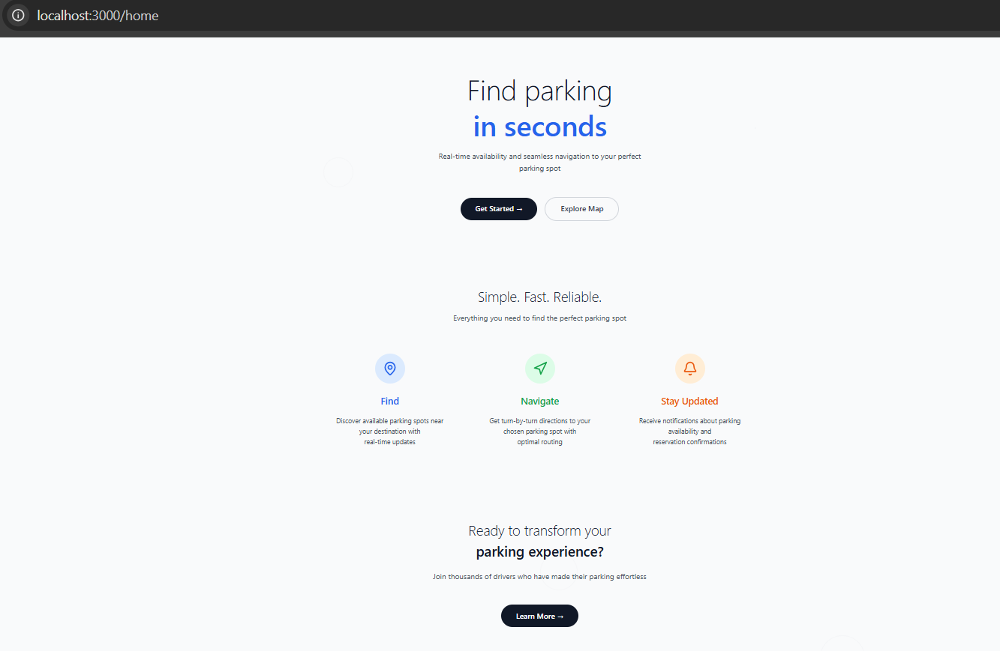
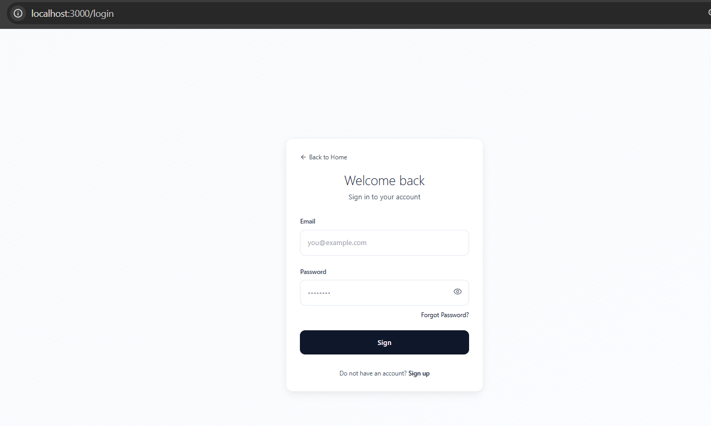

# smart-parking
Smart-Parking is a full-stack responsive web application that helps drivers find available parking spots in real time. It features an interactive map, real-time mock data visualization, and secure user authentication. This project is currently under development.

## Table of Contents

---

## Overview

Finding parking in busy cities like San Francisco can be frustrating. This app aims to solve that problem by showing available nearby spots on a live map, reducing the time spent circling streets. The app is fully responsive and works on both desktop and mobile browsers.

- [Overview](#overview)
- [Tech Stack](#tech-stack)
- [Features](#features)
- [Getting Started](#getting-started)
- [Running the App](#running-the-app)
- [Future Improvements](#future-improvements)

---

## Tech Stack

### Frontend
- React
- TypeScript
- Next.js
- Tailwind CSS
- Leaflet (OpenStreetMap)
- Context API & WebSocket (planned)


- ### Backend
- Java
- Spring Boot
- MySQL
- JWT (JSON Web Tokens)
- WebSocket (planned)
- RESTful APIs

----

## Features

- User registration and login with JWT authentication
- Clean, modern, and responsive UI
- Real-time map rendering with mock parking data
- Spot availability indicators (green = available, red = occupied)
- User location detection
- Organized component-based frontend structure
- Modular and scalable backend using OOP principles


## Getting Started

### Prerequisites

- Node.js (v18+)
- Java (17+)
- MySQL Server
- Maven

---

## Running the App

### 1. Clone the Repository

```bash
git clone https://github.com/yourusername/smart-parking.git
cd smart-parking

```

### 2. Backend Setup


### 3. Create the database

```
Create a new MySQL database (name it anything you want).  
2. Update your `application.yml` with your database name, username, and password.

Example:
```yaml
spring:
  datasource:
    url: jdbc:mysql://localhost:3306/your_database_name
    username: your_username
    password: your_password
  jpa:
    hibernate:
      ddl-auto: update
```

## If your database doesn't exist yet, create it manually:

```
CREATE DATABASE your_database_name;
```

###  4. Run the Spring Boot server

```
cd backend
mvn spring-boot:run
```

### 5. Run the Frontend 

```
cd frontend
npm install
npm run dev
```
Open the app in your browser at:
http://localhost:3000

---
---

## Sample Output

When you run the backend and frontend, you should see logs like the following.

### Backend (Spring Boot)

```
PS C:\Users\hp\Documents\Projects\backend> mvn spring-boot:run

[INFO] Building smart-parking 0.0.1-SNAPSHOT
[INFO] --- spring-boot:run (default-cli) @ backend ---
  .   ____          _            __ _ _
 /\\ / ___'_ __ _ _(_)_ __  __ _ \ \ \ \
( ( )\___ | '_ | '_| | '_ \/ _` | \ \ \ \
 \\/  ___)| |_)| | | | | || (_| |  ) ) ) )
  '  |____| .__|_| |_|_| |_\__, | / / / /
 =========|_|==============|___/=/_/_/_/

:: Spring Boot :: (v3.4.5)

...Started SmartParkingApplication in 6.5 seconds
...Tomcat started on port 8080 (http)
...Connected to MySQL via HikariCP
...Initialized JPA repositories and JWT security filters

```
If you see messages like the above, your backend is running successfully and ready to serve API requests on http://localhost:8080/api
Frontend (Next.js)

```
PS C:\Users\hp\Documents\Projects\backend\frontend> npm run dev

> next dev

▲ Next.js 15.3.3
- Local:        http://localhost:3000
- Network:      http://192.168.1.116:3000
- Environments: .env.local

✓ Starting...
✓ Ready in 2.1s
○ Compiling /home ...
✓ Compiled /home in 3.7s (956 modules)
✓ Compiled /favicon.ico in 366ms (588 modules)

```
If you see “started server on http://localhost:3000,” the frontend is live and accessible.

---

## Screenshots

### Home Page



### Registration Page


### Login Page


## Future Improvements

- Integrate real-time updates using WebSocket
- Fetch live parking data from external APIs or IoT sensors
- Improve marker clustering and map performance

