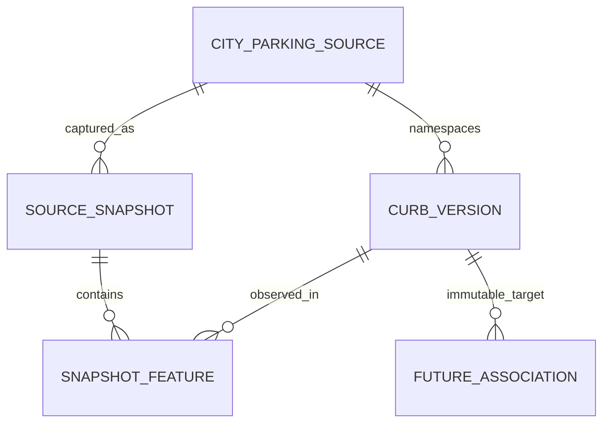

# City Curb Feature Storage Design V1

**STATIC VERIFIED; POSTGRES COMPILED; LIFECYCLE TESTED; IMMUTABILITY TESTED; ROLLBACK TESTED; CONCURRENCY TESTED; RLS/PRIVILEGES TESTED — LOCALLY. PRODUCTION NOT APPLIED; PRODUCTION ROLLOUT BLOCKED.** [Migration 00012](../supabase/migrations/00012_city_parking_curb_storage.sql) applied successfully after migrations 00001-00011 in fresh disposable Supabase PostgreSQL 17.6. The subsequent synthetic DB harness passed 132 checks. The ownership compatibility fix, exact local commands and execution evidence are recorded in the [publication contract](./CITY_CURB_PUBLICATION_CONTRACT.md#7-migration-structure-and-verification-boundary). No production-readiness claim follows.

**Publication follow-up:** [Curb Publication + Immutability Guards V1](./CITY_CURB_PUBLICATION_CONTRACT.md) supplies the reviewed SQL, actual-migration static verifier and separate local DB behavior harness. It replaces mutable retirement/current flags with `STAGING -> VALIDATED -> PUBLISHED`, terminal FAILED captures, and a separate per-source current publication pointer. Versions are append-only; membership freezes at validation. Local role/trigger and two-publisher concurrency tests passed. Live capture and retained-object operations independently block production rollout.

**Interval contract follow-up:** [Curb Interval Measurement V1](./CITY_CURB_INTERVAL_CONTRACT.md) defines the SF planar micrometre model, nine-decimal target fractions, explicit projection ties and conditional interval construction. Pure offline helpers and conformance fixtures are implemented. Migration 00012 supplies the stable version UUID target; it creates no intervals or associations. No verified association or runtime integration follows from these measurements.

**Status: storage migration compiled and behavior-tested locally; shared types deferred.** Only synthetic local fixtures were written. No production access, curb ingestion, association population, PostGIS enablement or runtime change. This provides the target-storage prerequisite needed by [Association Storage V1](./CITY_REGULATION_ASSOCIATION_STORAGE.md), not verified regulation associations. CITY remains **INCOMPLETE**. Historical profiling results below are unchanged.

**Snapshot contract follow-up:** [City Curb Snapshot + Canonicalization Contract V1](./CITY_CURB_SNAPSHOT_CONTRACT.md) specifies ordered capture, conservative consistency states, retained raw bodies/manifest, and exact `curb-jcs-v1` digests with an offline implementation and conformance checks. **LIVE QUERY VERIFIED on `data.sf.gov`; DOUBLE CAPTURE NOT VERIFIED; METADATA AVAILABLE; PRODUCTION PUBLICATION STILL BLOCKED.** On 2026-09-22, legacy `data.sfgov.org` ordered/count queries returned 403 while metadata/simple rows redirected to `data.sf.gov`; the current host accepted ordered rows, metadata and count (18,355). Two independent attempts each retained one identical 1,000-row page with unique nonblank ascending IDs and zero retries, then became INVALID because ten coordinate tokens fail the unchanged decimal round-trip guard. Before-schema digests and all retained byte checksums matched, but no full pagination, successful manifest or dataset/feature digest was verified. Capture transport and offline legacy/current-host verification were updated; canonicalization was not weakened. The existing DB source/manifest endpoint pins still require a separate compatibility review. Precision resolution, completed live validation and durable artifact operations remain rollout prerequisites. Exact evidence and local artifact locations are in the snapshot contract; no database was contacted by this live milestone.

## 1. Existing storage and reusable conventions

Inspected migrations, `ingest-sf-parking-data.ts`, `normalize-city-parking.ts`, both regulation profilers, shared domain/adapters, and the regulation storage, association storage, spatial research, city plan and architecture documents.

| Persisted entity | Identity / provenance | Versioning limitation |
|---|---|---|
| `city_parking_sources` | Generated UUID; unique `source_key`; provider/dataset/API metadata and latest import counters | Mutable registry, not a capture manifest |
| `city_parking_blocks` | UUID; unique `(source_id, external_id)`; source geometry in `raw_payload`; nullable/non-unique blockface text | Upserted current row; no immutable geometry history |
| `city_parking_meters` | UUID; unique `(source_id, external_id)`; meter/blockface text, coordinates, nullable block FK, `raw_payload` | A meter point, not a curb version |
| `normalized_parking_locations` | UUID; unique `(source_type, source_id)` where `source_id` is external **text**; `raw_source` links city row/source metadata | Normalized meter inventory points, updated in place |
| `city_parking_regulations` | UUID; unique `(source_id UUID FK, external_id text)`; geometry omitted from `raw_source`; nullable `block_id` | Rule storage, not a spatial target or immutable snapshot |

Reuse generated internal UUIDs, source-registry FKs, explicit external text identity, `timestamptz` defaults, source raw-data preservation, and server-owned writes. Do **not** reuse current-row overwrites for historical target versions. `ParkingLocation` remains a point-oriented runtime type; `ParkingEvidence` remains CITY/COMMUNITY/MOCK fact provenance, not a geometry version or quality score. No shared source category is added.

No separate persisted curb/blockface entity exists. The ingest source list does not register `pep9-66vw`; a future source key such as `datasf_citywide_curbs` is a **proposal**, not a source row created by this task. Registry metadata should identify the dataset once; snapshot records capture observations of it.

## 2. Live `pep9-66vw` identity evidence

Run: `pnpm.cmd exec tsx scripts/profile-regulation-spatial.ts --curb-storage`, starting **2026-09-19T01:00:55.071Z** (September 18 local Pacific date). It fetched all **18,355 rows**, used the existing retry helper, and exited **0**. No other dataset or production database was queried by this mode. Transient HTTP 425 retries recovered. Dataset metadata before/after the pagination had unchanged `rowsUpdatedAt`.

The [DataSF metadata](https://data.sfgov.org/api/views/pep9-66vw.json) exposes exactly these public fields: `name`, `popupinfo`, `shape_leng`, `street_nam`, `blockface_`, `sfpark_id`, `cnn_id`, `globalid`, `shape`. It describes curb-coincident line features assembled through manual drawing, offsets, centerlines and a blockface tool. Some features represent only portions of streets originally drawn for regulation extents. Attributes are described as unverified except `SFPARK_ID`.

| Candidate field | Missing/null | Blank/null placeholders | Meaningful rows | Distinct meaningful values | Duplicate groups | Rows in duplicate groups |
|---|---:|---:|---:|---:|---:|---:|
| `globalid` | 0 | 0 | 18,355 | 18,355 | 0 | 0 |
| `objectid` | 18,355 | 0 | 0 | 0 | 0 | 0 |
| `id` | 18,355 | 0 | 0 | 0 | 0 | 0 |
| `name` | 0 | 0 | 18,355 | 1,908 | 4 | 16,451 |
| `sfpark_id` | 16,445 | 0 | 1,910 | 1,907 | 3 | 6 |
| `blockface_` | 16,445 | 0 | 1,910 | 1,906 | 4 | 8 |
| `cnn_id` | 16,445 | 22 | 1,888 | 1,183 | 698 | 1,403 |

Counts refer to returned public row fields; omitted keys and JSON nulls are grouped. The 22 `cnn_id` placeholders are excluded from meaningful uniqueness. `name = Placemark` occurs 16,445 times. Neither `objectid` nor `id` is a public source column; hidden Socrata row metadata, if obtainable separately, is not assumed to be a physical identity or used as a fallback.

`sfpark_id` is documented as an ID generated for the meter database/parking-space inventory, related to meter/block/management-district identifiers. That is useful context, **not** a guarantee of unique physical curb identity in this layer. Duplicate values are `306221`, `687001`, `306222`: the first two each have different geometries/lengths (51.339 vs 58.464 m; 81.813 vs 128.731 m); the last has two different `globalid`s with equal geometry (54.407 m). `blockface_` duplicates include `24S`, `101`, `200`, `24T`. There is no documented parent/split/merge/version chain explaining these records.

### Identity and stability conclusions

- **Row identity:** a record observed in one captured snapshot. `(snapshot_id, external_id)` is sufficient for the currently observed unique `globalid` values.
- **Source feature identity:** `globalid` is the best observed feature-label candidate, but its metadata description is empty. Its persistence through redraw, split, merge, deletion or republishing is **not established**. Keep the source string, including braces/case, rather than casting it into an internal UUID or silently normalizing it.
- **Physical curb identity:** an independently established real-world curb/extent. No field in this profile proves a one-to-one mapping to such an identity. Equal coordinates, shared meter IDs, or a unique global ID do not establish it.

The current ID/geometry diagnostic digest `16c97866a440b45d510db842f2c396c864a2d893c54cf7585df9a43f3b72a18e` matches V1/V2, providing short observation-window consistency only. It is not a lifetime identity contract or evidence that the source reflects today's curbs.

There are **no per-feature update/version timestamp columns**. Catalog timestamps are: created 2019-05-01T23:11:30Z; publication 2019-05-01T23:49:05Z; rows updated **2020-10-12T17:01:01Z**; view last modified **2025-08-21T16:53:35Z**. View metadata modification is not a feature edit timestamp. Do not fill `valid_from` with any of these or with retrieval time. The descriptions still refer to development work in June 2015.

Distinct rows could be partial features, duplicates, redraws or split representations, but a single snapshot does not establish historical succession or physical equivalence. No synthetic curb lineage or automatic geometry-based identity merge is warranted.

## 3. Geometry findings

`shape` contains **18,355 LineStrings**, each with one component. Missing/null geometry: **0**; malformed coordinates/line structure: **0**; unsupported types: **0**; outside the profiler's SF diagnostic bounds: **0**. These checks validate finite coordinates, geographic bounds and minimum line structure, not survey accuracy, self-intersection validity or topology.

The DataSF geometry is WGS84 longitude/latitude GeoJSON. [Socrata line documentation](https://dev.socrata.com/docs/datatypes/line) and [GeoJSON RFC 7946](https://www.rfc-editor.org/rfc/rfc7946) establish coordinate-order/representation context. Store explicit `OGC:CRS84`/longitude-latitude semantics; do not confuse degree coordinates with metres or import a related ArcGIS layer's native feet without transformation provenance.

| Diagnostic | Result |
|---|---:|
| Ordered parsed-GeoJSON equality | 16 groups / 32 rows |
| Coordinate equality allowing line reversal | 17 groups / 34 rows; largest group 2 |
| Additional non-exact pairs, sampled symmetric Hausdorff <=2 m | 9 pairs / 18 distinct rows |
| Additional non-exact pairs <=0.25 m | 0 |
| Zero-length lines | 0 |
| Length <1 m / <5 m | 1 / 2 |
| Length >300 m / >500 m | 209 / 47 |
| Min / median / p90 / p99 / max length | 0.354 / 82.252 / 183.311 / 314.419 / 1,159.459 m |

Near-duplicate analysis used the existing 100 m grid, a 2 m expanded-bbox search, minimum segment-distance prefilter, and <=5 m sampling plus original vertices in both directions. It considered 11,339 unordered bbox pairs, measured 193 non-exact nearby pairs, and found the nine above. Grid-vs-brute-bbox checks and local arithmetic checks passed. Lengths/distances use the V1 local equirectangular approximation; neither near equality nor the parsed-JSON fingerprint is a production canonical geometry predicate.

Example equal-geometry rows: `{A341035D-0EDB-4E0D-B24E-FBBDDF6634EF}` and `{170A0458-850A-4F37-95F8-88761EABAD63}`, both `sfpark_id=306222`. Example near pair: `{39201823-F39A-427E-B5ED-EA9AE3FEDFC0}` and `{B8A75B97-1A46-456A-9634-CB1AD2A6120C}`, sampled Hausdorff 0.750 m. Preserve every source identity; do not deduplicate source features by these metrics.

The longest feature, `{E34C53F7-9B43-4B4D-8FA7-1730B5806FCC}`, is approximately 1,159.459 m. Long features and partial features mean “one source row = one city block” is not a safe domain assumption. No multipart geometry was observed; unexpected future MultiLineString/other geometry should be preserved and quarantined for an explicit contract revision rather than silently split into invented source IDs.

## 4. Representation and model choice

**Store the original parsed GeoJSON geometry as a first-class `geometry_geojson jsonb` value on an immutable version, plus non-geometry source fields in `raw_source jsonb`.** Preserve exact fetched response bytes in durable, checksummed snapshot artifacts when implementing ingestion. JSONB preserves values, not original wire formatting/order/number lexemes; the artifact provides byte-level reproducibility.

| Option | Decision |
|---|---|
| Raw GeoJSON | Preferred: retains explicit type/order and permits future spatial conversion |
| Separate coordinate array | Unnecessary duplicate representation; loses type/context unless wrapped again |
| WKT | Optional later derived export, not canonical source storage |
| Digest + live external fetch only | Insufficient: upstream changes/deletes would destroy reproducibility |
| PostGIS geometry | Possible derived analysis representation later; not required or enabled here |

Compare version models:

- In-place overwrite cannot retain accepted evidence.
- A logical `city_parking_curbs` row with a current-version pointer assumes identity continuity that the source has not established.
- Snapshot-local feature copies retain history but duplicate unchanged geometry on every capture.
- **Recommended hybrid: snapshots + immutable content versions + snapshot membership.** It avoids a claimed physical-curb entity while reusing exactly unchanged content for the same external key.

No `city_parking_curbs` physical-entity table or per-curb current pointer is proposed for V1. “Current” is membership in the current published snapshot. A namespaced external ID is an observed source label; a reused version means the same recorded content, not proof of real-world entity continuity or approval continuity.

## 5. Storage contract (migration 00012 compiled locally; production not applied)

### `city_parking_source_snapshots`

One capture of a registered source. Reuse `city_parking_sources` for dataset registration; do not copy its mutable import counters as historical evidence.

| Fields | Purpose / constraints |
|---|---|
| `id uuid` | Generated PK |
| `source_id uuid` | FK to `city_parking_sources(id)`, RESTRICT deletion |
| `capture_key text` | Unique with `source_id`; stable key for resuming the same capture, not a content ID |
| `retrieval_started_at`, `retrieval_completed_at` | Actual observation times; both required because DB staging follows retained capture completion |
| Upstream update/view timestamps | Retained catalog observations in manifest artifacts; not physical valid-time claims or duplicated required columns |
| `schema_sha256`, `source_content_sha256`, `identity_geometry_sha256` | Versioned manifest digests; non-null before publication |
| `row_count` and manifest usable/excluded counts | Typed total plus validated manifest counts; identity failures reject capture; V1 publication requires all members usable |
| `fetch_tool_version`, `canonicalization_version` | Explicit, nonempty versions |
| `manifest jsonb` | Captured provider/dataset/URL, metadata artifact, raw page/export artifacts and hashes, ordering, paging, capture consistency, field/schema descriptors and validation report |
| `artifact_uri`, `artifact_sha256`, `manifest_uri`, `manifest_sha256` | Immutable artifact locators/checksums, externally verified before validation |
| `membership_sha256`, artifact verification fields | Frozen validated DB-set seal and verifier provenance; separate from canonical source digest |
| `lifecycle` | `STAGING / VALIDATED / PUBLISHED / FAILED`; failure reason required; published/failed states terminal |
| `validated_at`, `published_at`, `failed_at`, `created_at` | Server timestamps; not source validity dates |

Use `UNIQUE(source_id, capture_key)` and `UNIQUE(id, source_id)` for membership FKs. Migration 00012 adds `UNIQUE(id, source_id, lifecycle)` for a pointer FK constrained to PUBLISHED. **Do not use a one-PUBLISHED-per-source partial index:** history remains PUBLISHED. `city_parking_curb_publications` has `source_id` as its PK, identifying zero or one current snapshot; superseded status is derived. Failed captures retain history and cannot publish. Additional index: `(source_id, retrieval_completed_at DESC)`. Distinct external-ID and usable counts remain manifest fields checked against actual membership and typed `row_count`, not duplicate scalar columns.

Source registry identity should not be repurposed for a different provider/dataset. Capture-time provider/dataset strings in the manifest are intentional audit copies, guarding history against later registry-label edits. Capturing identical content at a later time creates a new snapshot observation but can reuse every version; retrying one capture reuses its capture key. Completeness refers to the observed dataset, not complete city regulation coverage.

### `city_parking_curb_versions`

An immutable **source-feature content version**, not a physical-curb entity. Its UUID is the exact future association FK target.

| Fields | Purpose / constraints |
|---|---|
| `id uuid` | Generated internal PK; never copied/cast from DataSF `globalid` |
| `source_id uuid` | FK to source registry, RESTRICT |
| `external_id text` | Verbatim nonempty `globalid`; no random fallback or geometry-derived identity |
| `canonicalization_version text` | Identifies digest input/serialization contract |
| `geometry_presence` | `ABSENT / NULL / VALUE`; preserves source distinction for reproducible digest input |
| `geometry_geojson jsonb` | Original parsed `shape`; nullable for missing input; retain malformed JSON values as quarantined source evidence |
| `geometry_sha256 text` | Strict ordered geometry-value digest, including a versioned missing/null encoding if absent |
| `attributes_sha256 text`, `content_sha256 text` | Non-geometry values and the full feature identity/content envelope |
| `raw_source jsonb` | All source columns except `shape`, preserving values/types, placeholders and original `globalid` |
| `geometry_state` | `USABLE / MISSING / MALFORMED / UNSUPPORTED`; not a spatial-match quality |
| `validation_version`, `validation_reasons` | Frozen structural validation provenance; thresholds must not silently change old rows |
| `created_at timestamptz` | Database creation time only |

Unique content key: **`(source_id, external_id, canonicalization_version, content_sha256)`**. Verify equal canonical content before reusing a row; a digest collision or disagreement is an error, not an overwrite. Keep `UNIQUE(id, source_id, external_id)` for the membership composite FK. Index `(source_id, external_id)` for history discovery. No unique geometry digest: different external IDs with identical geometry must remain distinct. Do not constrain `sfpark_id`, `cnn_id`, name or geometry similarity as identity.

`USABLE` initially means structurally usable, nonzero LineString under a frozen validation policy; it does not certify curb side or survey accuracy. Tiny/long features remain retained with review flags rather than arbitrary deletion. Future changes in validation should be recorded in a separate assessment or a deliberately revised canonical/validation contract, not mutate an accepted version's payload/state.

No `updated_at`, per-version mutable `current` bit, source `valid_from`, or `valid_to` is appropriate on immutable content. Presence/absence and capture chronology belong to snapshots. A disappearance is not a proven physical demolition; reappearance is not a proven same curb. Artifact manifests retain exact omitted-vs-null geometry information so these cases can hash distinctly even if the projected JSONB geometry column is null for both.

### `city_parking_curb_snapshot_features`

Membership binds each observed row to its content version:

```text
snapshot_id UUID NOT NULL
source_id UUID NOT NULL
external_id TEXT NOT NULL
curb_version_id UUID NOT NULL
PRIMARY KEY (snapshot_id, external_id)
UNIQUE (snapshot_id, curb_version_id)
FOREIGN KEY (snapshot_id, source_id)
  -> city_parking_source_snapshots(id, source_id) ON DELETE RESTRICT
FOREIGN KEY (curb_version_id, source_id, external_id)
  -> city_parking_curb_versions(id, source_id, external_id) ON DELETE RESTRICT
INDEX (curb_version_id)
```

The repeated namespace/key columns here enforce same-source/same-external-ID membership; they are not an invented identity. A snapshot belongs to one source, so its `(snapshot_id, external_id)` PK is the enforceable equivalent of `(source_id, snapshot_id, external_id)`. **Do not use `UNIQUE(source_id, external_id)` on versions**, which would prevent history. A duplicate/missing global ID in one future capture fails publication and retains the raw capture for investigation; it must not be silently deduplicated or assigned a synthetic key.



Unchanged content shares a version across snapshots. Changed geometry **or any retained source attribute** creates new content under the same external key. A source key that disappears/reappears with the same content may reuse storage bytes/version, but new snapshot membership does not transfer approval. Splits/merges/renumbering create observations under new external keys; lineage remains unasserted until separate evidence supports it.

## 6. Digest strategy

Two separate needs must not be conflated: reproducible ordered geometry for interval references, and diagnostic geometric equivalence.

Contract `curb-jcs-v1` uses SHA-256 over UTF-8, explicitly domain-separated inputs. The [snapshot contract](./CITY_CURB_SNAPSHOT_CONTRACT.md#6-canonical-input-and-serialization) defines the implemented offline JCS serialization and stricter source decimal round-trip acceptance, duplicate-key and Unicode validation. Formatting/property order does not change identity; array order remains significant. This is not topology normalization. Raw bytes retain source-number lexemes and parser evidence; unsupported precision fails instead of silently rounding. The helper is outside production ingestion and runtime.

```text
geometry_sha256 = SHA256("city-curb/geometry/v1\n" + JCS(geometryEnvelope))
attributes_sha256 = SHA256("city-curb/attributes/v1\n" + JCS(rowWithoutShape))
content_sha256 = SHA256("city-curb/content/v1\n" + JCS({
  provider, dataset_id, external_id, canonicalization_version,
  geometry_sha256, attributes_sha256
}))
```

`geometryEnvelope` records whether `shape` was absent, explicitly null, or present, and its exact parsed value. Do not round coordinates, reverse lines, sort vertices, remove repeated vertices, snap points, simplify curves, project coordinates, or equate LineString with MultiLineString before the strict digest. Changed precision/vertices/direction creates a distinct version; JSON formatting and object-member order do not. Coordinate number spelling alone is a byte-artifact difference, not necessarily a parsed-value difference. Reject inputs outside the chosen numeric/Unicode contract and explicitly test negative zero and precision behavior before implementation.

Optional **diagnostic** reverse-insensitive fingerprints may group equivalent coordinate sequences; keep them separate from identity/version uniqueness. V1/V2's sorted/reversed `JSON.stringify` fingerprint is such a diagnostic, not `curb-jcs-v1`. It does not prove topological equality under resampling. A reversal could map fraction `f` to `1-f`; never remap a stored association automatically.

Snapshot digests: sort observed external IDs using the documented deterministic string ordering and hash a canonical array of `[external_id, content_sha256]` for `source_content_sha256`; similarly hash `[external_id, geometry_sha256]` for `identity_geometry_sha256`. Include provider/dataset/canonicalization version in both envelopes. Duplicate IDs reject the snapshot, rather than creating ambiguous sorting semantics. Geometry identity digest equality means the same identities and ordered geometries, not physical-curb equivalence independent of IDs. Capture/page ordering does not affect these logical-set digests.

`schema_sha256` covers sorted public field names/types and captured geometry/CRS interpretation; a separately checksummed metadata artifact retains descriptions/catalog values. Description/view changes should be visible in metadata without necessarily creating new feature versions. Tool versions, canonicalization versions and original artifact hashes let later work distinguish source changes from transformation changes. No production canonicalizer or digest migration is implemented here.

## 7. Raw preservation and bounded duplication

Keep the original geometry exactly once per content version in `geometry_geojson`; omit `shape` from `raw_source`. Retain `globalid`, `name`, `popupinfo`, `shape_leng`, `street_nam`, `blockface_`, `sfpark_id`, `cnn_id` as source values in `raw_source`, including literal `NULL` placeholders. `external_id` intentionally repeats the original `globalid` as an indexed identity column. Do not duplicate every optional scalar into SQL columns before there is a real query need; later validated projections can extract street/meter identifiers without promoting them to identity.

Do not add inferred street side, stable physical-curb ID, nearest block, regulation ID, or legality to source versions. `shape_leng` has undocumented units/provenance in this feed; retain it verbatim, while measured lengths belong to versioned analysis evidence with explicit units/method.

Raw response/export bytes and dataset metadata belong to a durable snapshot artifact store with checksums, retention and restore verification. They need not be copied to every version. All source keys, including newly observed fields, are preserved in the artifact; unknown schema/geometry changes require validation before publication. A temporary local log or current API URL is not a durable archive. Storage backend, permissions, retention and size bounds remain implementation prerequisites.

## 8. Exact future association and interval reference

Recommended FK: **`city_parking_regulation_associations.curb_version_id -> public.city_parking_curb_versions(id)`**, RESTRICT deletion. It never points at `globalid`, a mutable “current” curb, or a street-block polygon.

The association run must additionally reference **`target_snapshot_id -> city_parking_source_snapshots(id)`**. Publication verifies that every link's version belongs to that snapshot through `city_parking_curb_snapshot_features`, belongs to the expected source and is usable. The version FK alone does not enforce membership in a particular snapshot. A shared version can belong to several captures, so a single snapshot column on the version would be misleading.

Represent partial scope with normalized `[from_fraction, to_fraction]`, `0 <= from < to <= 1`, relative to stored coordinate direction and the specific version. Whole-feature scope is explicitly `[0,1]`. Initial association-ready targets are single LineStrings, component index 0; unexpected multipart data is retained but not auto-associated. Keep source regulation component/interval separately. Multiple link rows may reference complementary intervals on one or several target versions; duplicate identity includes the target version and both source/target intervals.

Fractional arclength now uses the offline [interval contract](./CITY_CURB_INTERVAL_CONTRACT.md): `sf-curb-planar-um-v1`, a fixed SF affine frame with derived integer micrometre coordinates/lengths, deterministic all-segment projection and explicit ties. Target fractions serialize to nine decimal places with proposed `numeric(10,9)` storage. Record the model in the interval reference/run; changing it requires reassessment. Metre offsets and subsegment geometries remain diagnostics, not competing authoritative extents. The helpers implement measurement only; independent side/extent evidence and metric calibration remain necessary for association acceptance.

## 9. Immutability, refresh and future ingestion

The future ingestion sequence, **not implemented or run**, is:

1. Register/resolve the source using the existing catalog mechanism, verifying provider/dataset identity; do not overwrite another dataset's registry identity.
2. Fetch/archive the complete source capture and metadata, recording ordering, page bounds, retries and consistency. Then create/resume a STAGING DB snapshot by capture key; retries must match its immutable envelope.
3. Validate row identities/schema and geometry without lossy repair. Preserve missing/malformed/unsupported geometry as quarantined content with reasons; identity conflicts prevent publishing the capture. Do not hide exclusions by reducing the source count.
4. Compute tested canonical geometry/attribute/content digests. Reuse a version only for equal content under the same source/external key/canonicalization contract; otherwise create a generated internal UUID version. Do not overwrite old rows.
5. Create snapshot membership idempotently. Compare exact identity sets, counts, artifacts and digests; a repeated membership insert must agree with the existing version, not change it in place.
6. Under source-then-snapshot locks, the independent verifier validates and freezes the complete set. A separate publication RPC rechecks gates, transitions VALIDATED to PUBLISHED and atomically advances the per-source pointer using an expected predecessor. Old snapshots remain immutable PUBLISHED history. Failed/partial or stale concurrent publications cannot replace current state.
7. Trigger an explicit association revalidation/release workflow for changed/current snapshot context. Historical version references and old evidence stay queryable. Reusing identical content is not automatic approval or freshness renewal.

Freeze version payloads and snapshot input envelopes from insertion, and membership at validation. Only guarded lifecycle transitions are permitted; published/failed rows never update. Use RESTRICT FKs and no routine DELETE/TRUNCATE privileges, including for failed captures. Any later cleanup needs a separate retention design. Missing features in a new complete snapshot disappear only from its membership, not from old versions/history.

The earlier profiler's `$limit`/`$offset` plus unchanged metadata is not proof of an atomic upstream snapshot. The [snapshot contract](./CITY_CURB_SNAPSHOT_CONTRACT.md#3-consistency-and-change-detection) now requires explicit ID ordering, counts, schema/metadata checks, strict identities and retained bodies, while explicitly limiting `CONSISTENT` to observed agreement. Its live validation is still blocked. Reproducibility of captured bytes and authority/completeness of the upstream set remain distinct.

## 10. RLS, publication and migration readiness

Migration 00012 enables RLS on all four new tables, with no anon/authenticated policies or privileges. Immutable versions/history are never client-editable. Service-role privileges allow reads and staging INSERTs only, plus publication/failure RPCs; independent validation belongs to the reviewed dedicated verifier role. A service role bypassing RLS does not replace grants and trigger guards.

Keep all four new base tables on **server-only reads**, including raw source/artifact manifests. If a real client feature later needs curb geometry, expose a narrowly scoped read projection of usable members of the current published snapshot, excluding private artifact/reviewer details. This projection is not built now. Existing registry policies remain unchanged; migration 00012 adds a source-identity trigger. Objects retain migration-executor ownership, confirmed locally as `postgres`; the verifier is a separate non-login permission group. Publishing curb data says nothing about verified regulation associations or coverage readiness.

**Migration locally compiled and behavior-tested; production rollout blocked.** The initial custom-owner AUTHORIZATION failed with SQLSTATE 42501. The narrow correction uses executor ownership, removes custom-owner transfers/grants/policies, and checks the actual table owner in invoker guards. No role membership or superuser privileges were added. Migration 00012 adds no source/data rows and uses no extensions. No shared type export was added. The later behavior stage found no migration defect and required no migration edit or reset. Live capture validation, operational artifact retention, real source registration and independent verifier authentication still block first production rollout. Metric calibration and unknown physical-curb continuity separately block automatic association promotion.

Verification passed: `pnpm.cmd typecheck`, 41 static checks from `pnpm.cmd exec tsx scripts/verify-curb-publication-contract.ts`, and 132 synthetic local checks from `pnpm.cmd verify:curb-publication-db --database-url=postgresql://postgres@127.0.0.1:54322/postgres`. Executed cases include lifecycle success/rejections, stale/older/current/historical retries, mutation/deletion/truncation guards, terminal FAILED, rollback after the snapshot transition, actual client/service/verifier operations, SECURITY DEFINER shadow resistance and live catalogs. Two publisher sessions demonstrated lock serialization and exactly one advancement; separate staging-versus-validation races are not claimed. The harness refuses hosted targets and retains positive synthetic history; negative mutations and temporary test objects roll back. Placeholder artifacts and local role switching do not prove production artifact retention or independent authentication. The original profiling milestone below remains historical evidence; no new source fetch or ingestion was run.

## 11. Proposed TypeScript contracts (documentation only)

```typescript
type SnapshotLifecycle = 'STAGING' | 'VALIDATED' | 'PUBLISHED' | 'FAILED';
type GeometryState = 'USABLE' | 'MISSING' | 'MALFORMED' | 'UNSUPPORTED';
type Sha256 = string; // Validated lowercase 64-hex, not an arbitrary string.
type FractionDecimal = string; // Validated interval decimal; not a JS float ID.

interface CurbSourceFeature {
  readonly sourceRegistryId: string;
  readonly sourceSnapshotId: string;
  readonly externalId: string; // Source globalid text; not an internal UUID.
  readonly curbVersionId: string;
}
interface CurbVersion {
  readonly id: string;
  readonly sourceRegistryId: string;
  readonly externalId: string;
  readonly canonicalizationVersion: string;
  readonly geometryPresence: 'ABSENT' | 'NULL' | 'VALUE';
  readonly geometryGeoJson: unknown; // Validate; malformed source is retained.
  readonly geometryState: GeometryState;
  readonly geometrySha256: Sha256;
  readonly attributesSha256: Sha256;
  readonly contentSha256: Sha256;
  readonly rawSource: Readonly<Record<string, unknown>>; // Excludes shape.
  readonly validationVersion: string;
  readonly validationReasons: readonly string[];
  readonly createdAt: string; // ISO capture/storage time, not physical valid_from.
}
interface CurbSourceSnapshot {
  readonly id: string;
  readonly sourceRegistryId: string;
  readonly captureKey: string;
  readonly retrievalStartedAt: string;
  readonly retrievalCompletedAt: string;
  readonly lifecycle: SnapshotLifecycle;
  readonly schemaSha256: Sha256;
  readonly sourceContentSha256: Sha256;
  readonly identityGeometrySha256: Sha256;
  readonly membershipSha256: Sha256 | null; // Filled once by validation.
  readonly fetchToolVersion: string;
  readonly canonicalizationVersion: string;
  readonly rowCount: number;
  readonly usableGeometryCount: number; // Resolved from validated manifest, not a second DB counter.
  readonly excludedGeometryCount: number; // Derived from total minus usable.
  readonly manifest: Readonly<Record<string, unknown>>; // Versioned schema.
}
interface CurbIntervalReference {
  readonly sourceSnapshotId: string;
  readonly curbVersionId: string;
  readonly componentIndex: 0; // Initial usable target contract is LineString.
  readonly fromFraction: FractionDecimal;
  readonly toFraction: FractionDecimal;
  readonly measurementModelVersion: string;
  readonly geometrySha256: Sha256; // Must agree with the referenced immutable version.
}
```

A future usable-geometry read DTO can narrow `geometryGeoJson` to a validated GeoJSON LineString. These research DTOs are not `ParkingLocation`, legality or availability facts, and TypeScript alone does not establish source truth or enforce the SQL/manifest invariants.

## 12. Coverage and validation

Persisting curb features creates a durable **spatial target** only. Still unresolved: verified regulation-to-curb association, parking-location-to-curb resolution, street sweeping, permit interpretation, meter-payment interpretation, `OTHER` semantics, unsupported schedules and complete city-source coverage. **CITY remains INCOMPLETE.**

Public curb-only profiler: exit 0; local geometry/grid checks passed; no source rows modified. `pnpm.cmd typecheck` passed across all workspaces/scripts. No production connection, ingestion, migration, PostGIS enablement, association population, runtime/legality/coverage/UI/AI/agent/MCP changes or commit occurred.
