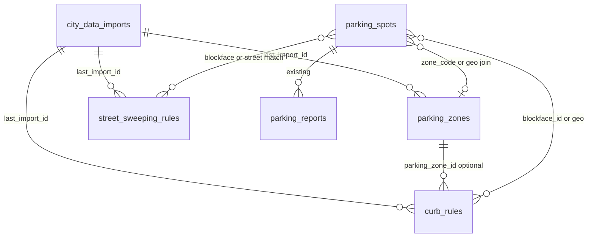

# City Data Integration Plan — Smart Parking (San Francisco)

> **Status:** Ingestion **prototype** on branch `feature/city-data-ingestion`. Mobile MVP unchanged.  
> **Goal:** Import real city parking/curb data into **separate** tables without breaking Expo Go, auth, realtime, reports, or the 26-row `MOCK` seed in `parking_spots`.

### Current ingestion prototype (active)

| Item | Location |
|------|----------|
| Migration | `supabase/migrations/00005_city_parking_data.sql` |
| Ingest script | `scripts/ingest-sf-parking-data.ts` |
| Command | `pnpm ingest:sf-parking` (requires service role + migration applied) |

**Tables added (separate from `parking_spots`):**

| Table | Purpose |
|-------|---------|
| `city_parking_sources` | Registry of DataSF datasets we import |
| `city_parking_blocks` | SFMTA metered street blocks + merged regulation fields |
| `city_parking_meters` | Parking meter points |

**Inspection view (read-only, not in mobile app):**

| View | Purpose |
|------|---------|
| `city_parking_meters_clean` | Flattened meters for SQL Editor / API inspection (`00006`) |

**Datasets ingested (v1):**

1. [SFMTA Metered Street Blocks](https://data.sfgov.org/d/27b3-yjjx) (`27b3-yjjx`) → `city_parking_blocks`
2. [Parking Meters](https://data.sfgov.org/d/8vzz-qzz9) (`8vzz-qzz9`) → `city_parking_meters` — **first real run:** `pnpm ingest:sf-parking:meters` (100 rows)
3. [Parking regulations (blockface map)](https://data.sfgov.org/d/hi6h-neyh) (`hi6h-neyh`) → updates matching `city_parking_blocks` by `blockface_id`

**Why the MVP is unaffected:** The mobile app still reads only `parking_spots` and `parking_reports`. City tables are optional, read-only for clients, and populated by a local script — not wired into the map UI yet.

### Inspection view: `city_parking_meters_clean`

Migration `00006_city_parking_views.sql` adds a **read-only** view over `city_parking_meters` joined to `city_parking_sources`. Use it to verify ingest quality in Supabase without reading large `raw_payload` JSON.

| Column | Meaning |
|--------|---------|
| `meter_id` | `post_id` or `external_id` |
| `status` | City `active_meter_flag` (not app availability) |
| `latitude` / `longitude` | WGS84 coordinates |
| `location_description` | e.g. `1301 POLK ST` |
| `last_ingested_at` | Row `imported_at` from last ingest |
| `source_name` | DataSF dataset display name |

**Example queries (Supabase SQL Editor):**

```sql
-- Row count after ingest
SELECT COUNT(*) FROM city_parking_meters_clean;

-- Sample rows
SELECT meter_id, status, latitude, longitude, location_description, source_name, last_ingested_at
FROM city_parking_meters_clean
ORDER BY last_ingested_at DESC
LIMIT 20;

-- Rows missing location text (data quality check)
SELECT meter_id, latitude, longitude, last_ingested_at
FROM city_parking_meters_clean
WHERE location_description IS NULL;
```

**Why not in the production app yet:** The Expo Go MVP still maps `parking_spots` only. This view is for operators/developers to inspect city ingest before any future UI or projection work. It uses `security_invoker = true`, so the same RLS read rules as the underlying city tables apply.

**Planned later (not in prototype):** street sweeping (`yhqp-riqs`), RPP zones (SFMTA GIS), projection into `parking_spots`, Edge Function cron sync. See §7 legacy design notes and §11.

### Phase 2: Normalized city layer — status

| Item | Status |
|------|--------|
| Migration `00007_normalized_city_parking.sql` | **In repo** — apply in Supabase SQL Editor after `00005`/`00006` |
| Table `normalized_parking_locations` | Canonical city inventory (not `parking_spots`) |
| Script `scripts/normalize-city-parking.ts` | **Added** — upserts from `city_parking_meters` |
| Script `scripts/verify-normalized-parking.ts` | **Added** — read-only validation |
| Mobile app | **Not connected** — Expo Go MVP unchanged |

**Pipeline (run in order):**

```powershell
# Apply 00005 → 00006 → 00007 in Supabase, then:
$env:SUPABASE_URL = "https://YOUR_PROJECT.supabase.co"
$env:SUPABASE_SERVICE_ROLE_KEY = "your-service-role-key"
pnpm ingest:sf-parking:meters
pnpm normalize:city-parking
pnpm verify:normalized-parking
pnpm check:city-parking
```

| Command | Purpose |
|---------|---------|
| `pnpm normalize:city-parking` | Upsert meters → normalized rows (service role) |
| `pnpm verify:normalized-parking` | Validate row count, coords, duplicates, `raw_source` |
| `pnpm check:city-parking` | Inspect raw ingest via `city_parking_meters_clean` |

**Upsert key:** `(source_type, source_id)` e.g. `datasf_parking_meter` + `post_id`.

**Verification checklist:** row count > 0; valid lat/lng; no duplicate `(source_type, source_id)`; `active` is boolean; `raw_source` populated; `last_synced_at` set.

**Next step (Phase 3):** Read-only API/service layer (Supabase RPC or Edge Function) to query normalized locations near a point — still **not** wired into the mobile map until a deliberate cutover.

Not connected to the mobile app yet.

Related: high-level architecture overview in [`ARCHITECTURE.md`](./ARCHITECTURE.md) §10.

---

## Table of Contents

1. [Executive summary](#1-executive-summary)
2. [Data domains we will integrate](#2-data-domains-we-will-integrate)
3. [Official data sources](#3-official-data-sources)
4. [Data classification: rules vs availability](#4-data-classification-rules-vs-availability)
5. [How this maps to the app today](#5-how-this-maps-to-the-app-today)
6. [MVP strategy (phased)](#6-mvp-strategy-phased)
7. [Future Supabase schema (detailed design)](#7-future-supabase-schema-detailed-design)
8. [Connection to `parking_spots`](#8-connection-to-parking_spots)
9. [Future ingestion flow](#9-future-ingestion-flow)
10. [Risks and limitations](#10-risks-and-limitations)
11. [Open questions and next steps](#11-open-questions-and-next-steps)

---

## 1. Executive summary

Smart Parking today shows **26 mock spots** in San Francisco with **user-reported availability** (`AVAILABLE` / `OCCUPIED` / `UNKNOWN`) and Supabase Realtime updates. City open data does **not** provide citywide, real-time “this space is free right now” for every curb space.

What San Francisco **does** publish well:

- **Where** parking infrastructure exists (meters, blockfaces, garages).
- **What rules apply** (time limits, RPP areas, sweeping schedules, many regulations by blockface).
- **Some** specialized layers (color curb, loading, accessible parking) via SFMTA GIS — with varying completeness.

The integration plan is therefore:

1. **Inventory + rules first** (static / scheduled sync).
2. **Treat “availability” as app-layer signal** (user reports, heuristics, optional future feeds) — not as something we assume from DataSF CSV alone.
3. **Keep `MOCK` data** until a deliberate cutover migration is tested.

---

## 2. Data domains we will integrate

### 2.1 Parking meters

**What it is:** Point (or space) locations of SFMTA parking meters, often with rate zone, meter type (single-space vs multi-space), on/off-street flag, and related SFpark-era metadata.

**Why we want it:** Anchor the map to **real places** users can park and pay; show **price** and **meter context** instead of invented addresses.

**Typical fields (source-dependent):** meter ID, lat/lng, street name, blockface, rate area, hourly rate band, `ON_OFF_STR`, post ID, CAP color (often in SFMTA GIS, not in simplified DataSF exports).

**Primary sources:**

| Source | Dataset / layer | Notes |
|--------|-----------------|--------|
| DataSF | [Parking Meters](https://data.sfgov.org/Transportation/Parking-Meters/8vzz-qzz9) (`8vzz-qzz9`) | Tabular open data; good for bulk CSV/JSON import |
| DataSF | [Map of Parking Meters](https://data.sfgov.org/Transportation/Map-of-Parking-Meters/fqfu-vcqd) (`fqfu-vcqd`) | Map-oriented companion dataset |
| SFMTA ArcGIS | [Parking MapServer](https://services.sfmta.com/arcgis/rest/services/Parking/parking/MapServer) — **Layer 11: Meters** | Richer attributes; GeoJSON query API; `MaxRecordCount` 10,000 per request |
| SFMTA ArcGIS | Layers **12–13** (Metered blockfaces / streetblocks) | Line geometry; links meters to block segments |

**Integration use:** Seed `city_meters` (future table) and optionally **project** summary rows into `parking_spots` with `source = 'DATASF'` or `'SFMTA'`.

---

### 2.2 Curb rules

**What it is:** Regulations that govern whether parking is allowed, for how long, and under what permit — usually attached to a **blockface** (segment of street), not a live occupancy state.

**Includes:** Time-limited parking, residential permit (RPP) rules for non-holders, government permit zones, no overnight, oversized vehicle rules, tow-away / no-parking periods, and (separately) **color curb** (loading, disabled, etc.).

**Why we want it:** Answer “**Can I park here at 4pm on Tuesday?**” even when we do not know if a car is currently in the space.

**Primary sources:**

| Source | Dataset / layer | Notes |
|--------|-----------------|--------|
| DataSF | [Parking regulations (except non-metered color curb)](https://data.sfgov.org/Transportation/Parking-regulations-except-non-metered-color-curb-/hi6h-neyh) (`hi6h-neyh`) | Blockface-level; **explicitly excludes** color curb and detailed meter hours |
| DataSF | [Color curb](https://data.sfgov.org/City-Management-and-Ethics/Color-curb/v3se-eucw) (`v3se-eucw`) | Separate; completeness varies |
| SFMTA ArcGIS | Layer **18: MTA.colorcurb** | Colored curb zones (loading, blue, etc.) |
| SFMTA ArcGIS | Layer **9: Time Limited Parking**, Layer **10: Other parking regulations** | Additional regulation geometry |
| SFMTA ArcGIS | [parkingregulations_timelimited MapServer](https://services.sfmta.com/arcgis/rest/services/Parking/parkingregulations_timelimited/MapServer) | Custodian docs note **limited accuracy** and missing color curb |

**Important:** Meter **operating hours**, cap color, and pay-station logic often live in SFMTA internal / SFpark systems — **not** fully in the open “regulations” CSV.

---

### 2.3 Street sweeping

**What it is:** Scheduled times when parking is prohibited for street cleaning, typically by block and side of street.

**Why we want it:** Prevent tickets; show **temporary** no-parking windows; complement static curb rules.

**Primary sources:**

| Source | Dataset / layer | Notes |
|--------|-----------------|--------|
| DataSF | [Street Sweeping Schedule](https://data.sfgov.org/City-Infrastructure/Street-Sweeping-Schedule/yhqp-riqs) (`yhqp-riqs`) | Widely used by community tools; Socrata API |
| SFMTA ArcGIS | Parking MapServer **Layer 3: Street cleaning (Public Works)** | Spatial layer aligned with SFMTA parking stack |

**Integration use:** Store in `street_sweeping_rules` (future); at query time, mark spots/blockfaces as **restricted** during sweeping windows (does not imply a car is present).

---

### 2.4 Parking zones

**What it is:** Polygon or area-level groupings: Residential Parking Permit (RPP) areas, parking management districts, rate areas, car-share pricing zones, etc.

**Why we want it:** Context for **permits**, **pricing bands**, and map styling — “you are in Area 2 ($3/hr meters).”

**Primary sources:**

| Source | Dataset / layer | Notes |
|--------|-----------------|--------|
| SFMTA ArcGIS | Layer **17: MTA.rpp_areas** — [REST layer 17](https://services.sfmta.com/arcgis/rest/services/Parking/parking/MapServer/17) | Polygons; weekly script updates per layer metadata |
| SFMTA ArcGIS | Layer **15: parkingmanagementdistricts**, **14: carshare_pricing_zones** | District-level context |
| DataSF / SFMTA | Meter rate area attributes on meter layers | Point-level zone codes (e.g. Area 1–5) |

**Integration use:** `parking_zones` table with `geometry` (PostGIS later) or simplified `zone_code` on meters/blockfaces for MVP.

---

### 2.5 City parking restrictions (umbrella)

**What it is:** The combined rule set a driver cares about: regulations + sweeping + color curb + special cases (accessible, car share, tow-away, loading, garages).

**Sources:** Union of §2.2–2.4 plus:

| Source | Dataset / layer | Notes |
|--------|-----------------|--------|
| SFMTA ArcGIS | Layer **1: Accessible parking**, **0: On-street Car Share**, **7: Garages and Lots** | Specialized inventory |
| SFMTA ArcGIS | Layer **6–5** Motorcycle parking | Niche but easy to layer |
| SFDPW / DataSF | [Street Space Permits / Parking Signs](https://data.sfgov.org/d/sftu-nd43) (`sftu-nd43`) | Sign-level metadata; optional advanced phase |

**Product framing:** Show **restrictions** and **risk** (ticket/tow) separately from **availability** (green/red markers).

---

## 3. Official data sources

### 3.1 DataSF (Socrata)

- Portal: [data.sfgov.org](https://data.sfgov.org/)
- API pattern: `https://data.sfgov.org/resource/{dataset-id}.json` with `$limit`, `$offset`, `$where`
- Docs: [dev.socrata.com](https://dev.socrata.com/)

**Pros:** Simple HTTP, CSV export, stable for hackathon batch jobs.  
**Cons:** May lag SFMTA GIS; not all layers published; field names differ per dataset.

### 3.2 SFMTA ArcGIS REST

- Base service: `https://services.sfmta.com/arcgis/rest/services/Parking/parking/MapServer`
- Staging mirror (sometimes cited in docs): `https://stageservices.sfmta.com/arcgis/rest/services/Parking/parking/MapServer`
- Query example (meters, GeoJSON):  
  `.../MapServer/11/query?where=1%3D1&outFields=*&f=geojson&resultRecordCount=1000&resultOffset=0`

**Pros:** Richer geometry (points, lines, polygons), more layers in one stack.  
**Cons:** Pagination required (`MaxRecordCount` 10,000); coordinate systems must be normalized to WGS84; terms of use and rate limits must be respected.

### 3.3 What is *not* a reliable public feed today

- **Citywide real-time on-street occupancy** for all meters (SFpark pilot sensors largely historical post-2013).
- **Single “source of truth” curb API** — SFMTA [Digital Curb Program](https://www.sfmta.com/) is improving internal consolidation; public exports remain fragmented.

---

## 4. Data classification: rules vs availability

Three categories must stay separate in the schema, APIs, and UI.

### 4.1 Static / legal-rule data (city tables)

**What:** Regulations and schedules that define whether parking is *permitted* at a time — not whether a space is empty.

| Stored in | Examples | Updates |
|-----------|----------|---------|
| `parking_zones` | RPP Area G, management district, rate area | Weekly–quarterly city publishes |
| `curb_rules` | 2hr limit, no overnight, loading zone, tow-away | When MTA board resolutions change data |
| `street_sweeping_rules` | Mon 8–10am no parking | Periodic DataSF refresh |

**Characteristics:** Slow-changing, authoritative for *rules*, incomplete in open data. **Never** drives green/red “available” markers by itself.

### 4.2 Estimated availability (app layer)

**What:** A best guess that a space is free or taken, derived from signals that are not city-real-time.

| Stored in | Examples | How produced |
|-----------|----------|--------------|
| `parking_spots.status` | `AVAILABLE`, `OCCUPIED`, `UNKNOWN` | User `parking_reports`, optional decay/heuristics |
| Future: `availability_signals` (optional) | confidence score, expires_at | Aggregate reports per blockface; “stale after 20 min” |

**Characteristics:** Crowdsourced or inferred; good for demo and MVP; must show *“reported X min ago”* in UI later.

### 4.3 True realtime availability (rare / future)

**What:** Sensor or operator feed that reflects occupancy near-now.

| Source | SF today | Schema impact |
|--------|----------|----------------|
| SFpark-era occupancy flags | Historical metadata in meter GIS, not live citywide | Do not import as `AVAILABLE` |
| Future SFMTA / private feeds | Unknown for MVP | Would write to `parking_spots` or a dedicated `occupancy_events` table with `source` + `observed_at` |

**Characteristics:** Only this category should update markers in near-real-time without user action. **Public DataSF/SFMTA bulk exports do not provide this for all on-street spaces.**

### 4.4 Quick comparison

| Question | Data type | Primary tables |
|----------|-----------|----------------|
| “Can I park here at 4pm Tuesday?” | Static / legal-rule | `curb_rules`, `street_sweeping_rules`, `parking_zones` |
| “Did someone report this open 5 min ago?” | Estimated availability | `parking_spots`, `parking_reports` |
| “Does the city say this meter is empty right now?” | True realtime | *Not available citywide today* |

```
┌─────────────────────────────────────────────────────────────┐
│  "Can I park here?"  →  parking_zones + curb_rules +        │
│                         street_sweeping_rules (STATIC)        │
├─────────────────────────────────────────────────────────────┤
│  "Is it free now?"   →  parking_reports / status (ESTIMATED) │
│                         optional future sensors (REALTIME)   │
└─────────────────────────────────────────────────────────────┘
```

**Rule:** Ingestion must **not** set `parking_spots.status = 'AVAILABLE'` from city rule tables. Default city-linked spots stay `UNKNOWN` until a report or a verified realtime feed updates them.

---

## 5. How this maps to the app today

Current schema (`00001_initial_schema.sql`) — **unchanged in this phase**:

| Column | Role today | City data future |
|--------|------------|------------------|
| `parking_spots.source` | `MOCK` \| `DATASF` \| `SFMTA` \| `USER_REPORT` | Use `DATASF` / `SFMTA` for imported inventory |
| `parking_spots.status` | Demo + user reports | `UNKNOWN` at import; reports override |
| `parking_spots.parking_type` | UI badge | Map from regulation type / layer |
| `parking_spots.price`, `time_limit` | Display strings | Derive from meter rate area + regulations |
| `parking_reports` | User submissions | Unchanged; still the main “live” signal |

Mobile types in `apps/mobile/src/shared.ts` already define `ParkingSource` — no change required until we ingest.

**Non-goals for this phase:** Touch `AuthContext`, `useRealtimeSpots`, report flows, or seed SQL.

---

## 6. MVP strategy (phased)

### Phase 0 — Planning (now)

- This document.
- No DB or app changes.

### Phase 1 — Static inventory (first import)

**Scope:** Parking meters only (≈30k points citywide; start with one neighborhood for dev).

**Approach:**

- Load into **new** tables (see §7), not destructive overwrite of `MOCK`.
- Optional: duplicate a **small subset** into `parking_spots` with `source = 'DATASF'` for map QA behind a feature flag.
- All imported spots: `status = 'UNKNOWN'`.

**Demo:** Map shows real meter locations; list shows real streets/rates; availability still from reports.

### Phase 2 — Rules layer (restrictions, not occupancy)

**Scope:** Blockface regulations + street sweeping schedule.

**UX (later):** Detail sheet sections — “Restrictions”, “Next street sweeping”, separate from “Reported availability”.

**Logic:** Compute `is_parking_allowed_now` at read time from rules + local time (America/Los_Angeles).

### Phase 3 — Zones and curb geometry

**Scope:** RPP polygons, management districts, color curb / loading where data quality allows.

**Requires:** PostGIS or precomputed “zone at point” lookup table.

### Phase 4 — Smarter availability (still not full city RT)

- Decay user reports (e.g. trust for 15–30 minutes).
- Aggregate reports per blockface.
- Optional: explore any remaining SFMTA occupancy APIs (expect limited coverage).

### Cutover from MOCK

Only after mobile QA:

1. Migration adds `external_id` + unique constraint per source.
2. Seed script keeps `MOCK` in dev; production uses `DATASF`/`SFMTA`.
3. Document rollback: re-run `seed.sql` for demos.

---

## 7. Future Supabase schema (detailed design)

> **Prototype migration:** `supabase/migrations/00005_city_parking_data.sql` — apply before running `pnpm ingest:sf-parking`.  
> Older draft `00005_city_data_tables.sql` was replaced by this schema.  
> `parking_spots` / `parking_reports` remain unchanged for the mobile MVP.

### 7.0 Design principles

| Principle | Detail |
|-----------|--------|
| **City vs app split** | City rule/inventory tables are read-only for clients; writes via service role / Edge Functions only. |
| **Stable keys** | Every city row: `(source, external_id)` unique. |
| **Provenance** | `source`, `source_dataset`, `last_import_id`, `imported_at` on every city row. |
| **Raw retention** | `raw_payload jsonb` for forward-compatible reprocessing when APIs change. |
| **No availability in city tables** | Rules tables never store `AVAILABLE` / `OCCUPIED`. |

### 7.0.1 Entity relationship (future)



### 7.0.2 Shared conventions (all city tables)

| Field | Type | Purpose |
|-------|------|---------|
| `source` | `text` NOT NULL | `DATASF` or `SFMTA` (matches `parking_spots.source` check) |
| `source_dataset` | `text` NOT NULL | Dataset or ArcGIS layer id, e.g. `8vzz-qzz9`, `parking/MapServer/11` |
| `external_id` | `text` NOT NULL | Stable id from city row (`OBJECTID`, `POST_ID`, composite key string) |
| `created_at` | `timestamptz` DEFAULT `now()` | First insert into our DB |
| `updated_at` | `timestamptz` DEFAULT `now()` | Last row mutation (trigger: `set_updated_at()`) |
| `imported_at` | `timestamptz` NOT NULL | When this row was last touched by a successful import |
| `last_import_id` | `uuid` FK → `city_data_imports.id` | Which import run wrote this version |

**Unique constraint (each city table):** `UNIQUE (source, external_id)`

**RLS (future):** `SELECT` for `authenticated`; no `INSERT`/`UPDATE`/`DELETE` for client roles.

---

### 7.1 `city_data_imports`

#### Purpose

Audit and operational log for every DataSF/SFMTA pull. Supports debugging failed syncs, showing “city data updated …” in the app, and correlating row-level `imported_at` to a specific run.

#### Columns

| Column | Type | Nullable | Description |
|--------|------|----------|-------------|
| `id` | `uuid` | PK | `gen_random_uuid()` |
| `source` | `text` | NOT NULL | `DATASF` \| `SFMTA` |
| `source_dataset` | `text` | NOT NULL | e.g. `yhqp-riqs`, `hi6h-neyh`, `parking/MapServer/17` |
| `target_table` | `text` | NOT NULL | `parking_zones` \| `curb_rules` \| `street_sweeping_rules` |
| `status` | `text` | NOT NULL | `running` \| `success` \| `failed` \| `partial` |
| `triggered_by` | `text` | NOT NULL | `cron` \| `manual` \| `edge_function` |
| `schema_version` | `text` | YES | Hash or version of expected API columns |
| `started_at` | `timestamptz` | NOT NULL | Run start |
| `finished_at` | `timestamptz` | YES | Run end |
| `imported_at` | `timestamptz` | YES | Same as `finished_at` on success; used as batch timestamp for child rows |
| `rows_fetched` | `integer` | DEFAULT 0 | Raw rows from API |
| `rows_inserted` | `integer` | DEFAULT 0 | New keys |
| `rows_updated` | `integer` | DEFAULT 0 | Existing keys updated |
| `rows_skipped` | `integer` | DEFAULT 0 | Validation failures |
| `rows_deleted` | `integer` | DEFAULT 0 | Soft-delete / tombstone count (if used) |
| `error_message` | `text` | YES | Failure summary |
| `metadata` | `jsonb` | YES | Pagination cursors, API URLs, sample errors |

#### Relationships

- **Parent of:** `parking_zones.last_import_id`, `curb_rules.last_import_id`, `street_sweeping_rules.last_import_id`
- **Does not reference** `parking_spots` directly

#### Indexes

| Index | Columns | Use |
|-------|---------|-----|
| `idx_city_data_imports_started` | `started_at DESC` | Recent runs dashboard |
| `idx_city_data_imports_dataset` | `source`, `source_dataset`, `started_at DESC` | Per-dataset history |
| `idx_city_data_imports_status` | `status`, `finished_at DESC` | Alert on `failed` |

#### Source field

- `source` + `source_dataset` identify the upstream API/dataset for this run.

#### Timestamps

| Field | Meaning |
|-------|---------|
| `started_at` / `finished_at` | Job duration |
| `imported_at` | Batch time applied to child rows’ `imported_at` on success |

---

### 7.2 `parking_zones`

#### Purpose

Area-level context: RPP eligibility polygons, parking management districts, meter rate areas, car-share pricing zones. Answers “what zone am I in?” and supports permit/pricing copy — not spot occupancy.

#### Columns

| Column | Type | Nullable | Description |
|--------|------|----------|-------------|
| `id` | `uuid` | PK | Internal id |
| `source` | `text` | NOT NULL | `DATASF` \| `SFMTA` |
| `source_dataset` | `text` | NOT NULL | e.g. `parking/MapServer/17` |
| `external_id` | `text` | NOT NULL | City feature id |
| `zone_type` | `text` | NOT NULL | `RPP` \| `MANAGEMENT_DISTRICT` \| `RATE_AREA` \| `CARSHARE_PRICING` \| `OTHER` |
| `zone_code` | `text` | NOT NULL | Short code, e.g. RPP `RPPELIGIB` value |
| `name` | `text` | YES | Human label |
| `description` | `text` | YES | Optional detail |
| `centroid_latitude` | `double precision` | YES | For bbox queries before PostGIS |
| `centroid_longitude` | `double precision` | YES | For bbox queries before PostGIS |
| `boundary_geojson` | `jsonb` | YES | Polygon GeoJSON until `geometry` column added |
| `is_active` | `boolean` | NOT NULL DEFAULT true | Soft-disable outdated zones |
| `raw_payload` | `jsonb` | NOT NULL | Full city feature |
| `created_at` | `timestamptz` | NOT NULL | |
| `updated_at` | `timestamptz` | NOT NULL | Trigger-maintained |
| `imported_at` | `timestamptz` | NOT NULL | Last successful upsert |
| `last_import_id` | `uuid` | FK | → `city_data_imports.id` |

**PostGIS phase (later):** replace or supplement `boundary_geojson` with `geometry geography(Polygon, 4326)`.

#### Relationships

| To | Cardinality | Join |
|----|-------------|------|
| `city_data_imports` | many → one | `last_import_id` |
| `curb_rules` | one → many | `curb_rules.parking_zone_id` (optional FK when rule is RPP-scoped) |
| `parking_spots` | many → many (logical) | Point-in-polygon or matching `zone_code` on spot (future column) |

#### Indexes

| Index | Columns | Use |
|-------|---------|-----|
| `uq_parking_zones_source_external` | UNIQUE `(source, external_id)` | Upsert key |
| `idx_parking_zones_type_code` | `zone_type`, `zone_code` | Lookup by permit area |
| `idx_parking_zones_centroid` | `centroid_latitude`, `centroid_longitude` | Rough nearby zones |
| `idx_parking_zones_imported` | `imported_at DESC` | Staleness checks |
| `idx_parking_zones_active` | `is_active` WHERE `is_active` | Filter live zones |

#### Source field

- `source` + `source_dataset` + `external_id` = full provenance.

#### Timestamps

| Field | Meaning |
|-------|---------|
| `created_at` | First time we saw this zone |
| `updated_at` | Any column change |
| `imported_at` | Last time an import run upserted this row |

---

### 7.3 `curb_rules`

#### Purpose

Blockface- or segment-level **legal** parking rules: time limits, RPP restrictions for non-holders, government permit, no overnight, color curb (loading, disabled), tow-away windows. Static/rule data only.

#### Columns

| Column | Type | Nullable | Description |
|--------|------|----------|-------------|
| `id` | `uuid` | PK | |
| `source` | `text` | NOT NULL | `DATASF` \| `SFMTA` |
| `source_dataset` | `text` | NOT NULL | e.g. `hi6h-neyh`, `parking/MapServer/18` |
| `external_id` | `text` | NOT NULL | City row id |
| `rule_category` | `text` | NOT NULL | `REGULATION` \| `COLOR_CURB` \| `TIME_LIMITED` \| `OTHER` |
| `regulation_type` | `text` | NOT NULL | e.g. `RPP`, `TIME_LIMITED`, `NO_PARKING`, `LOADING`, `GOVERNMENT_PERMIT` |
| `agency` | `text` | YES | From city `Agency` field |
| `blockface_id` | `text` | YES | Preferred join key to meters/spots |
| `street_name` | `text` | YES | Display / fallback match |
| `cross_street_from` | `text` | YES | |
| `cross_street_to` | `text` | YES | |
| `days_of_week` | `text` | YES | Raw city string, e.g. `Mon,Tue,Wed` |
| `hours` | `text` | YES | Raw city hours string |
| `hour_limit` | `integer` | YES | Max stay hours for non-RPP |
| `permit_area` | `text` | YES | RPP area name/code |
| `parking_zone_id` | `uuid` | FK | → `parking_zones.id` when rule is zone-scoped |
| `anchor_latitude` | `double precision` | YES | Point for radius / map preview |
| `anchor_longitude` | `double precision` | YES | |
| `line_geojson` | `jsonb` | YES | Line geometry until PostGIS |
| `priority` | `smallint` | DEFAULT 0 | Conflict resolution (higher = stricter for UI) |
| `is_active` | `boolean` | NOT NULL DEFAULT true | |
| `raw_payload` | `jsonb` | NOT NULL | |
| `created_at` | `timestamptz` | NOT NULL | |
| `updated_at` | `timestamptz` | NOT NULL | |
| `imported_at` | `timestamptz` | NOT NULL | |
| `last_import_id` | `uuid` | FK | → `city_data_imports.id` |

#### Relationships

| To | Cardinality | Join |
|----|-------------|------|
| `city_data_imports` | many → one | `last_import_id` |
| `parking_zones` | many → one | `parking_zone_id` (optional) |
| `parking_spots` | many → many (logical) | `blockface_id` match, or nearest anchor within ~25 m |

**Optional future junction (not required for v1):** `parking_spot_curb_rules (parking_spot_id, curb_rule_id)` — materialized nightly for fast detail screens.

#### Indexes

| Index | Columns | Use |
|-------|---------|-----|
| `uq_curb_rules_source_external` | UNIQUE `(source, external_id)` | Upsert |
| `idx_curb_rules_blockface` | `blockface_id` | Primary join to spots |
| `idx_curb_rules_street` | `street_name` | Fallback text search |
| `idx_curb_rules_regulation` | `regulation_type`, `rule_category` | Filter by rule kind |
| `idx_curb_rules_anchor` | `anchor_latitude`, `anchor_longitude` | Nearby rules query |
| `idx_curb_rules_zone` | `parking_zone_id` | Zone-scoped rules |
| `idx_curb_rules_imported` | `imported_at DESC` | |

#### Source field

- `source` + `source_dataset` + `external_id`.

#### Timestamps

Same pattern as `parking_zones`.

---

### 7.4 `street_sweeping_rules`

#### Purpose

Recurring **no-parking windows** for street cleaning. Temporal restriction only — does not indicate whether a car is currently parked.

#### Columns

| Column | Type | Nullable | Description |
|--------|------|----------|-------------|
| `id` | `uuid` | PK | |
| `source` | `text` | NOT NULL | `DATASF` \| `SFMTA` |
| `source_dataset` | `text` | NOT NULL | e.g. `yhqp-riqs`, `parking/MapServer/3` |
| `external_id` | `text` | NOT NULL | City row id (or hash of street+side+weekday+time) |
| `blockface_id` | `text` | YES | Join to spots/meters |
| `street_name` | `text` | NOT NULL | |
| `from_street` | `text` | YES | |
| `to_street` | `text` | YES | |
| `block_side` | `text` | YES | `L` \| `R` \| `B` (both) |
| `weekday` | `text` | NOT NULL | e.g. `Monday` or `Mon` (normalize in ingest) |
| `start_time` | `time` | NOT NULL | Local SF time |
| `end_time` | `time` | NOT NULL | Local SF time |
| `weeks_of_month` | `text` | YES | If city provides alternating weeks |
| `anchor_latitude` | `double precision` | YES | |
| `anchor_longitude` | `double precision` | YES | |
| `line_geojson` | `jsonb` | YES | Segment geometry if available |
| `is_active` | `boolean` | NOT NULL DEFAULT true | |
| `raw_payload` | `jsonb` | NOT NULL | |
| `created_at` | `timestamptz` | NOT NULL | |
| `updated_at` | `timestamptz` | NOT NULL | |
| `imported_at` | `timestamptz` | NOT NULL | |
| `last_import_id` | `uuid` | FK | → `city_data_imports.id` |

**Future:** `holiday_exceptions jsonb` — not in base DataSF dataset.

#### Relationships

| To | Cardinality | Join |
|----|-------------|------|
| `city_data_imports` | many → one | `last_import_id` |
| `parking_spots` | many → many (logical) | `blockface_id`, or `street_name` + `block_side` + proximity |

#### Indexes

| Index | Columns | Use |
|-------|---------|-----|
| `uq_street_sweeping_rules_source_external` | UNIQUE `(source, external_id)` | Upsert |
| `idx_sweeping_blockface` | `blockface_id` | |
| `idx_sweeping_street_side` | `street_name`, `block_side` | |
| `idx_sweeping_weekday` | `weekday`, `start_time` | “What’s active now?” queries |
| `idx_sweeping_anchor` | `anchor_latitude`, `anchor_longitude` | Nearby |
| `idx_sweeping_imported` | `imported_at DESC` | |

#### Source field

- `source` + `source_dataset` + `external_id`.

#### Timestamps

Same pattern as other city tables.

---

### 7.5 Optional future table: `city_meters` (inventory)

Not in the first migration batch, but useful when projecting city inventory into `parking_spots`:

| Role | Link |
|------|------|
| Canonical meter points from DataSF layer 11 | `parking_spots.external_id` = `city_meters.external_id` |
| Holds `blockface_id`, rate area | Joins to `curb_rules` / `street_sweeping_rules` |

Documented here for completeness; implement when Phase 1 meter import starts.

---

### 7.6 Future extensions to **existing** `parking_spots` (separate migration)

Do not alter until city ingest is tested. Proposed additive columns:

| Column | Type | Purpose |
|--------|------|---------|
| `external_id` | `text` | City meter / space id |
| `blockface_id` | `text` | Join to `curb_rules` / sweeping |
| `parking_zone_id` | `uuid` FK | Resolved zone (optional cache) |
| `rules_summary` | `text` | Cached one-line for list UI |
| `imported_at` | `timestamptz` | When spot row last synced from city |
| `availability_source` | `text` | `USER_REPORT` \| `UNKNOWN` \| `SENSOR` (future) |

**Unique (partial):** `UNIQUE (source, external_id)` WHERE `external_id IS NOT NULL`

**Unchanged:** `status` remains estimated availability; `parking_reports` + Realtime unchanged.

---

## 8. Connection to `parking_spots`

### 8.1 Roles today (unchanged)

| Table | Role |
|-------|------|
| `parking_spots` | Map pins + `status` for the mobile list/map |
| `parking_reports` | User-driven status updates |
| City tables (future) | Rules and zones only — **read** by app for context |

### 8.2 How joins work (read path)

When the mobile app loads a spot (current or future city-backed row):

```
parking_spots (lat/lng, blockface_id?, source, status)
       │
       ├─► curb_rules          ON blockface_id OR within 25m of anchor
       ├─► street_sweeping_rules ON blockface_id OR street_name + side
       ├─► parking_zones       ON parking_zone_id OR point-in-polygon / zone_code
       └─► parking_reports     ON parking_spot_id (availability — existing)
```

**Supabase query pattern (future RPC or view, not implemented yet):**

- Input: `spot_id` or `(latitude, longitude)`
- Output: `{ spot, rules[], sweeping[], zone, last_imported_at, reported_status }`
- Compute `is_parking_allowed_now` in SQL or Edge Function using `America/Los_Angeles`

### 8.3 Projection: city inventory → `parking_spots`

Optional ingest step **after** city tables are populated:

| `parking_spots` column | From |
|------------------------|------|
| `latitude`, `longitude` | Meter / anchor point |
| `street_name`, `address` | City fields |
| `parking_type` | Derived from `curb_rules.regulation_type` or default `METERED` |
| `price`, `time_limit` | Display strings from rate area + rules (cache) |
| `source` | `DATASF` or `SFMTA` |
| `status` | Always `UNKNOWN` on import |
| `external_id`, `blockface_id` | City ids |

**MOCK rows:** `source = 'MOCK'` — never updated by city import jobs.

### 8.4 What the mobile app reads (future, no code yet)

| Screen | City data | Availability data |
|--------|-----------|-------------------|
| Map / list | Spot location from `parking_spots` | `status` + Realtime |
| Spot detail | Rules + sweeping + zone via join | `parking_reports` history |
| “Can I park now?” | Computed from city tables | N/A |
| “Is it free?” | N/A | `status` / reports only |

---

## 9. Future ingestion flow

End-to-end pipeline (design only — no Edge Function code yet):

```
┌─────────────┐     ┌──────────────────────┐     ┌─────────────────────────┐
│ DataSF      │     │ Supabase Edge        │     │ PostgreSQL (service     │
│ Socrata API │────▶│ Function             │────▶│ role)                   │
│ SFMTA ArcGIS│     │ sync-city-parking    │     │                         │
└─────────────┘     └──────────┬───────────┘     │ 1. city_data_imports    │
                               │                 │ 2. normalize rows       │
                               │                 │ 3. upsert city tables     │
                               │                 │ 4. optional project spots │
                               ▼                 └───────────┬─────────────┘
                    ┌──────────────────────┐                │
                    │ Normalize / validate │                │
                    │ - WGS84 coords       │                │
                    │ - source + external_id│               │
                    │ - raw_payload        │                │
                    │ - schema_version chk │                │
                    └──────────────────────┘                │
                                                            ▼
                                               ┌─────────────────────────┐
                                               │ Mobile app (authenticated)│
                                               │ - reads parking_spots   │
                                               │ - RPC: nearby rules     │
                                               │   (curb + sweep + zone) │
                                               │ - status via reports/RT │
                                               └─────────────────────────┘
```

### 9.1 Step-by-step

| Step | Actor | Action |
|------|-------|--------|
| 1 | Cron / manual | Invoke Edge Function with `target_table` + `source_dataset` |
| 2 | Edge Function | Insert `city_data_imports` row `status = running` |
| 3 | Edge Function | Paginated fetch from DataSF (`$offset`) or ArcGIS (`resultOffset`) |
| 4 | Edge Function | Map each row → normalized shape; validate required fields |
| 5 | Edge Function | `UPSERT` into `parking_zones` / `curb_rules` / `street_sweeping_rules` on `(source, external_id)` |
| 6 | Edge Function | Set row `imported_at`, `last_import_id`, `updated_at` |
| 7 | Edge Function | Update import row: counts, `status`, `finished_at`, `imported_at` |
| 8 | Edge Function (optional) | Project subset into `parking_spots` with `status = UNKNOWN` |
| 9 | Mobile app | Query spots in bbox; call `get_nearby_parking_context(lat, lng)` for rules |

### 9.2 Edge Function responsibilities

**Name:** `sync-city-parking` (or per-dataset: `sync-curb-rules`, `sync-sweeping`, `sync-zones`)

- Service role only; secrets in Edge env
- Idempotent upserts
- On API column drift: fail import with `schema_version` mismatch, keep last good data
- **Do not** broadcast Realtime on city table writes unless `parking_spots.updated_at` intentionally changes

### 9.3 Suggested sync cadence

| Dataset | Target table | Cadence |
|---------|--------------|---------|
| Street sweeping | `street_sweeping_rules` | Monthly |
| Parking regulations | `curb_rules` | Monthly |
| RPP / zones | `parking_zones` | Monthly |
| Meters (when added) | `city_meters` → `parking_spots` | Quarterly or on demand |

### 9.4 Mobile “nearby rules” read (future)

- **Input:** user location or selected `parking_spot_id`
- **Query:** rules where anchor within radius OR matching `blockface_id`
- **Output:** sorted restrictions + next sweeping window + zone name + `imported_at` max for disclaimer
- **Does not return:** live empty-spot guarantee

---

## 10. Risks and limitations

### 10.1 Product / data risks (required)

| Risk | Why it matters | Mitigation |
|------|----------------|------------|
| **City data does not provide live empty spots** | Users may expect green markers from import | Never map city ingest → `AVAILABLE`; separate UI for “Rules” vs “Reported open” |
| **Curb rules ≠ availability** | Showing rules as “open” is misleading | §4 classification; detail screen sections |
| **API formats may change** | Socrata / ArcGIS field renames break transforms | `raw_payload`, `schema_version` on imports, fail closed |
| **Incomplete regulations** | DataSF excludes color curb and meter hours | Multiple datasets; `rule_category`; “verify posted signs” |
| **Stale imports** | Old sweeping schedule → wrong advice | Show `imported_at`; monitor failed `city_data_imports` |
| **Conflicting rules** | Multiple rows per blockface | `priority` column; document resolution order |
| **MOCK/demo overwrite** | Breaks hackathon | Import never touches `source = 'MOCK'` |

### 10.2 Technical risks

| Risk | Mitigation |
|------|------------|
| ArcGIS 10k page limit | Paginate; verify `rows_fetched` vs city total |
| 30k+ rows performance | Bbox indexes; don’t load full city on app start |
| RLS misconfiguration | City tables read-only for clients |
| PostGIS delay | `boundary_geojson` / `line_geojson` interim |
| SFpark `SENSOR_FLA` | Historical only — not realtime availability |

### 10.3 Legal / attribution

- Attribute DataSF / SFMTA in app settings
- Review terms of use before production cron sync

---

## 11. Open questions and next steps

### Open questions

1. Materialize `parking_spot_curb_rules` junction vs runtime joins?
2. Single Edge Function vs one per `target_table`?
3. Enable PostGIS in Supabase in `00005` or defer to `00006`?
4. First geographic slice for import (SoMa vs full city)?

### Recommended next steps (implementation — not now)

1. Add `supabase/migrations/00005_city_data_tables.sql` from §7.1–7.4 only.
2. Add `supabase/migrations/00006_parking_spots_city_columns.sql` (additive).
3. Implement Edge Function + local dry-run script.
4. Add RPC `get_parking_context_near(lat, lng, radius_m)`.
5. Mobile: spot detail “Restrictions” section (separate task).

### What to commit in this phase

- `docs/CITY_DATA_PLAN.md` only (schema design update).

---

## Appendix A — Quick reference links

| Domain | URL |
|--------|-----|
| Parking Meters (DataSF) | https://data.sfgov.org/Transportation/Parking-Meters/8vzz-qzz9 |
| Parking regulations (DataSF) | https://data.sfgov.org/Transportation/Parking-regulations-except-non-metered-color-curb-/hi6h-neyh |
| Street Sweeping (DataSF) | https://data.sfgov.org/City-Infrastructure/Street-Sweeping-Schedule/yhqp-riqs |
| Color curb (DataSF) | https://data.sfgov.org/City-Management-and-Ethics/Color-curb/v3se-eucw |
| SFMTA Parking MapServer | https://services.sfmta.com/arcgis/rest/services/Parking/parking/MapServer |
| RPP areas (layer 17) | https://services.sfmta.com/arcgis/rest/services/Parking/parking/MapServer/17 |

## Appendix B — SFMTA Parking MapServer layer index

| ID | Layer name (summary) |
|----|----------------------|
| 0 | On-street Car Share |
| 1 | Accessible parking |
| 2 | PCO Beats |
| 3 | Street cleaning (Public Works) |
| 4 | Parking census - onstreet |
| 5 | Motorcycle parking (unmetered) |
| 6 | Motorcycle parking (metered) |
| 7 | Garages and Lots |
| 8 | Parking census - offstreet |
| 9 | Time Limited Parking |
| 10 | Other parking regulations |
| 11 | **Meters** |
| 12 | Metered blockfaces |
| 13 | Metered streetblocks |
| 14 | carshare_pricing_zones |
| 15 | parkingmanagementdistricts |
| 16 | rpp_addresses |
| 17 | **rpp_areas** |
| 18 | **colorcurb** |
| 19 | meters_cad |
| 20 | rpp_parcels |

---

*Last updated: schema design phase — May 2026. No migrations applied.*
