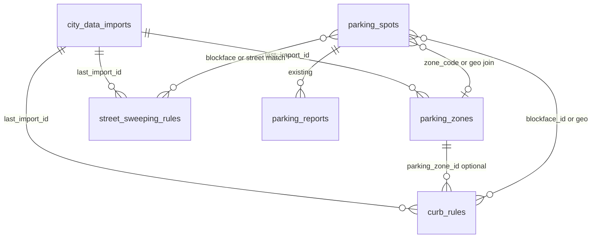

# City Data Integration Plan — Smart Parking (San Francisco)

> **Status:** Phase 1–3 ingestion prototype is **merged into `main`**. The `parking_spots` MVP experience (list/map/filters/reporting/realtime/favorites) is unchanged and still reads only `parking_spots`. City data now has one additive, non-authoritative UI path: a "City parking data (preview)" section in `MapScreen`, gated by `EXPO_PUBLIC_ENABLE_CITY_DATA_PREVIEW` (default **off**), that reads `normalized_parking_locations` through `packages/shared`'s deterministic candidate service. See "Mobile Runtime Integration" in [`ARCHITECTURE.md`](./ARCHITECTURE.md) §13. City candidates always have `availability.status = "UNKNOWN"` — never inferred as available.
>
> **Goal:** Import real city parking/curb data into **separate** tables without breaking Expo Go, auth, realtime, reports, or the 26-row `MOCK` seed in `parking_spots`.

### Current ingestion prototype (active)

| Item | Location |
|------|----------|
| Migration | `supabase/migrations/00005_city_parking_data.sql` |
| Ingest script | `scripts/ingest-sf-parking-data.ts` |
| Command | `pnpm ingest:sf-parking` (requires service role + migration applied) |

**Tables added (separate from `parking_spots`):**

| Table | Purpose |
|-------|---------|
| `city_parking_sources` | Registry of DataSF datasets we import |
| `city_parking_blocks` | SFMTA metered street blocks + merged regulation fields |
| `city_parking_meters` | Parking meter points |

**Inspection view (read-only, not in mobile app):**

| View | Purpose |
|------|---------|
| `city_parking_meters_clean` | Flattened meters for SQL Editor / API inspection (`00006`) |

**Datasets ingested (v1):**

1. [SFMTA Metered Street Blocks](https://data.sfgov.org/d/27b3-yjjx) (`27b3-yjjx`) → `city_parking_blocks`
2. [Parking Meters](https://data.sfgov.org/d/8vzz-qzz9) (`8vzz-qzz9`) → `city_parking_meters` — **first real run:** `pnpm ingest:sf-parking:meters` (100 rows)
3. [Parking regulations (blockface map)](https://data.sfgov.org/d/hi6h-neyh) (`hi6h-neyh`) → **lossless** `city_parking_regulations` by `objectid` (migration `00011`) plus a **lossy, deprecated** UPDATE of matching `city_parking_blocks` by guessed `blockface_id` so current lookup does not go empty. See [CITY_REGULATION_STORAGE.md](./CITY_REGULATION_STORAGE.md). **Join discovery V1:** there is no verified identifier joining live `hi6h-neyh` rows to blocks/meters ([DATASF_REGULATION_JOIN.md](./DATASF_REGULATION_JOIN.md); recommendation C) — `city_parking_regulations.block_id` stays null.

**Why the MVP is unaffected:** The mobile app still reads only `parking_spots` and `parking_reports`. City tables are optional, read-only for clients, and populated by a local script — not wired into the map UI yet.

### Inspection view: `city_parking_meters_clean`

Migration `00006_city_parking_views.sql` adds a **read-only** view over `city_parking_meters` joined to `city_parking_sources`. Use it to verify ingest quality in Supabase without reading large `raw_payload` JSON.

| Column | Meaning |
|--------|---------|
| `meter_id` | `post_id` or `external_id` |
| `status` | City `active_meter_flag` (not app availability) |
| `latitude` / `longitude` | WGS84 coordinates |
| `location_description` | e.g. `1301 POLK ST` |
| `last_ingested_at` | Row `imported_at` from last ingest |
| `source_name` | DataSF dataset display name |

**Example queries (Supabase SQL Editor):**

```sql
-- Row count after ingest
SELECT COUNT(*) FROM city_parking_meters_clean;

-- Sample rows
SELECT meter_id, status, latitude, longitude, location_description, source_name, last_ingested_at
FROM city_parking_meters_clean
ORDER BY last_ingested_at DESC
LIMIT 20;

-- Rows missing location text (data quality check)
SELECT meter_id, latitude, longitude, last_ingested_at
FROM city_parking_meters_clean
WHERE location_description IS NULL;
```

**Why not in the production app yet:** The Expo Go MVP still maps `parking_spots` only. This view is for operators/developers to inspect city ingest before any future UI or projection work. It uses `security_invoker = true`, so the same RLS read rules as the underlying city tables apply.

**Planned later (not in prototype):** street sweeping (`yhqp-riqs`), RPP zones (SFMTA GIS), projection into `parking_spots`, Edge Function cron sync. See §7 legacy design notes and §11.

### Phase 2: Normalized city layer — status

| Item | Status |
|------|--------|
| Migration `00007_normalized_city_parking.sql` | **In repo and merged** — apply in Supabase SQL Editor after `00005`/`00006` |
| Table `normalized_parking_locations` | **Implemented** — canonical city inventory (not `parking_spots`) |
| Script `scripts/normalize-city-parking.ts` | **Implemented** — upserts from `city_parking_meters` |
| Script `scripts/verify-normalized-parking.ts` | **Implemented** — read-only validation |
| Mobile app | **Preview-only, flag-gated** — `cityParkingService.ts`'s `fetchNearbyNormalizedLocationRows` feeds `MapScreen`'s "City parking data (preview)" section via `packages/shared`'s `findParkingCandidates`, only when `EXPO_PUBLIC_ENABLE_CITY_DATA_PREVIEW=true`. The primary `parking_spots` list/map is untouched. `getNormalizedParkingNearby`/`getNormalizedParkingByCity`/`getActiveNormalizedParking` remain unused by any screen. |

**Pipeline (run in order):**

```powershell
# Apply 00005 → 00006 → 00007 in Supabase, then:
$env:SUPABASE_URL = "https://YOUR_PROJECT.supabase.co"
$env:SUPABASE_SERVICE_ROLE_KEY = "your-service-role-key"
pnpm ingest:sf-parking:meters
pnpm normalize:city-parking
pnpm verify:normalized-parking
pnpm check:city-parking
```

| Command | Purpose |
|---------|---------|
| `pnpm normalize:city-parking` | Upsert meters → normalized rows (service role) |
| `pnpm verify:normalized-parking` | Validate row count, coords, duplicates, `raw_source` |
| `pnpm check:city-parking` | Inspect raw ingest via `city_parking_meters_clean` |

**Upsert key:** `(source_type, source_id)` e.g. `datasf_parking_meter` + `post_id`.

**Verification checklist:** row count > 0; valid lat/lng; no duplicate `(source_type, source_id)`; `active` is boolean; `raw_source` populated; `last_synced_at` set.

**Phase 3 — Read-only service layer:** `apps/mobile/src/services/cityParkingService.ts` is **implemented** — it provides `getNormalizedParkingNearby`, `getNormalizedParkingByCity`, `getActiveNormalizedParking`, and (new) `fetchNearbyNormalizedLocationRows` queries over `normalized_parking_locations`. This service uses the anon key (public read RLS). Only `fetchNearbyNormalizedLocationRows` is called by a screen today — it feeds `MapScreen`'s city-data preview section (flag-gated, off by default) via `packages/shared`'s `findParkingCandidates`. The other three exports remain unused by any screen.

**Mobile runtime integration (this milestone):** `apps/mobile` now depends on `@smart-parking/shared` as a real pnpm workspace package (`apps/mobile/src/services/candidateService.ts` calls `findParkingCandidates`, wiring `fetchNearbyParkingSpotRows` + `fetchNearbyNormalizedLocationRows` as the injected fetchers). Both fetchers use a corrected bounding-box prefilter (`apps/mobile/src/utils/geoBoundingBox.ts`) that accounts for longitude degrees shrinking with latitude — the previous `radiusMeters / 111_000` offset applied to both axes under-covered the east-west extent by ~20% at SF's latitude. The shared service still applies its own exact-radius haversine filter over whatever the prefilter returns.

Related: high-level architecture overview in [`ARCHITECTURE.md`](./ARCHITECTURE.md) §10.

### Regulation data — current capabilities (Parking Regulation Model V1)

**What is actually ingested today:** exactly one regulation dataset — DataSF's [Parking regulations (blockface map)](https://data.sfgov.org/d/hi6h-neyh) (`hi6h-neyh`), via `ingestRegulations()` in `scripts/ingest-sf-parking-data.ts`. Every fetched source row is UPSERTed into `public.city_parking_regulations` on `(source_id, objectid)` with `block_id` null (`00011`). The same run still merges (`UPDATE`) onto existing `public.city_parking_blocks` rows matched by guessed `blockface_id`, populating `regulation_type`, `agency`, `days_of_week` (raw text), `hours` (raw text), `hour_limit` (integer, hours — lossy vs source numeric), and `permit_area` (`rpparea1` only). That block merge remains **lossy and deprecated**. Live `hi6h-neyh` rows have no ingest blockface keys, so the legacy UPDATE still matches nothing; the new table retains the rows. Runtime lookup still reads `city_parking_blocks` only.

**Data gap:** `scripts/normalize-city-parking.ts` normalizes `city_parking_meters` only — it never reads `city_parking_blocks`, so none of the regulation fields above reach `normalized_parking_locations`. `normalized_parking_locations.time_limit` exists as a column but is hardcoded `null` by the normalization script; `restrictions` is built only from meter fields (`cap_color`/`on_offstreet_type`/`jurisdiction`/`meter_type`), never from block regulation fields. Net effect: real, ingested regulation data (`hour_limit`, `regulation_type`, etc.) is currently invisible to every downstream consumer (`normalized_parking_locations`, `ParkingCandidate`, the mobile app).

**Street sweeping does not exist anywhere in this repo** — no table, no ingestion script, no seed data. `STREET_SWEEPING` is only a placeholder value in the `normalized_parking_locations.parking_type` CHECK constraint and the mobile `ParkingType` union; nothing ever sets it. §7's `street_sweeping_rules` design below was never built (see §7.4) — DataSF's `yhqp-riqs` schedule dataset is not ingested.

**New in this milestone:** a deterministic domain representation for known regulations, independent of the (not-yet-built) legality engine:

- `ParkingRule` / `ParkingRuleKind` (`"METERED" | "TIME_LIMIT" | "OTHER"`) / `ParkingRuleSchedule` / `ParkingTimeWindow` / `DayOfWeek` — `packages/shared/src/domain/rule.ts`.
- `mapCityRegulationRowToParkingRules(row: CityParkingBlockRow)` — `packages/shared/src/adapters/regulation.ts`. Maps a `city_parking_blocks` row to zero or more `ParkingRule`s: a `TIME_LIMIT` rule when `hour_limit` is a real positive number; an `OTHER` rule when `regulation_type`/`agency`/`permit_area`/`days_of_week`/`hours` carry any information (preserved verbatim, not classified); an empty array when the row has none of the above.

**Regulation Model V1 review — a mistake was caught and fixed before commit:** the first version of this adapter emitted a `METERED` rule for *every* `city_parking_blocks` row, reasoning that the table is populated exclusively from DataSF's "SFMTA Metered Street Blocks" dataset. On review, that's an inference about which ingestion pipeline produced the row (via an unresolved `source_id` foreign key), not a fact verified on the row itself — exactly the kind of unverified inference this module must avoid. It was removed. `city_parking_blocks`-derived rules can now only be `TIME_LIMIT` or `OTHER`. `"METERED"` remains a valid `ParkingRuleKind` value, reserved for a future, separate adapter over `city_parking_meters` (the structurally reliable meter-inventory table — see "Meter data" above) — not built in this milestone. Meter inventory ("there is a meter here") and regulation ("a payment/time rule applies") are kept as distinct concepts, never collapsed into one kind.

A `ParkingRule` describes a regulation ("what applies"), never a legality verdict ("is parking legal now") — see "Legality evaluation" below for the (now-implemented) evaluator; every `ParkingCandidate`-attached `ParkingLegality` in this codebase still reports `status: "UNKNOWN"` (the evaluator exists but is not yet wired into candidate lookup — see below). `days_of_week` and `hours` are preserved verbatim via `ParkingRule.rawText` rather than parsed into `ParkingRuleSchedule` — there is no confirmed, safe parsing rule for either field's format, so `schedule.daysOfWeek` / `schedule.timeWindow` stay `null` (unknown) rather than guessed. This adapter is **not wired to any live Supabase query** — `city_parking_blocks` still isn't fetched by any mobile code; wiring a fetcher is deferred to a future milestone.

### Regulation lookup — join path (Parking Regulation Lookup / Association V1)

**Wired in this milestone.** `apps/mobile/src/services/regulationService.ts` now fetches the adapter above's input (`CityParkingBlockRow[]`), and `packages/shared/src/services/regulation.ts` (`findParkingRulesForLocation`) orchestrates fetch → map → flatten into `ParkingRule[]`, wired via `candidateService.ts`'s `findParkingRulesForCandidate(candidate)`. This answers "what regulation records are associated with this location?" — **not** "is parking legal now?"; no schedule evaluation exists.

**Identifier fields found by inspection:**

| Table | Own PK | Cross-table identifiers |
|---|---|---|
| `city_parking_blocks` | `id` (uuid) | `external_id` (unique with `source_id`), `blockface_id` (text, nullable, indexed but **not unique**) |
| `city_parking_meters` | `id` (uuid) | `external_id` (unique with `source_id`), `post_id`, `blockface_id` (text, raw, same source field as blocks'), `block_id` (uuid, **real FK** → `city_parking_blocks.id`, `ON DELETE SET NULL`, resolved once at ingest time via `blockIdByBlockface.get(blockfaceId)`) |
| `normalized_parking_locations` | `id` (uuid) | `source_id` (**text**, not a FK — the meter's `post_id`/`external_id` copied as a string, used only for `(source_type, source_id)` upsert idempotency), `raw_source` (jsonb, preserves `city_row_id` = the source meter's own `id`, and `blockface_id` = the source meter's raw `blockface_id`, verbatim) |

**Two possible ID-based join paths from a normalized row back to a block — both used, in strength order (corrected from an earlier version that used only the weaker path):**
1. **PRIMARY — `block_id` FK:** `normalized_parking_locations.raw_source.city_row_id` → `city_parking_meters.id` → `city_parking_meters.block_id` → `city_parking_blocks.id`. `block_id` is a real, DB-enforced FK — an exact PK lookup, so at most one row can match. Tried first. Falls through to the fallback only when `city_row_id` is missing, the meter row isn't found, or `block_id` is `null` (the documented ingest-order gap).
2. **FALLBACK — `blockface_id` text match:** `normalized_parking_locations.raw_source.blockface_id` → `city_parking_blocks.blockface_id` (exact equality). Used only when the primary path is unusable. Weaker: no FK/uniqueness constraint backs it (only `(source_id, external_id)` is unique on `city_parking_blocks`), so it is not guaranteed one-to-one by the schema, even though it's expected to be in practice for this single-source dataset.

**Cardinality.** Primary path: at most one row (PK lookup). Fallback path: not guaranteed one-to-one — `fetchCityParkingBlocksForLocation` returns an array (0, 1, or more rows) either way, never assumes exactly one. No confidence score or certainty percentage was introduced to express this — the code path taken (primary vs. fallback) is itself the only "strength" signal, documented in comments.

**No migration required.** `raw_source.city_row_id` and `raw_source.blockface_id` already exist in every meter-sourced `normalized_parking_locations` row (written by `scripts/normalize-city-parking.ts` since migration `00007`) — no schema change was needed to perform this lookup.

**Not associated by geography.** No nearest-block, nearest-coordinate, nearest-street-name, fuzzy-address, or substring-street matching was used or considered sufficient — only exact ID equality on columns both ingestion scripts already populate from the same city source fields.

**Candidate source safety.** `findParkingRulesForCandidate(candidate)` only performs this lookup for CITY-sourced candidates (checked via the existing `isCityProvenance` / `ParkingEvidence.sourceCategory` signal — not a geographic or table proxy). `parking_spots`-sourced (`CURRENT_SPOTS`/`MOCK`) candidates have a `location.id` from a different table entirely (`parking_spots.id`, not `normalized_parking_locations.id`); calling this function with one resolves to `[]` immediately, without issuing any Supabase query.

### Regulation association hardening (V1)

**New in this milestone.** The FALLBACK join path above (`blockface_id` text match) previously returned **every** matching `city_parking_blocks` row unconditionally, with no check on how many rows matched. Since `blockface_id` has no uniqueness constraint, this meant an ambiguous match (2+ rows sharing the same `blockface_id`) silently returned all of them as if each were a confirmed association — combining unrelated blocks' regulations onto one location.

**Why this needed fixing before schedule applicability.** Once a future milestone teaches `evaluateParkingLegality` to read `schedule.daysOfWeek`/`schedule.timeWindow` (not done in this milestone — see "Legality evaluation" above, unchanged), a `TIME_LIMIT` rule can start proving real `ILLEGAL` verdicts from schedule data, not just `maxDurationMinutes`. Attaching a rule from an ambiguous, unverified association at that point could falsely reject a candidate based on a regulation that was never actually confirmed to apply to it. The system's rule must be **ambiguous association → `UNKNOWN`**, never **ambiguous association → treat every possible rule as applicable**.

**Corrected fallback semantics.** `apps/mobile/src/services/regulationService.ts`'s `fetchBlockRowsViaBlockfaceIdFallback` now passes its raw query result through `resolveExactFallbackMatches` (new file: `apps/mobile/src/services/regulationAssociation.ts`, a small pure helper with zero imports):
- 0 exact matches → `[]` (already unambiguous — unchanged)
- exactly 1 exact match → that row (unambiguous — unchanged)
- 2+ exact matches → `[]` (ambiguous — **changed**: previously returned all matching rows)

No row is ever arbitrarily picked (no `.single()`/`[0]`) and ambiguous rows are never combined/unioned — both were explicitly avoided.

**Primary path is unaffected and remains authoritative.** `fetchBlockRowsViaMeterForeignKey` (the FK-backed `block_id` path) was not modified. It was already correct: `block_id` is a PK-targeting FK, so at most one row can ever match, and — already true before this milestone, confirmed by inspection, not changed — if the primary path resolves a `block_id` but the referenced block query unexpectedly returns zero rows, the function returns `[]` (not `null`), and the caller (`fetchCityParkingBlocksForLocation`) treats "primary path was usable" (`viaForeignKey !== null`) as reason enough to return that `[]` directly, without silently falling through to the weaker fallback. A resolved-but-empty primary result is a data-integrity signal, not permission to guess via the fallback.

**Error semantics unchanged.** A genuine Supabase query/network error still throws (`throw new Error(error.message)`) exactly as before in both the primary and fallback functions. Only the "how many rows count as a safe association" decision was hardened — ambiguity and query failure remain distinguishable and are never conflated.

**No new confidence model.** No `associationConfidence`, confidence percentage, or `EXACT_FK`/`BLOCKFACE_FALLBACK` enum was added. The existing two-path structure (primary vs. fallback, described in code comments) remains the only "strength" signal; this milestone only changed the fallback's row-count decision.

**Verification.** `scripts/verify-regulation-association.ts` (`pnpm verify:regulation-association`) is a zero-dependency script testing `resolveExactFallbackMatches` directly: 0/1/2/3+ rows, confirming the returned single-row case is referentially the original row (not reconstructed), and confirming ambiguous input is neither reduced to the first row nor combined into a multi-row result. The primary path and the CITY-provenance gate are unchanged by this milestone and were confirmed correct by code inspection rather than a new runtime test — importing `regulationService.ts`/`candidateService.ts` from a bare Node/tsx script fails (`supabaseUrl is required`) because both construct a real Supabase client at module-load time; refactoring that for testability was judged out of scope for this narrow hardening milestone.

### Legality evaluation (Legality Engine V1)

`packages/shared/src/services/legality.ts` adds `evaluateParkingLegality(rules: ParkingRule[], interval: ParkingRequestedInterval): ParkingLegality` — a pure, deterministic function with no Supabase/network/env/React/mobile/LLM dependency. `ParkingCandidate.legality` itself still always reports `status: "UNKNOWN"` unchanged (see `packages/shared/src/adapters/parking.ts`) — this evaluator's real verdict is only available through the separate orchestration layer below (`findAndEvaluateParkingCandidates`), which composes it alongside a candidate rather than mutating `candidate.legality` in place.

**Why a new `ParkingRequestedInterval` type instead of reusing `ParkingSearchConstraints`.** `ParkingSearchConstraints.arrivalTime`/`departureTime` are individually nullable with soft semantics ("null means now" / "null means the caller doesn't know how long they'll stay") intended for a future search contract, not a duration calculation. `ParkingRequestedInterval` (`packages/shared/src/domain/legality.ts`) requires both `arrival` and `departure` as full ISO 8601 date-time strings with an explicit `Z`/offset — the same convention already used for every other timestamp in this domain model (`ParkingEvidence.retrievedAt`, etc.). A bare date or any other locale-dependent format is rejected (returns `UNKNOWN`/`INVALID_INTERVAL`, never guessed).

**What is evaluated, and what is deliberately not:**
- Duration: `departure - arrival` in minutes, compared against any known `TIME_LIMIT` rule's `schedule.maxDurationMinutes`. This needs no timezone knowledge — both timestamps are absolute instants, so their difference is timezone-independent.
- `schedule.allDay` (a plain boolean) — the one schedule field this engine reads besides `maxDurationMinutes`, because it needs no date/timezone calculation. It is the APPLICABILITY GATE: a `TIME_LIMIT` rule's `maxDurationMinutes` can only prove either `ILLEGAL` or `LEGAL` once `allDay === true` ("confirmed-applicable"). `null`/`false` is always "unresolved", never inferred as "applies" or "doesn't apply".
- **Never evaluated:** `schedule.daysOfWeek`, `schedule.timeWindow`, `schedule.timezone` (would require a timezone-aware "which local day/hour is this instant" calculation this engine deliberately does not perform — see the file's doc comment), or any of `rawText`/`sourceRegulationType`/`agency`/`permitArea` (free text / unvalidated vocabulary — presence of an `OTHER` rule is used as a signal, its content never is; applicability is never inferred from `rawText` either).

**Corrected in review: the applicability gate must apply symmetrically.** The first version of this evaluator let *any* exceeded `TIME_LIMIT` rule prove `ILLEGAL`, regardless of `allDay` — only the `LEGAL` direction was gated on confirmed applicability. That was asymmetric and unsafe: an unresolved rule (the common case today, since the adapter never sets `allDay` to anything but `null`) could sink a candidate to `ILLEGAL` on exceeded duration alone, while the same unresolved rule couldn't raise a candidate to `LEGAL` even when duration fit comfortably. Both directions now require the same gate — `schedule.allDay === true` — before a `TIME_LIMIT` rule's `maxDurationMinutes` can prove anything at all; an unresolved `TIME_LIMIT` rule now contributes `UNKNOWN` regardless of whether the requested duration happens to exceed its `maxDurationMinutes`.

**Precedence (checked in order):** (1) invalid or calendar-impossible interval → `UNKNOWN`/`INVALID_INTERVAL`; (2) no rules → `UNKNOWN`/`INSUFFICIENT_RULE_DATA` (absence of known regulation is not evidence of unrestricted parking); (3) any **confirmed-applicable** (`allDay === true`) `TIME_LIMIT` rule with a usable `maxDurationMinutes` that's exceeded → `ILLEGAL`/`EXCEEDS_MAX_DURATION` (checked before steps 4–6 — a proven, confirmed-applicable violation outranks "unknown"; an unresolved `TIME_LIMIT` rule is skipped entirely here, it cannot prove a violation no matter how large the requested duration is); (4) otherwise, any `OTHER` rule present → `UNKNOWN`/`UNPARSED_RESTRICTION`; (5) otherwise, any `METERED` rule present → `UNKNOWN`/`INSUFFICIENT_RULE_DATA` (not currently produced by any adapter — handled defensively); (6) otherwise, any `TIME_LIMIT` rule with unresolved applicability (`allDay !== true`) → `UNKNOWN`/`INSUFFICIENT_RULE_DATA`; (7) otherwise, `LEGAL` only if **every** rule is a confirmed-applicable `TIME_LIMIT` with a usable, non-exceeded `maxDurationMinutes`.

**A usable `maxDurationMinutes` must be finite and positive.** `NaN`, `Infinity`, `0`, and negative values are all treated as "no usable value" — they can prove neither `ILLEGAL` (step 3) nor `LEGAL` (step 7), even on an otherwise confirmed-applicable rule. This is a defensive guard against malformed rule data; it does not change `ParkingRule`'s type.

**Interval parsing rejects impossible calendar dates rather than silently normalizing them.** `new Date("2026-02-30T10:00:00Z")` — a syntactically-ISO but calendrically-impossible string — normalizes to `2026-03-02T10:00:00.000Z` in JavaScript instead of failing to parse. The evaluator's `parseInstantMs` independently validates year/month/day (against actual days-in-month, including leap years) and hour/minute/second range BEFORE calling `Date.UTC`, so an impossible date is rejected (`UNKNOWN`/`INVALID_INTERVAL`) rather than silently becoming a different, valid instant. No date library was added — this is plain arithmetic (a small leap-year check and a 12-entry days-per-month table).

**`LEGAL` is effectively unreachable with today's real data, on purpose; unresolved-rule `ILLEGAL` now is too.** `mapCityRegulationRowToParkingRules` never sets `schedule.allDay` to anything but `null` (it never parses `days_of_week`/`hours`), so step 7 above can never be satisfied by a real `city_parking_blocks`-derived rule today, and — after this correction — neither can an unresolved rule alone satisfy step 3. This is intentional: a `TIME_LIMIT` rule with unconfirmed applicability cannot prove legality OR illegality on its own (it might only apply part of the day). "No proven violation" is never converted into `LEGAL`, and "not proven applicable" is never converted into `ILLEGAL` — see this codebase's core principle that `UNKNOWN` is a first-class, correct result, not a fallback to avoid.

**`ParkingLegality` gained one new field:** `reasonCode: LegalityReasonCode | null` (`"EXCEEDS_MAX_DURATION" | "INSUFFICIENT_RULE_DATA" | "UNPARSED_RESTRICTION" | "INVALID_INTERVAL" | null`) — a machine-readable counterpart to the existing human-readable `reason` string, for future orchestration code to branch on without parsing prose. It is `null` on `LEGAL` verdicts and on the two pre-existing adapter-level `UNKNOWN` placeholders in `packages/shared/src/adapters/parking.ts` (`mapParkingSpotToCandidate`/`mapNormalizedLocationToCandidate`), which don't call this evaluator at all and were updated only to add this required field.

**Verification.** `scripts/verify-legality-engine.ts` (`pnpm verify:legality-engine`) is a small, zero-dependency script — not a new test framework — checking 23 representative cases: no rules; invalid/unparseable/impossible-calendar/out-of-range intervals (Feb 30, April 31, hour 24, plus a valid Feb 29 leap day accepted); the applicability-gate correction (exceeded + `allDay=null` → `UNKNOWN`, exceeded + `allDay=true` → `ILLEGAL`, within-limit for both); interaction with `OTHER`/`METERED`, including the case where a confirmed violation coexists with an `OTHER` rule (`ILLEGAL` wins) versus an unresolved exceeded rule coexisting with `OTHER` (`UNKNOWN`); malformed `maxDurationMinutes` (`NaN`/`Infinity`/`0`/negative); and multi-rule combinations.

### Search + legality orchestration (Find and Evaluate Parking Candidates V1)

**New in this milestone.** `packages/shared/src/services/orchestration.ts` adds `findAndEvaluateParkingCandidates(request: {candidateSearch, interval}, deps): Promise<EvaluatedParkingCandidate[]>` — connecting `findParkingCandidates` → a per-candidate rule fetcher → `evaluateParkingLegality` into one deterministic flow. This is the first milestone where discovery, regulation lookup, and legality evaluation actually run together for real candidates; each piece itself is unchanged.

**Why not `findLegalParking`.** With today's real ingested city data, `schedule.allDay` is never confirmed `true` (see the Legality Engine section above), so most CITY candidates with a known `TIME_LIMIT` rule evaluate to `UNKNOWN`, not `LEGAL`. This function returns **every** discovered candidate — `UNKNOWN` included, in the same distance order `findParkingCandidates` produces — never only the legal ones. Naming it `findLegalParking` would promise stronger semantics than the system can currently prove. That name is reserved for a later milestone once filtering/rule-coverage semantics are mature enough to justify it; V1 is named for what it actually does: find, then evaluate.

**Result shape.** `EvaluatedParkingCandidate { candidate: ParkingCandidate; rules: readonly ParkingRule[]; legality: ParkingLegality }` — explicit composition. `candidate.legality` is left exactly as `findParkingCandidates` produced it (always `UNKNOWN`/`null` reasonCode); the real, requested-interval verdict lives only in this type's own `legality` field, never written back onto `candidate`.

**Why the rule fetcher is injected instead of called directly.** `findParkingRulesForCandidate` (apps/mobile's existing candidate→rules lookup, including its CITY-provenance gate) depends on Supabase-backed joins in `apps/mobile/src/services/regulationService.ts` — `packages/shared` has no Supabase dependency and does not gain one here. Instead, `findAndEvaluateParkingCandidates` accepts a `fetchRulesForCandidate: (candidate) => Promise<ParkingRule[]>` dependency with exactly `findParkingRulesForCandidate`'s existing signature/semantics (resolves to `[]` for "no known rules", including non-CITY candidates — never throws for that case). `apps/mobile/src/services/candidateService.ts`'s new `findAndEvaluateNearbyParkingCandidates` wires the real, unchanged `findParkingRulesForCandidate` in as that dependency — so this package still makes no CITY-provenance/routing decision of its own; it only calls what it is given.

**Source semantics preserved.** CURRENT_SPOTS and CITY candidates are both accepted (per `request.candidateSearch`'s existing source-selection contract) and evaluated identically by this orchestrator — it has no source-specific branching. In practice, CURRENT_SPOTS/MOCK candidates' `fetchRulesForCandidate` call resolves to `[]` (the CITY-provenance gate inside the real implementation), which `evaluateParkingLegality` correctly turns into `UNKNOWN`/`INSUFFICIENT_RULE_DATA` — no legality is fabricated for a source that has no regulation association.

**Error isolation.** A candidate-discovery failure (step 1: `findParkingCandidates` itself, e.g. no fetcher supplied, or an injected fetcher's own Supabase error) fails the whole call — the error propagates unchanged, since there is nothing useful to return without candidates. An individual candidate's rule-lookup failure (step 2) is caught per-candidate and treated as `[]` rules — never fabricated — so that candidate is still returned, evaluated as `UNKNOWN`/`INSUFFICIENT_RULE_DATA` by the same, unmodified `evaluateParkingLegality` path used for a genuine "no rules found" result. One accepted V1 limitation: a failed lookup and a genuine zero-rules result are indistinguishable in the returned `reasonCode` — no error-tracking field was added to keep the result shape minimal.

**Concurrency.** Candidate discovery can return on the order of ~100-200 rows in the worst case (mobile's per-fetcher query caps — `NEARBY_PARKING_QUERY_LIMIT`/`DEFAULT_NEARBY_LIMIT`, both 100 — see `apps/mobile/src/services/parkingService.ts`/`cityParkingService.ts`), and only CITY candidates trigger a real (possibly multi-query) regulation lookup. Rather than an unbounded `Promise.all` across up to ~100 real lookups, a small hand-rolled worker-pool helper (`mapWithConcurrencyLimit`, no dependency added) bounds concurrent rule lookups to `DEFAULT_RULE_LOOKUP_CONCURRENCY` (8) by default, overridable via `deps.maxConcurrentRuleLookups`. Result order is preserved regardless of completion order (each worker writes into its own pre-allocated index).

**No duplicate legality logic.** The orchestrator never independently computes duration, applicability, coverage, or a status — it calls `evaluateParkingLegalConclusion({ candidate, rules, interval, coverageDeclaration })`, which composes the known-rule engine and the coverage evaluator. `evaluateParkingLegality` remains the known-rule authority; the composition is the final verdict written to `EvaluatedParkingCandidate.legality`.

**Verification.** `scripts/verify-orchestration.ts` (`pnpm verify:orchestration`) is a small, zero-dependency script — not a new test framework — using fake injected `fetchNearbySpots`/`fetchRulesForCandidate` functions. It checks 11 cases: no candidates → `[]`; a candidate with no rules → `UNKNOWN`; an all-day safe `TIME_LIMIT` with UNDECLARED coverage → `UNKNOWN` (coverage gate); a confirmed exceeded `TIME_LIMIT` → `ILLEGAL` (coverage does not weaken a violation); an unresolved `TIME_LIMIT` → `UNKNOWN`; a candidate simulating no city-rule association → `UNKNOWN`; candidate ordering preserved (nearest-first, independent of input order); one candidate's simulated rule-lookup failure isolated from another candidate's evaluation; three candidates evaluated independently; MOCK + COMPLETE + known LEGAL → `LEGAL`; and a simulated candidate-discovery failure propagating (not swallowed).

**Mobile wiring, not UI wiring.** `apps/mobile/src/services/candidateService.ts`'s `findAndEvaluateNearbyParkingCandidates(latitude, longitude, radiusMeters, interval, options)` supplies the three real dependencies (the existing `fetchNearbyParkingSpotRows`/`fetchNearbyNormalizedLocationRows`, selected via `options.sources` exactly like the existing `findNearbyParkingCandidates`, plus `fetchRulesForCandidate: findParkingRulesForCandidate`, unchanged). This is new mobile-reachable code — re-verified via `npx expo export --platform android --source-maps`, whose sourcemap now genuinely includes `packages/shared/src/services/orchestration.ts` and `services/legality.ts` in the bundle graph — but it is not called from any screen/UI in this milestone.

### Regulation coverage / legal-conclusion readiness (V1)

**New in this milestone.** `packages/shared/src/domain/coverage.ts` and `packages/shared/src/services/regulationCoverage.ts` add `evaluateLegalConclusionReadiness({ candidate, rules, coverageDeclaration? }): LegalConclusionCoverage`. This answers "is the regulation evidence sufficient to even permit a LEGAL conclusion?" — **not** "is parking legal?" and **not** a confidence score. Coverage is categorical: `READY` | `INCOMPLETE`.

It is **not** wired into `evaluateParkingLegality` (the known-rule engine is unchanged). Coverage-gated final conclusions live in `evaluateParkingLegalConclusion` (`packages/shared/src/services/legalConclusion.ts`): known-rule `ILLEGAL` is unchanged; known-rule `UNKNOWN` is unchanged; known-rule `LEGAL` becomes final `LEGAL` only when coverage is `READY`, otherwise `UNKNOWN` / `INSUFFICIENT_RULE_DATA`. Orchestration calls that composition with `coverageDeclaration` defaulting to `UNDECLARED`. Production CITY lookup must not pass `COMPLETE`.

**Verified answers to the source-completeness questions (from code/schema, not guessed):**

1. **Does one associated `city_parking_blocks` row represent all relevant regulations for the parking location?** No. The table stores a single `regulation_type` / `days_of_week` / `hours` / `hour_limit` / `permit_area`. `ingestRegulations()` `UPDATE`s that same block for every matching source row (`scripts/ingest-sf-parking-data.ts`), so later source rows overwrite earlier ones. Primary lookup returns at most one block (`block_id` PK). Street sweeping (`yhqp-riqs`) is a different dataset and is not ingested. Meter inventory is a different table with no `METERED` adapter.
2. **Can multiple regulation records exist for the same physical location?** Yes in the source: full-dataset profiling of `hi6h-neyh` (7788 rows) found 127 `fid_100` values with 2+ rows, 47 of those groups with materially different regulation/days/hours/permit payloads (see `docs/CITY_REGULATION_STORAGE.md`). `fid_100="0"` is a 328-row sentinel, not a location key. Live rows have **no** `blockface_id`. Yes in our schema: `city_parking_blocks.blockface_id` is not unique. The fallback association path returns `[]` when 2+ block rows share a `blockface_id`.
3. **Are unmatched regulation rows dropped during ingestion?** They are **retained** in `city_parking_regulations` (V1 UPSERT by `objectid`, `block_id` null). The legacy `city_parking_blocks` UPDATE still drops them from the block table when `blockface_id` is missing. Runtime lookup still only sees the block table.
4. **Does the normalized candidate retain enough provenance to know whether a regulation association is complete?** No. `normalized_parking_locations.raw_source` keeps `city_row_id` and `blockface_id` for the join, not unmatched counts, multi-row source cardinality, whether fallback discarded 2+ matches, or whether other datasets apply. `ParkingCandidate` does not carry `raw_source`. Empty `ParkingRule[]` is indistinguishable among "no association", "ambiguous association", "no regulations on the block", and "lookup failed" (orchestration already documents that last pair).
5. **Does DataSF expose a field/category that tells us all restrictions for the block have been captured?** Not in anything this pipeline ingests. `ingestRegulations()` maps `regulation`/`agency`/`days`/`hours`/`hrlimit`/`rpparea1` only. Prior profiling of `hi6h-neyh` found `regulation_type` to be free text and RPP columns to have empty DataSF descriptions. No completeness flag is stored on `city_parking_blocks`.
6. **Can the current system know that street sweeping / permit / meter requirements are absent rather than merely not ingested?** No. Street sweeping has no table and no ingest. Permit: `rpparea1` is stored as raw `permit_area` and never evaluated; `rpparea2`/`rpparea3` are not persisted. Meter payment: `"METERED"` is a reserved `ParkingRuleKind` not produced by the blocks adapter. `regulation_type` values such as `"No parking any time"`, `"No oversized vehicles"`, `"No overnight parking"`, `"Government permit"`, `"Pay or Permit"` become generic `OTHER`, not classified absences.

**READY semantics.** `READY` requires an explicit `coverageDeclaration: "COMPLETE"`, MOCK-only provenance on the candidate and every rule, at least one rule, every rule `TIME_LIMIT` (no `OTHER`, no `METERED`), and a fully known schedule (`allDay === true`, or a fully parsed window with days + timeWindow + timezone) plus a usable `maxDurationMinutes`. The live CITY lookup never passes `COMPLETE`; if a caller did, CITY provenance still forces `INCOMPLETE`.

**INCOMPLETE semantics.** Default for live data. Includes: no rules; undeclared completeness; CITY/COMMUNITY provenance; `OTHER`; `METERED`; unsupported/partial TIME_LIMIT schedules.

**Real CITY candidates cannot currently be READY.** That is the correct V1 outcome, not a missing feature. MOCK/synthetic fixtures can be `READY` only when explicitly declared complete as above.

**No database-specific metadata was added.** The evaluator reads `ParkingCandidate` evidence, `ParkingRule[]`, and the optional declaration. It does not query Supabase.

**Verification.** `scripts/verify-regulation-coverage.ts` (`pnpm verify:regulation-coverage`). Coverage-gated final conclusions are verified by `scripts/verify-legal-conclusion.ts` (`pnpm verify:legal-conclusion`).

**Storage (implemented V1).** Lossless one-to-many `city_parking_regulations` is in [`CITY_REGULATION_STORAGE.md`](./CITY_REGULATION_STORAGE.md) and migration `00011`. Full-dataset profiling (7788 rows, 2026-09-15) found `objectid` unique and ingest `blockface_id` keys **absent** on every live regulation row. Join discovery V1 ([`DATASF_REGULATION_JOIN.md`](./DATASF_REGULATION_JOIN.md)) found **no verified identifier join** to `city_parking_blocks` / meters (recommendation **C**), so `block_id` stays null. Runtime still uses legacy block columns. This does **not** make CITY coverage `READY`.

**Spatial design follow-up (2026-09-18).** [Regulation spatial association design V1](./DATASF_REGULATION_JOIN.md#15-spatial-association-design-v1--2026-09-18) profiles all five public geometry sources and a 266-regulation spatial sample. Citywide curb lines are the strongest geometric candidate, but side identity, extent, data age, and corner/opposite-curb ambiguity remain unresolved. Association is **PLAUSIBLE_BUT_UNPROVEN**; no matcher or `block_id` population was added. A future verified association would address regulation-to-location linkage only, leaving sweeping, permit/payment interpretation, `OTHER`, schedule grammar, and city-source completeness unresolved. CITY stays **INCOMPLETE**. Run the read-only diagnostics with `pnpm.cmd exec tsx scripts/profile-regulation-spatial.ts`.

**Spatial validation V2 (2026-09-18).** [Full-source results and rejection rules](./DATASF_REGULATION_JOIN.md#16-spatial-association-validation-v2--2026-09-18) cover 7,778 usable regulations against 18,355 citywide curbs. Of 165 rows passing a conservative geometry-only screen, none has independently verified curb-side/extent evidence: 7,695 usable rows remain ambiguous and 83 have no candidate within the 50 m diagnostic search. Ten source rows lack usable geometry. PostGIS is not enabled per the user's production SQL check. Future work should use reviewed offline computation and explicit curb/interval association records; no production or runtime change was made. CITY remains **INCOMPLETE**. Run V2 with `pnpm.cmd exec tsx scripts/profile-regulation-spatial.ts --v2 --evidence` (public reads; pair evidence on stdout).

**Association storage design V1.** [The proposed run/assessment/curb-interval model](./CITY_REGULATION_ASSOCIATION_STORAGE.md) supports unmatched/excluded assessments, multiple rules per target, and jointly reviewed complementary targets per regulation. No persisted curb-version entity exists today, so the conditional SQL and TypeScript contracts remain documentation; no migration, shared exports, association population or runtime switch was added. Publication must require independent side/extent evidence and resolved competing candidates. CITY remains **INCOMPLETE**.

**Curb feature storage design V1.** [The proposed snapshot/version storage model](./CITY_CURB_STORAGE.md) profiles all 18,355 citywide curb rows: `globalid` is unique in this capture, but durable physical-curb identity is unproven. Immutable source-feature versions plus explicit snapshot membership would preserve geometry and provenance for future reviewed interval associations. Canonicalization, durable capture retention, interval measurement, and publication guards still need settled implementation contracts, so migrations and shared exports are deferred. No curb ingest, association population, or runtime change was added. CITY remains **INCOMPLETE**. Repeat the public read-only profile with `pnpm.cmd exec tsx scripts/profile-regulation-spatial.ts --curb-storage`.

**Curb snapshot + canonicalization contract V1.** [The capture and artifact contract](./CITY_CURB_SNAPSHOT_CONTRACT.md) specifies ordered public fetches, explicit consistency limits, retained raw bodies and direction-sensitive feature/dataset digests. Offline conformance and synthetic archive reconstruction are implemented outside runtime. The live double-capture experiment stopped on HTTP 403 before source rows were fetched. Migrations remain deferred for live/operational validation, interval measurement and database publication/immutability guards. CITY remains **INCOMPLETE**.

**Curb interval measurement contract V1.** [The offline interval contract](./CITY_CURB_INTERVAL_CONTRACT.md) now binds nine-decimal fractions to an immutable curb version and the fixed `sf-curb-planar-um-v1` measurement model. It preserves direction, reports projection ties, and requires explicit continuous-extent evidence before conditional construction. Separate/adjacent intervals and stacked rules are supported without automatic merging. Interval fields are now specified, but live snapshot validation, operational artifact retention and database publication/immutability guards still block migration. No regulation association, runtime or coverage change was made; CITY remains **INCOMPLETE**.

**Curb publication + immutability guards V1.** [The SQL design and static checks](./CITY_CURB_PUBLICATION_CONTRACT.md) define STAGING/VALIDATED/PUBLISHED/FAILED snapshots, append-only versions, frozen membership, independent artifact attestation and atomic per-source publication with an expected predecessor. Superseded snapshots remain immutable published history. Isolated PostgreSQL execution/privilege/concurrency tests still gate schema readiness; live double-capture validation and operational artifact retention separately gate production rollout. No migration file, DB changes or runtime/coverage change was made. CITY remains **INCOMPLETE**.

### Regulation schedule data profiling (V1) — observed facts, not a parser design

**New in this milestone.** Before designing any `days_of_week`/`hours` parser, `scripts/profile-regulation-data.ts` (`pnpm profile:regulation-data`) profiled the REAL values behind `city_parking_blocks`'s regulation columns. It adds no parser, no schedule-applicability logic, and no change to `evaluateParkingLegality`/`ParkingRuleSchedule`/`mapCityRegulationRowToParkingRules` — it only reads and counts.

**Data source used.** No Supabase project is reachable from this environment (no `SUPABASE_URL`/`SUPABASE_SERVICE_ROLE_KEY`/`.env` configured), so the already-populated `city_parking_blocks` table (option A) could not be queried directly. Instead, this profiled the exact DataSF Socrata dataset `scripts/ingest-sf-parking-data.ts` already fetches regulation data from — `hi6h-neyh`, "Parking Regulations" (`DATASETS.regulations.datasetId`) — a public, unauthenticated JSON endpoint, confirmed reachable. Field extraction copies `ingestRegulations()`'s exact `pickString`/`pickNumber` key lists verbatim, so the profile reflects what would actually be persisted into `city_parking_blocks`, not just the raw Socrata schema.

**Sample size.** 3,000 rows (of the dataset's real total of 7,788 rows at profiling time — confirmed via a `$select=count(*)` Socrata query), fetched via the same paginated `$limit`/`$offset` pattern the ingestion script already uses. This is a bounded sample, not the full dataset, and not every row in `city_parking_blocks` (which also blends in `city_parking_meters`-derived rows without regulation data at all).

**Null / non-null counts (of 3,000 sampled rows):**

| Field | Non-null | Null |
|---|---|---|
| `regulation_type` | 2,990 | 10 |
| `agency` | 39 | 2,961 |
| `days_of_week` | 2,894 | 106 |
| `hours` | 2,924 | 76 |
| `hour_limit` | 2,895 | 105 |
| `permit_area` (as currently mapped) | **0** | **3,000** |

**PRIMARY FINDING — `permit_area` was always null in practice, a verified mapping gap, not a data-sparsity issue — FIXED in the "DataSF permit area ingestion fix" milestone below.** `ingestRegulations()` used to read `permit_area` from Socrata keys `["permitarea", "permit_area"]`. Neither key ever existed in this dataset's real rows — the actual field is named `rpparea1` (with `rpparea2`/`rpparea3` present on a minority of rows for blocks with more than one permit area). Profiling `rpparea1` directly found it non-null on 2,500 of 3,000 rows (83%) — real, common data — but it was not reaching `city_parking_blocks.permit_area` because of this key-name mismatch. This profiling-only milestone did not fix it (out of scope at the time); see the dedicated section below for the fix that followed.

**`regulation_type` — 13 distinct values observed, dominated by one, with case/spelling inconsistency.** `"Time limited"` accounts for 2,639/2,990 non-null (88%). Other values: `"No oversized vehicles"` (206), `"No parking any time"` (64), `"Government permit"` (22), `"Time Limited"` (18 — different capitalization, same apparent meaning as `"Time limited"`), `"Pay or Permit"` (15), `"Limited No Parking"` (14), `"No overnight parking"` (8), plus rare one-off values including an apparent typo `"Time LImited"` (1). Vocabulary is small and mostly consistent, but not perfectly normalized — a future classifier would need case-insensitive matching and to decide how to treat near-duplicate/typo variants.

**`agency` — almost always null (2,961/3,000), and only meaningful for a small non-`"Time limited"` minority.** The 39 non-null values are `"SFMTA"` (18), `"SFPD"` (7), `"City Hall"` (5), `"SFGH"` (3), `"Customs"` (2), and single occurrences of `"DEA"`, `"DPH"`, `"Cable Car"`, `"Emergency"`. None of the sampled `"Time limited"` rows carried a non-null `agency` in this sample.

**`hour_limit` — a small, clean, structurally consistent set of values.** Observed distinct values: `2` (2,229 — the large majority), `0` (231), `1` (202), `4` (154), `3` (62), `72` (15), `12` (2). This confirms the existing adapter's `hasValidHourLimit` guard is correctly conservative: `0` is common (231 rows) and must never be read as "no limit" — the adapter already treats it as "not a known time limit," which this profiling supports as correct, not overly cautious. **`hour_limit` correlates strongly, but not perfectly, with `regulation_type`:** `"Time limited"` rows have a positive `hour_limit` in 2,635/2,639 cases (>99%), while every `"No oversized vehicles"`/`"No parking any time"`/`"Government permit"`/`"Limited No Parking"`/`"No overnight parking"` row has `hour_limit` absent or `0` — consistent with those regulation types not being duration-based. The 4 exceptions (`"Time limited"` rows without a positive `hour_limit`) and the 5 `"Time Limited"`/1 `"Time LImited"` rows that DO have one show the correlation is strong but not a safe substitute for reading `hour_limit` directly.

**`days_of_week` — only 7 distinct values in 2,894 non-null rows, but with real ambiguity.** `"M-F"` (2,104), `"M-Sa"` (516), `"M-Su"` (263) — these three account for 99.7% of non-null values and look like an unambiguous "single-letter-range" convention (`Su/M/T/W/Th/F/Sa`, using `-` for a contiguous range). However: `"M-S"` appears 5 times — genuinely ambiguous, since `"S"` alone doesn't disambiguate between Saturday and Sunday the way `"Sa"`/`"Su"` do elsewhere in the same field. `"M, TH"` appears 5 times — a comma-separated explicit day list (not a range) using a different abbreviation style (`"TH"` for Thursday, two letters, vs. the single/double-letter range endpoints elsewhere). One row has lowercase `"m-f"` — a case inconsistency against the otherwise-consistent capitalized convention. No weekend/everyday phrases were observed in this sample.

**`hours` — 40 distinct values in 2,924 non-null rows, structurally consistent as digit-dash-digit but inconsistently padded, with genuine overnight windows.** 2,923/2,924 non-null values match `^\d{1,4}-\d{1,4}$` (a start and end expressed as digits with no colon, no AM/PM, no explicit units — e.g. `"800"` means 8:00, `"1800"` means 18:00). Within that: digit padding is inconsistent — `"900-1800"` (178 occurrences) vs. `"0900-2000"` (8 occurrences) express the same style of value with and without a leading zero; one value (`"800 - 2000"`) has stray internal spaces. 217 of 2,924 values (7%) are genuine overnight windows where the numeric "start" is greater than the numeric "end" (e.g. `"2400-600"` — 209 occurrences, using `"2400"` rather than `"0000"` for midnight — and `"2200-600"`, `"1800-600"`), meaning a naive "end minus start" duration calculation would silently produce a negative number for these rows if ever parsed. A separate ambiguous value, `"0-0"` (23 occurrences), does not clearly mean "all day," "unknown," or "not applicable" from the string alone — its actual meaning is not verifiable from this field in isolation. No colon-separated, AM/PM-marked, or multi-segment (comma/semicolon) `hours` values were observed anywhere in this sample — those richer formats exist only in OTHER raw Socrata fields not currently persisted at all (see below).

**`days_of_week` + `hours` combinations — 58 distinct pairs observed, heavily concentrated.** The top pair, `"M-F | 800-1800"`, alone accounts for 1,275/3,000 rows (42%); the top 5 pairs account for ~2,146 rows (72%). This means a small number of combinations would cover the large majority of real rows, but the long tail (58 total distinct pairs in just a 3,000-row sample, including the ambiguous/inconsistent values noted above) is still real, non-trivial data that any future parser would need to handle deliberately rather than default-case away.

**Raw fields that exist in the Socrata source but are NOT currently persisted at all — a future parsing opportunity, not something acted on here.** The raw dataset also carries `hrs_begin`/`hrs_end` (the same start/end as `hours`, but as separate fields) and `from_time`/`to_time` (human-readable equivalents, e.g. `"9am"`/`"6pm"`) alongside every `hours` value observed — these are considerably easier to reason about than the combined `hours` string, but `ingestRegulations()` does not currently map any of them into `city_parking_blocks`, so they are invisible to `mapCityRegulationRowToParkingRules` today. Not acted on in this milestone (would require a schema/ingestion change) — noted here purely as an observed fact for future scoping.

**Which formats look structurally safe for a future parser, and which should remain `UNKNOWN`:**
- Structurally safer: `days_of_week` values matching the single/double-letter range convention (`M-F`, `M-Sa`, `M-Su`) and `hours` values matching the plain 3-4-digit start/end convention WITHOUT the overnight case — these cover the large majority of rows and have one dominant, consistent shape each.
- Should remain `UNKNOWN` even to a future parser without further design work: `"M-S"` (genuinely ambiguous endpoint), `"M, TH"` (different grammar — explicit list, not a range), any overnight window (`start > end`, e.g. `"2400-600"` — needs explicit day-rollover handling, not naive subtraction), `"0-0"` (unverifiable meaning from the field alone), and any `regulation_type` value outside the observed 13 (an unclassified value should not be silently assumed to behave like `"Time limited"`).
- `permit_area` is now correctly mapped from `rpparea1` as of the DataSF permit area ingestion fix milestone below (previously always null due to the key-name mismatch). The field remains raw, unevaluated source data — see that section for the ingestion fix details, the observed rpparea2/rpparea3 evidence, and the backfill procedure.

**No parser, legality change, or schema change was made.** This section documents observed facts about the real data only; none of the classifications above are implemented as code that runs against `ParkingRule`/`ParkingRuleSchedule`/`evaluateParkingLegality` — `scripts/profile-regulation-data.ts`'s own pattern-tally helpers are confined to that one script and are not exported or reused anywhere else in this repository.

### DataSF permit area ingestion fix (V1)

**New in this milestone.** The `permit_area` mapping gap identified above is fixed. `scripts/ingest-sf-parking-data.ts`'s `ingestRegulations()` now reads `permit_area` from `["rpparea1"]` instead of the never-matching `["permitarea", "permit_area"]`. No fallback to the old keys was kept — profiling confirmed neither exists anywhere in the live source, so keeping them would only have been misleading dead code. `packages/shared` was not touched beyond two doc-comment clarifications (`ParkingRule.permitArea` in `domain/rule.ts`, `CityParkingBlockRow.permit_area` in `adapters/regulation.ts`) — the column's runtime type (`text | null`) and the adapter's handling of it (preserved verbatim, never evaluated) are unchanged.

**Verification before the fix — exact source fields, and whether they coexist.** Re-profiling (`scripts/profile-regulation-data.ts`, same 3,000-row DataSF sample) confirmed:
- The real Socrata schema (`hi6h-neyh`) has exactly three permit-area fields: `rpparea1`, `rpparea2`, `rpparea3` — confirmed both by sampled rows and by that dataset's own column metadata (`https://data.sfgov.org/api/views/hi6h-neyh.json`), which lists all three as plain `text` columns with no description (DataSF does not document their relationship — the semantics below are derived from data, not from documentation).
- **They coexist on individual rows, filled strictly in order:** of 3,000 rows, 2,216 have only `rpparea1`, 265 have `rpparea1`+`rpparea2`, and 19 have all three. `rpparea2` never appeared without `rpparea1` (0 rows), and `rpparea3` never appeared without both `rpparea1` and `rpparea2` (0 rows) — a fixed-width, sequentially-filled list, not independent/alternative fields.
- **They are never duplicates:** across every row where `rpparea2` or `rpparea3` was set, it never equaled `rpparea1` (or, for `rpparea3`, either earlier value) — 0 occurrences of `rpparea2 === rpparea1` or `rpparea3 ∈ {rpparea1, rpparea2}` in the sample.
- **Representative values:** all three fields draw from the same vocabulary of short area codes (single letters `A`–`Z` plus a few two-letter codes like `HV`, `AA`, `BB`, `DD`, `EE`) — e.g. a row with `rpparea1="A", rpparea2="K", rpparea3="M"`, or `rpparea1="HV", rpparea2="Q", rpparea3="S"`.
- **What the evidence does and does not establish:** the ordering and distinctness observations above describe structural patterns in the sampled data. The semantic relationship among the three fields — why a row carries multiple values, what each positional slot means, whether they are simultaneously applicable or ordered by something else — is not established by available DataSF source metadata (all three columns have empty descriptions in the dataset's metadata endpoint). No semantic interpretation of `rpparea1`/`rpparea2`/`rpparea3` is made in this codebase.

**Modeling decision.** With the field semantics unknown, the most conservative approach is the partial fix: `permit_area ← rpparea1`. This stores one verified, non-fabricated source value in the existing singular column without inventing structure. It does not claim rpparea1 has any priority or special role beyond being the first field the ingestion script reads.

**Why the singular `permit_area` field is not blindly extended, and no migration was made.** `city_parking_blocks.permit_area` (and `ParkingRule.permitArea`) is `text | null` — a single string. Concatenating `rpparea1`/`rpparea2`/`rpparea3` into one string (e.g. `"A,K,M"`) was explicitly avoided: it would silently invent a delimiter/format this column was never designed to hold, indistinguishable from a single, real, comma-containing value if one ever appeared, and would need to be un-invented later. Mapping only `rpparea1` stores one verified, non-fabricated source value. The tradeoff: `rpparea2`/`rpparea3` — real source data present on 265+19=284 of the 2,500 rows that carry rpparea1 (~11.4%) — are **not captured anywhere** in `city_parking_blocks` today (confirmed: `ingestRegulations()`'s `.update(patch)` never touches `raw_payload`, which is set only once, from the *blocks* dataset, by `ingestBlocks()` — the *regulations* dataset's raw row, including `rpparea2`/`rpparea3`, is not preserved verbatim anywhere in this schema). Per this milestone's instructions, that gap is reported here rather than closed with an in-task migration.

**Schema gap for a future milestone (NOT built here).** The source can contain up to three distinct RPP-area code fields (`rpparea1`, `rpparea2`, `rpparea3`) while the current schema stores one `permit_area` value. Full source fidelity would require preserving additional source fields. The exact shape of that schema change (extra columns, an array column, or a join table) is left for a future milestone where the schema decision can be made with a clear scope — it is not decided here because the field semantics remain unestablished and the tradeoffs differ depending on what a future consumer would actually need. Any such change would also require updating `ParkingRule` in `domain/rule.ts`, `CityParkingBlockRow` in `adapters/regulation.ts`, and a real migration — none of that is implemented in this milestone.

**Backfill of already-ingested rows.** `ingestRegulations()` is idempotent: for each source row, it resolves a target `city_parking_blocks.id` via the existing `blockIdByBlockface` index (built from `blockface_id`, unchanged by this fix) and issues a plain `.update(patch).eq("id", blockId)` — deterministic from the same DataSF input, so running it twice produces the same result. **No one-off backfill script was written or is needed.** The exact backfill procedure is: re-run the existing regulation ingestion (`pnpm ingest:sf-parking -- --only=regulations` or `pnpm ingest:sf-parking -- --only=regulations --full` for the complete dataset instead of the default 100-row limit) against an environment with a real `SUPABASE_URL`/`SUPABASE_SERVICE_ROLE_KEY` configured — this will naturally overwrite every already-matched block row's `permit_area` (now correctly populated with `rpparea1`) alongside its other regulation columns, with no other change in behavior. **This was not actually executed against any database in this milestone** — this environment has no reachable Supabase project (same constraint noted in the prior profiling milestone) and no production/remote database write was in scope or safe to perform here regardless.

**Domain semantics unchanged and reaffirmed.** `permit_area`/`ParkingRule.permitArea` remains raw structured source information only — a non-null value does not mean parking is legal, illegal, permit-required-right-now, or that any particular user holds that permit. `evaluateParkingLegality` does not read `permitArea` today and was not changed by this milestone.

### Regulation schedule parser (V1)

**New in this milestone.** `packages/shared/src/adapters/regulationSchedule.ts` is a DataSF-specific parser for the `days_of_week` and `hours` fields of `city_parking_blocks` rows. It is called by `mapCityRegulationRowToParkingRules` (in `regulation.ts`) for every `TIME_LIMIT` rule, and populates `schedule.daysOfWeek` and `schedule.timeWindow` when the source value matches a V1-supported format. Everything else returns `null` (unresolved) — no exception, no silent normalisation, no guess.

**V1 supported `days_of_week` formats** (exact string match, case-sensitive, no trimming):

| Source value | Parsed result |
|---|---|
| `"M-F"` | `[MONDAY, TUESDAY, WEDNESDAY, THURSDAY, FRIDAY]` |
| `"M-Sa"` | `[MONDAY, TUESDAY, WEDNESDAY, THURSDAY, FRIDAY, SATURDAY]` |
| `"M-Su"` | `[MONDAY, TUESDAY, WEDNESDAY, THURSDAY, FRIDAY, SATURDAY, SUNDAY]` |

Unsupported (return `null`): `"M-S"` (ambiguous endpoint — Saturday vs. Sunday), `"M, TH"` (different grammar — comma-separated explicit list), `"m-f"` (lowercase — NOT auto-normalised), `null`, anything else. Profiling confirmed the three supported strings account for >99% of non-null, non-ambiguous values in the sampled dataset; the rest are small-tail ambiguous cases that must remain unresolved.

**V1 supported `hours` formats** (3–4 digit HHMM-style numeric range, optional whitespace around the dash):

| Source value | Parsed result |
|---|---|
| `"800-1800"` | `08:00` / `18:00` |
| `"0900-2000"` | `09:00` / `20:00` |
| `"800 - 2000"` | `08:00` / `20:00` |

Rules: both tokens must be 3–4 digits; hour 0–23; minute 0–59; end must be strictly greater than start (same-day only). Unsupported (return `null`): `"2400-600"` (hour 24 is invalid), `"1800-800"` / `"800-800"` (overnight or equal — end ≤ start), `"0-0"` (single-digit tokens, below the 3-digit minimum), any out-of-range clock value, `null`, anything else.

**`allDay` semantics** (critical for legality):
- `allDay = false` when a `timeWindow` is successfully parsed — we know the rule is time-windowed, not all-day.
- `allDay = null` when `hours` did not parse — unknown whether all-day or time-windowed.
- `allDay` is **NEVER set to `true`** by this parser or the adapter. Setting it to `true` would require explicit source evidence of an all-day rule, which V1 does not have. The legality engine's applicability gate (`schedule.allDay === true`) is therefore completely unchanged by this milestone — parsing schedules does NOT produce `LEGAL` or `ILLEGAL` outcomes.

**Partial schedules** — when only one field parses successfully:
- Days parse, hours unresolved → `daysOfWeek` populated, `timeWindow = null`, `allDay = null`.
- Hours parse, days unresolved → `daysOfWeek = null`, `timeWindow` populated, `allDay = false`.
- Neither parses → both `null`, `allDay = null` (same as before this milestone for most real rows).

**Raw source evidence is always preserved.** `rawText` on every rule (`buildRawScheduleText`: `"days:M-F; hours:800-1800"`) retains the original source strings regardless of parse success. Unsupported or ambiguous values remain visible in `rawText` even when `schedule.daysOfWeek`/`schedule.timeWindow` are `null`.

**Parser location rationale.** The grammar is DataSF-specific (`M-F`, HHMM numeric), not a general-purpose schedule format. The parser lives in `packages/shared/src/adapters/regulationSchedule.ts` (adapter layer, DataSF-adjacent) rather than `services/` (which is for deterministic orchestration/evaluation logic). It is not exported from `adapters/index.ts` — it is an internal module used only by `regulation.ts`.

**What does NOT change.** `OTHER` rules continue to be emitted for any row that carries `regulation_type`, `agency`, `permit_area`, `days_of_week`, or `hours` — even when those fields parse successfully. The `OTHER` kind exists to signal that regulation content exists beyond the numeric `hour_limit` (which drives `TIME_LIMIT`); its presence ensures the legality engine returns `UNKNOWN/UNPARSED_RESTRICTION` rather than attempting to evaluate unclassified content. No migration, no schema change, no legality change, no timezone/DST logic, no AI/agent/MCP, no UI work in this milestone.

**Verification.** `scripts/verify-schedule-parser.ts` (`pnpm verify:schedule-parser`). DataSF-sourced `TIME_LIMIT` schedules now also set `timezone: "America/Los_Angeles"` (see Schedule applicability V1 below). Parser grammar is unchanged.

### Parking schedule applicability (V1)

**New in this milestone.** `packages/shared/src/services/scheduleApplicability.ts` adds `evaluateScheduleApplicability(schedule, interval)` — a pure function that answers whether a `ParkingRuleSchedule` `APPLIES`, `DOES_NOT_APPLY`, or is `UNKNOWN` for a `ParkingRequestedInterval`. `evaluateParkingLegality` now calls it as the TIME_LIMIT applicability gate (see the integration section below). `allDay` is never rewritten based on a request; it still describes the rule's own schedule.

**Result type.** `ScheduleApplicabilityResult { status: "APPLIES" | "DOES_NOT_APPLY" | "UNKNOWN"; reason: string }`. No confidence score.

**Timezone.** Local schedule times are converted from requested ISO instants with `Intl.DateTimeFormat` and an explicit IANA `timeZone` taken **only** from `schedule.timezone`. The machine timezone is never used; UTC-8/UTC-7 are never hardcoded. DataSF `hi6h-neyh` TIME_LIMIT rules now carry `timezone: "America/Los_Angeles"` from `mapCityRegulationRowToParkingRules` (`DATASF_REGULATION_TIMEZONE`). If `timezone` is null or unrecognized, windowed evaluation returns `UNKNOWN`.

**When V1 can be definitive.**
- `allDay === true` → `APPLIES` for any valid interval.
- `daysOfWeek`, `timeWindow`, and `timezone` all present → evaluate conservatively.
- Anything partial (days without time, time without days, missing timezone, null schedule, overnight window) → `UNKNOWN`. Missing days are never "every day"; missing time is never "all day".

**Boundaries.** Windows are half-open `[startLocalTime, endLocalTime)`. Requested intervals are treated as `[arrival, departure)`. Fully contained (`APPLIES`) requires arrival ≥ start and departure ≤ end on one local date whose weekday is in `daysOfWeek`. A request starting exactly at 18:00 against an 08:00–18:00 window is outside (`DOES_NOT_APPLY` if there is zero overlap). A request ending exactly at 18:00 may still be fully contained.

**Partial overlap → `UNKNOWN`.** Example: Tuesday 07:00–09:00 or 17:00–19:00 against 08:00–18:00. V1 does not model the legal meaning of a stay that is only partly inside an active window.

**`DOES_NOT_APPLY`** only when V1 can prove zero overlap: wrong weekday, or same weekday entirely before start or at/after end.

**Multi-day.** If arrival and departure fall on different local calendar dates in the schedule timezone → `UNKNOWN`.

**DST.** Instants are converted to local civil time via Intl (unambiguous). If local wall-clock order disagrees with instant order, or elapsed duration disagrees with wall-clock duration by more than one second (skipped/repeated hour), → `UNKNOWN`.

**Invalid interval.** Same strict ISO rules as `evaluateParkingLegality` (reuses `parseInstantMs`): unparseable, impossible calendar date, or departure not after arrival → `UNKNOWN`.

**What does not change.** Parser grammar is unchanged. `evaluateScheduleApplicability` behavior is unchanged. No overnight windows, no ambiguous DataSF syntax, no UI.

**Verification.** `scripts/verify-schedule-applicability.ts` (`pnpm verify:schedule-applicability`).

### Legality + schedule applicability integration (V1)

**New in this milestone.** `evaluateParkingLegality` now calls `evaluateScheduleApplicability` for each `TIME_LIMIT` rule. It does not reimplement weekday, window, DST, or timezone logic. Orchestration is unchanged — it still calls `evaluateParkingLegality` once per candidate.

**ILLEGAL (new for parsed windows).** If applicability is `APPLIES`, `maxDurationMinutes` is usable, and requested duration (`departureInstant - arrivalInstant`) exceeds that maximum → `ILLEGAL` / `EXCEEDS_MAX_DURATION`. This outranks `OTHER` / `METERED` / unresolved rules.

**Must not become ILLEGAL.** `UNKNOWN` applicability (including partial overlap) even when duration exceeds the limit. `DOES_NOT_APPLY` never produces a time-limit violation.

**Must not become LEGAL from parsed windows.** An `APPLIES` time-window rule that is not exceeded, or a `DOES_NOT_APPLY` rule, yields `UNKNOWN` / `INSUFFICIENT_RULE_DATA` (or `UNPARSED_RESTRICTION` if an `OTHER` rule is also present). City data does not yet prove complete regulation coverage.

**Legacy `allDay === true` LEGAL.** Unchanged: LEGAL only when every known rule is a confirmed all-day `TIME_LIMIT` with a usable, non-exceeded max duration.

**Reason codes.** Existing set only: `EXCEEDS_MAX_DURATION`, `INSUFFICIENT_RULE_DATA`, `UNPARSED_RESTRICTION`, `INVALID_INTERVAL`.

---

## Table of Contents

1. [Executive summary](#1-executive-summary)
2. [Data domains we will integrate](#2-data-domains-we-will-integrate)
3. [Official data sources](#3-official-data-sources)
4. [Data classification: rules vs availability](#4-data-classification-rules-vs-availability)
5. [How this maps to the app today](#5-how-this-maps-to-the-app-today)
6. [MVP strategy (phased)](#6-mvp-strategy-phased)
7. [Future Supabase schema (detailed design)](#7-future-supabase-schema-detailed-design)
8. [Connection to `parking_spots`](#8-connection-to-parking_spots)
9. [Future ingestion flow](#9-future-ingestion-flow)
10. [Risks and limitations](#10-risks-and-limitations)
11. [Open questions and next steps](#11-open-questions-and-next-steps)

---

## 1. Executive summary

Smart Parking today shows **26 mock spots** in San Francisco with **user-reported availability** (`AVAILABLE` / `OCCUPIED` / `UNKNOWN`) and Supabase Realtime updates. City open data does **not** provide citywide, real-time “this space is free right now” for every curb space.

What San Francisco **does** publish well:

- **Where** parking infrastructure exists (meters, blockfaces, garages).
- **What rules apply** (time limits, RPP areas, sweeping schedules, many regulations by blockface).
- **Some** specialized layers (color curb, loading, accessible parking) via SFMTA GIS — with varying completeness.

The integration plan is therefore:

1. **Inventory + rules first** (static / scheduled sync).
2. **Treat “availability” as app-layer signal** (user reports, heuristics, optional future feeds) — not as something we assume from DataSF CSV alone.
3. **Keep `MOCK` data** until a deliberate cutover migration is tested.

---

## 2. Data domains we will integrate

### 2.1 Parking meters

**What it is:** Point (or space) locations of SFMTA parking meters, often with rate zone, meter type (single-space vs multi-space), on/off-street flag, and related SFpark-era metadata.

**Why we want it:** Anchor the map to **real places** users can park and pay; show **price** and **meter context** instead of invented addresses.

**Typical fields (source-dependent):** meter ID, lat/lng, street name, blockface, rate area, hourly rate band, `ON_OFF_STR`, post ID, CAP color (often in SFMTA GIS, not in simplified DataSF exports).

**Primary sources:**

| Source | Dataset / layer | Notes |
|--------|-----------------|--------|
| DataSF | [Parking Meters](https://data.sfgov.org/Transportation/Parking-Meters/8vzz-qzz9) (`8vzz-qzz9`) | Tabular open data; good for bulk CSV/JSON import |
| DataSF | [Map of Parking Meters](https://data.sfgov.org/Transportation/Map-of-Parking-Meters/fqfu-vcqd) (`fqfu-vcqd`) | Map-oriented companion dataset |
| SFMTA ArcGIS | [Parking MapServer](https://services.sfmta.com/arcgis/rest/services/Parking/parking/MapServer) — **Layer 11: Meters** | Richer attributes; GeoJSON query API; `MaxRecordCount` 10,000 per request |
| SFMTA ArcGIS | Layers **12–13** (Metered blockfaces / streetblocks) | Line geometry; links meters to block segments |

**Integration use:** Seed `city_meters` (future table) and optionally **project** summary rows into `parking_spots` with `source = 'DATASF'` or `'SFMTA'`.

---

### 2.2 Curb rules

**What it is:** Regulations that govern whether parking is allowed, for how long, and under what permit — usually attached to a **blockface** (segment of street), not a live occupancy state.

**Includes:** Time-limited parking, residential permit (RPP) rules for non-holders, government permit zones, no overnight, oversized vehicle rules, tow-away / no-parking periods, and (separately) **color curb** (loading, disabled, etc.).

**Why we want it:** Answer “**Can I park here at 4pm on Tuesday?**” even when we do not know if a car is currently in the space.

**Primary sources:**

| Source | Dataset / layer | Notes |
|--------|-----------------|--------|
| DataSF | [Parking regulations (except non-metered color curb)](https://data.sfgov.org/Transportation/Parking-regulations-except-non-metered-color-curb-/hi6h-neyh) (`hi6h-neyh`) | Blockface-level; **explicitly excludes** color curb and detailed meter hours |
| DataSF | [Color curb](https://data.sfgov.org/City-Management-and-Ethics/Color-curb/v3se-eucw) (`v3se-eucw`) | Separate; completeness varies |
| SFMTA ArcGIS | Layer **18: MTA.colorcurb** | Colored curb zones (loading, blue, etc.) |
| SFMTA ArcGIS | Layer **9: Time Limited Parking**, Layer **10: Other parking regulations** | Additional regulation geometry |
| SFMTA ArcGIS | [parkingregulations_timelimited MapServer](https://services.sfmta.com/arcgis/rest/services/Parking/parkingregulations_timelimited/MapServer) | Custodian docs note **limited accuracy** and missing color curb |

**Important:** Meter **operating hours**, cap color, and pay-station logic often live in SFMTA internal / SFpark systems — **not** fully in the open “regulations” CSV.

---

### 2.3 Street sweeping

**What it is:** Scheduled times when parking is prohibited for street cleaning, typically by block and side of street.

**Why we want it:** Prevent tickets; show **temporary** no-parking windows; complement static curb rules.

**Primary sources:**

| Source | Dataset / layer | Notes |
|--------|-----------------|--------|
| DataSF | [Street Sweeping Schedule](https://data.sfgov.org/City-Infrastructure/Street-Sweeping-Schedule/yhqp-riqs) (`yhqp-riqs`) | Widely used by community tools; Socrata API |
| SFMTA ArcGIS | Parking MapServer **Layer 3: Street cleaning (Public Works)** | Spatial layer aligned with SFMTA parking stack |

**Integration use:** Store in `street_sweeping_rules` (future); at query time, mark spots/blockfaces as **restricted** during sweeping windows (does not imply a car is present).

---

### 2.4 Parking zones

**What it is:** Polygon or area-level groupings: Residential Parking Permit (RPP) areas, parking management districts, rate areas, car-share pricing zones, etc.

**Why we want it:** Context for **permits**, **pricing bands**, and map styling — “you are in Area 2 ($3/hr meters).”

**Primary sources:**

| Source | Dataset / layer | Notes |
|--------|-----------------|--------|
| SFMTA ArcGIS | Layer **17: MTA.rpp_areas** — [REST layer 17](https://services.sfmta.com/arcgis/rest/services/Parking/parking/MapServer/17) | Polygons; weekly script updates per layer metadata |
| SFMTA ArcGIS | Layer **15: parkingmanagementdistricts**, **14: carshare_pricing_zones** | District-level context |
| DataSF / SFMTA | Meter rate area attributes on meter layers | Point-level zone codes (e.g. Area 1–5) |

**Integration use:** `parking_zones` table with `geometry` (PostGIS later) or simplified `zone_code` on meters/blockfaces for MVP.

---

### 2.5 City parking restrictions (umbrella)

**What it is:** The combined rule set a driver cares about: regulations + sweeping + color curb + special cases (accessible, car share, tow-away, loading, garages).

**Sources:** Union of §2.2–2.4 plus:

| Source | Dataset / layer | Notes |
|--------|-----------------|--------|
| SFMTA ArcGIS | Layer **1: Accessible parking**, **0: On-street Car Share**, **7: Garages and Lots** | Specialized inventory |
| SFMTA ArcGIS | Layer **6–5** Motorcycle parking | Niche but easy to layer |
| SFDPW / DataSF | [Street Space Permits / Parking Signs](https://data.sfgov.org/d/sftu-nd43) (`sftu-nd43`) | Sign-level metadata; optional advanced phase |

**Product framing:** Show **restrictions** and **risk** (ticket/tow) separately from **availability** (green/red markers).

---

## 3. Official data sources

### 3.1 DataSF (Socrata)

- Portal: [data.sfgov.org](https://data.sfgov.org/)
- API pattern: `https://data.sfgov.org/resource/{dataset-id}.json` with `$limit`, `$offset`, `$where`
- Docs: [dev.socrata.com](https://dev.socrata.com/)

**Pros:** Simple HTTP, CSV export, stable for hackathon batch jobs.  
**Cons:** May lag SFMTA GIS; not all layers published; field names differ per dataset.

### 3.2 SFMTA ArcGIS REST

- Base service: `https://services.sfmta.com/arcgis/rest/services/Parking/parking/MapServer`
- Staging mirror (sometimes cited in docs): `https://stageservices.sfmta.com/arcgis/rest/services/Parking/parking/MapServer`
- Query example (meters, GeoJSON):  
  `.../MapServer/11/query?where=1%3D1&outFields=*&f=geojson&resultRecordCount=1000&resultOffset=0`

**Pros:** Richer geometry (points, lines, polygons), more layers in one stack.  
**Cons:** Pagination required (`MaxRecordCount` 10,000); coordinate systems must be normalized to WGS84; terms of use and rate limits must be respected.

### 3.3 What is *not* a reliable public feed today

- **Citywide real-time on-street occupancy** for all meters (SFpark pilot sensors largely historical post-2013).
- **Single “source of truth” curb API** — SFMTA [Digital Curb Program](https://www.sfmta.com/) is improving internal consolidation; public exports remain fragmented.

---

## 4. Data classification: rules vs availability

Three categories must stay separate in the schema, APIs, and UI.

### 4.1 Static / legal-rule data (city tables)

**What:** Regulations and schedules that define whether parking is *permitted* at a time — not whether a space is empty.

| Stored in | Examples | Updates |
|-----------|----------|---------|
| `parking_zones` | RPP Area G, management district, rate area | Weekly–quarterly city publishes |
| `curb_rules` | 2hr limit, no overnight, loading zone, tow-away | When MTA board resolutions change data |
| `street_sweeping_rules` | Mon 8–10am no parking | Periodic DataSF refresh |

**Characteristics:** Slow-changing, authoritative for *rules*, incomplete in open data. **Never** drives green/red “available” markers by itself.

### 4.2 Estimated availability (app layer)

**What:** A best guess that a space is free or taken, derived from signals that are not city-real-time.

| Stored in | Examples | How produced |
|-----------|----------|--------------|
| `parking_spots.status` | `AVAILABLE`, `OCCUPIED`, `UNKNOWN` | User `parking_reports`, optional decay/heuristics |
| Future: `availability_signals` (optional) | confidence score, expires_at | Aggregate reports per blockface; “stale after 20 min” |

**Characteristics:** Crowdsourced or inferred; good for demo and MVP; must show *“reported X min ago”* in UI later.

### 4.3 True realtime availability (rare / future)

**What:** Sensor or operator feed that reflects occupancy near-now.

| Source | SF today | Schema impact |
|--------|----------|----------------|
| SFpark-era occupancy flags | Historical metadata in meter GIS, not live citywide | Do not import as `AVAILABLE` |
| Future SFMTA / private feeds | Unknown for MVP | Would write to `parking_spots` or a dedicated `occupancy_events` table with `source` + `observed_at` |

**Characteristics:** Only this category should update markers in near-real-time without user action. **Public DataSF/SFMTA bulk exports do not provide this for all on-street spaces.**

### 4.4 Quick comparison

| Question | Data type | Primary tables |
|----------|-----------|----------------|
| “Can I park here at 4pm Tuesday?” | Static / legal-rule | `curb_rules`, `street_sweeping_rules`, `parking_zones` |
| “Did someone report this open 5 min ago?” | Estimated availability | `parking_spots`, `parking_reports` |
| “Does the city say this meter is empty right now?” | True realtime | *Not available citywide today* |

```
┌─────────────────────────────────────────────────────────────┐
│  "Can I park here?"  →  parking_zones + curb_rules +        │
│                         street_sweeping_rules (STATIC)        │
├─────────────────────────────────────────────────────────────┤
│  "Is it free now?"   →  parking_reports / status (ESTIMATED) │
│                         optional future sensors (REALTIME)   │
└─────────────────────────────────────────────────────────────┘
```

**Rule:** Ingestion must **not** set `parking_spots.status = 'AVAILABLE'` from city rule tables. Default city-linked spots stay `UNKNOWN` until a report or a verified realtime feed updates them.

---

## 5. How this maps to the app today

Current schema (`00001_initial_schema.sql`) — **unchanged in this phase**:

| Column | Role today | City data future |
|--------|------------|------------------|
| `parking_spots.source` | `MOCK` \| `DATASF` \| `SFMTA` \| `USER_REPORT` | Use `DATASF` / `SFMTA` for imported inventory |
| `parking_spots.status` | Demo + user reports | `UNKNOWN` at import; reports override |
| `parking_spots.parking_type` | UI badge | Map from regulation type / layer |
| `parking_spots.price`, `time_limit` | Display strings | Derive from meter rate area + regulations |
| `parking_reports` | User submissions | Unchanged; still the main “live” signal |

Mobile types in `apps/mobile/src/shared.ts` already define `ParkingSource` — no change required until we ingest.

**Non-goals for this phase:** Touch `AuthContext`, `useRealtimeSpots`, report flows, or seed SQL.

---

## 6. MVP strategy (phased)

### Phase 0 — Planning (now)

- This document.
- No DB or app changes.

### Phase 1 — Static inventory (first import)

**Scope:** Parking meters only (≈30k points citywide; start with one neighborhood for dev).

**Approach:**

- Load into **new** tables (see §7), not destructive overwrite of `MOCK`.
- Optional: duplicate a **small subset** into `parking_spots` with `source = 'DATASF'` for map QA behind a feature flag.
- All imported spots: `status = 'UNKNOWN'`.

**Demo:** Map shows real meter locations; list shows real streets/rates; availability still from reports.

### Phase 2 — Rules layer (restrictions, not occupancy)

**Scope:** Blockface regulations + street sweeping schedule.

**UX (later):** Detail sheet sections — “Restrictions”, “Next street sweeping”, separate from “Reported availability”.

**Logic:** Compute `is_parking_allowed_now` at read time from rules + local time (America/Los_Angeles).

### Phase 3 — Zones and curb geometry

**Scope:** RPP polygons, management districts, color curb / loading where data quality allows.

**Requires:** PostGIS or precomputed “zone at point” lookup table.

### Phase 4 — Smarter availability (still not full city RT)

- Decay user reports (e.g. trust for 15–30 minutes).
- Aggregate reports per blockface.
- Optional: explore any remaining SFMTA occupancy APIs (expect limited coverage).

### Cutover from MOCK

Only after mobile QA:

1. Migration adds `external_id` + unique constraint per source.
2. Seed script keeps `MOCK` in dev; production uses `DATASF`/`SFMTA`.
3. Document rollback: re-run `seed.sql` for demos.

---

## 7. Future Supabase schema (detailed design)

> **Prototype migration:** `supabase/migrations/00005_city_parking_data.sql` — apply before running `pnpm ingest:sf-parking`.  
> Older draft `00005_city_data_tables.sql` was replaced by this schema.  
> `parking_spots` / `parking_reports` remain unchanged for the mobile MVP.

### 7.0 Design principles

| Principle | Detail |
|-----------|--------|
| **City vs app split** | City rule/inventory tables are read-only for clients; writes via service role / Edge Functions only. |
| **Stable keys** | Every city row: `(source, external_id)` unique. |
| **Provenance** | `source`, `source_dataset`, `last_import_id`, `imported_at` on every city row. |
| **Raw retention** | `raw_payload jsonb` for forward-compatible reprocessing when APIs change. |
| **No availability in city tables** | Rules tables never store `AVAILABLE` / `OCCUPIED`. |

### 7.0.1 Entity relationship (future)


```mermaid
erDiagram
  city_data_imports ||--o{ parking_zones : "last_import_id"
  city_data_imports ||--o{ curb_rules : "last_import_id"
  city_data_imports ||--o{ street_sweeping_rules : "last_import_id"

  parking_zones ||--o{ curb_rules : "parking_zone_id optional"
  parking_spots }o--o| parking_zones : "zone_code or geo join"
  parking_spots }o--o{ curb_rules : "blockface_id or geo"
  parking_spots }o--o{ street_sweeping_rules : "blockface or street match"

  parking_spots ||--o{ parking_reports : "existing"
```

### 7.0.2 Shared conventions (all city tables)

| Field | Type | Purpose |
|-------|------|---------|
| `source` | `text` NOT NULL | `DATASF` or `SFMTA` (matches `parking_spots.source` check) |
| `source_dataset` | `text` NOT NULL | Dataset or ArcGIS layer id, e.g. `8vzz-qzz9`, `parking/MapServer/11` |
| `external_id` | `text` NOT NULL | Stable id from city row (`OBJECTID`, `POST_ID`, composite key string) |
| `created_at` | `timestamptz` DEFAULT `now()` | First insert into our DB |
| `updated_at` | `timestamptz` DEFAULT `now()` | Last row mutation (trigger: `set_updated_at()`) |
| `imported_at` | `timestamptz` NOT NULL | When this row was last touched by a successful import |
| `last_import_id` | `uuid` FK → `city_data_imports.id` | Which import run wrote this version |

**Unique constraint (each city table):** `UNIQUE (source, external_id)`

**RLS (future):** `SELECT` for `authenticated`; no `INSERT`/`UPDATE`/`DELETE` for client roles.

---

### 7.1 `city_data_imports`

#### Purpose

Audit and operational log for every DataSF/SFMTA pull. Supports debugging failed syncs, showing “city data updated …” in the app, and correlating row-level `imported_at` to a specific run.

#### Columns

| Column | Type | Nullable | Description |
|--------|------|----------|-------------|
| `id` | `uuid` | PK | `gen_random_uuid()` |
| `source` | `text` | NOT NULL | `DATASF` \| `SFMTA` |
| `source_dataset` | `text` | NOT NULL | e.g. `yhqp-riqs`, `hi6h-neyh`, `parking/MapServer/17` |
| `target_table` | `text` | NOT NULL | `parking_zones` \| `curb_rules` \| `street_sweeping_rules` |
| `status` | `text` | NOT NULL | `running` \| `success` \| `failed` \| `partial` |
| `triggered_by` | `text` | NOT NULL | `cron` \| `manual` \| `edge_function` |
| `schema_version` | `text` | YES | Hash or version of expected API columns |
| `started_at` | `timestamptz` | NOT NULL | Run start |
| `finished_at` | `timestamptz` | YES | Run end |
| `imported_at` | `timestamptz` | YES | Same as `finished_at` on success; used as batch timestamp for child rows |
| `rows_fetched` | `integer` | DEFAULT 0 | Raw rows from API |
| `rows_inserted` | `integer` | DEFAULT 0 | New keys |
| `rows_updated` | `integer` | DEFAULT 0 | Existing keys updated |
| `rows_skipped` | `integer` | DEFAULT 0 | Validation failures |
| `rows_deleted` | `integer` | DEFAULT 0 | Soft-delete / tombstone count (if used) |
| `error_message` | `text` | YES | Failure summary |
| `metadata` | `jsonb` | YES | Pagination cursors, API URLs, sample errors |

#### Relationships

- **Parent of:** `parking_zones.last_import_id`, `curb_rules.last_import_id`, `street_sweeping_rules.last_import_id`
- **Does not reference** `parking_spots` directly

#### Indexes

| Index | Columns | Use |
|-------|---------|-----|
| `idx_city_data_imports_started` | `started_at DESC` | Recent runs dashboard |
| `idx_city_data_imports_dataset` | `source`, `source_dataset`, `started_at DESC` | Per-dataset history |
| `idx_city_data_imports_status` | `status`, `finished_at DESC` | Alert on `failed` |

#### Source field

- `source` + `source_dataset` identify the upstream API/dataset for this run.

#### Timestamps

| Field | Meaning |
|-------|---------|
| `started_at` / `finished_at` | Job duration |
| `imported_at` | Batch time applied to child rows’ `imported_at` on success |

---

### 7.2 `parking_zones`

#### Purpose

Area-level context: RPP eligibility polygons, parking management districts, meter rate areas, car-share pricing zones. Answers “what zone am I in?” and supports permit/pricing copy — not spot occupancy.

#### Columns

| Column | Type | Nullable | Description |
|--------|------|----------|-------------|
| `id` | `uuid` | PK | Internal id |
| `source` | `text` | NOT NULL | `DATASF` \| `SFMTA` |
| `source_dataset` | `text` | NOT NULL | e.g. `parking/MapServer/17` |
| `external_id` | `text` | NOT NULL | City feature id |
| `zone_type` | `text` | NOT NULL | `RPP` \| `MANAGEMENT_DISTRICT` \| `RATE_AREA` \| `CARSHARE_PRICING` \| `OTHER` |
| `zone_code` | `text` | NOT NULL | Short code, e.g. RPP `RPPELIGIB` value |
| `name` | `text` | YES | Human label |
| `description` | `text` | YES | Optional detail |
| `centroid_latitude` | `double precision` | YES | For bbox queries before PostGIS |
| `centroid_longitude` | `double precision` | YES | For bbox queries before PostGIS |
| `boundary_geojson` | `jsonb` | YES | Polygon GeoJSON until `geometry` column added |
| `is_active` | `boolean` | NOT NULL DEFAULT true | Soft-disable outdated zones |
| `raw_payload` | `jsonb` | NOT NULL | Full city feature |
| `created_at` | `timestamptz` | NOT NULL | |
| `updated_at` | `timestamptz` | NOT NULL | Trigger-maintained |
| `imported_at` | `timestamptz` | NOT NULL | Last successful upsert |
| `last_import_id` | `uuid` | FK | → `city_data_imports.id` |

**PostGIS phase (later):** replace or supplement `boundary_geojson` with `geometry geography(Polygon, 4326)`.

#### Relationships

| To | Cardinality | Join |
|----|-------------|------|
| `city_data_imports` | many → one | `last_import_id` |
| `curb_rules` | one → many | `curb_rules.parking_zone_id` (optional FK when rule is RPP-scoped) |
| `parking_spots` | many → many (logical) | Point-in-polygon or matching `zone_code` on spot (future column) |

#### Indexes

| Index | Columns | Use |
|-------|---------|-----|
| `uq_parking_zones_source_external` | UNIQUE `(source, external_id)` | Upsert key |
| `idx_parking_zones_type_code` | `zone_type`, `zone_code` | Lookup by permit area |
| `idx_parking_zones_centroid` | `centroid_latitude`, `centroid_longitude` | Rough nearby zones |
| `idx_parking_zones_imported` | `imported_at DESC` | Staleness checks |
| `idx_parking_zones_active` | `is_active` WHERE `is_active` | Filter live zones |

#### Source field

- `source` + `source_dataset` + `external_id` = full provenance.

#### Timestamps

| Field | Meaning |
|-------|---------|
| `created_at` | First time we saw this zone |
| `updated_at` | Any column change |
| `imported_at` | Last time an import run upserted this row |

---

### 7.3 `curb_rules`

#### Purpose

Blockface- or segment-level **legal** parking rules: time limits, RPP restrictions for non-holders, government permit, no overnight, color curb (loading, disabled), tow-away windows. Static/rule data only.

#### Columns

| Column | Type | Nullable | Description |
|--------|------|----------|-------------|
| `id` | `uuid` | PK | |
| `source` | `text` | NOT NULL | `DATASF` \| `SFMTA` |
| `source_dataset` | `text` | NOT NULL | e.g. `hi6h-neyh`, `parking/MapServer/18` |
| `external_id` | `text` | NOT NULL | City row id |
| `rule_category` | `text` | NOT NULL | `REGULATION` \| `COLOR_CURB` \| `TIME_LIMITED` \| `OTHER` |
| `regulation_type` | `text` | NOT NULL | e.g. `RPP`, `TIME_LIMITED`, `NO_PARKING`, `LOADING`, `GOVERNMENT_PERMIT` |
| `agency` | `text` | YES | From city `Agency` field |
| `blockface_id` | `text` | YES | Preferred join key to meters/spots |
| `street_name` | `text` | YES | Display / fallback match |
| `cross_street_from` | `text` | YES | |
| `cross_street_to` | `text` | YES | |
| `days_of_week` | `text` | YES | Raw city string, e.g. `Mon,Tue,Wed` |
| `hours` | `text` | YES | Raw city hours string |
| `hour_limit` | `integer` | YES | Max stay hours for non-RPP |
| `permit_area` | `text` | YES | RPP area name/code |
| `parking_zone_id` | `uuid` | FK | → `parking_zones.id` when rule is zone-scoped |
| `anchor_latitude` | `double precision` | YES | Point for radius / map preview |
| `anchor_longitude` | `double precision` | YES | |
| `line_geojson` | `jsonb` | YES | Line geometry until PostGIS |
| `priority` | `smallint` | DEFAULT 0 | Conflict resolution (higher = stricter for UI) |
| `is_active` | `boolean` | NOT NULL DEFAULT true | |
| `raw_payload` | `jsonb` | NOT NULL | |
| `created_at` | `timestamptz` | NOT NULL | |
| `updated_at` | `timestamptz` | NOT NULL | |
| `imported_at` | `timestamptz` | NOT NULL | |
| `last_import_id` | `uuid` | FK | → `city_data_imports.id` |

#### Relationships

| To | Cardinality | Join |
|----|-------------|------|
| `city_data_imports` | many → one | `last_import_id` |
| `parking_zones` | many → one | `parking_zone_id` (optional) |
| `parking_spots` | many → many (logical) | `blockface_id` match, or nearest anchor within ~25 m |

**Optional future junction (not required for v1):** `parking_spot_curb_rules (parking_spot_id, curb_rule_id)` — materialized nightly for fast detail screens.

#### Indexes

| Index | Columns | Use |
|-------|---------|-----|
| `uq_curb_rules_source_external` | UNIQUE `(source, external_id)` | Upsert |
| `idx_curb_rules_blockface` | `blockface_id` | Primary join to spots |
| `idx_curb_rules_street` | `street_name` | Fallback text search |
| `idx_curb_rules_regulation` | `regulation_type`, `rule_category` | Filter by rule kind |
| `idx_curb_rules_anchor` | `anchor_latitude`, `anchor_longitude` | Nearby rules query |
| `idx_curb_rules_zone` | `parking_zone_id` | Zone-scoped rules |
| `idx_curb_rules_imported` | `imported_at DESC` | |

#### Source field

- `source` + `source_dataset` + `external_id`.

#### Timestamps

Same pattern as `parking_zones`.

---

### 7.4 `street_sweeping_rules`

#### Purpose

Recurring **no-parking windows** for street cleaning. Temporal restriction only — does not indicate whether a car is currently parked.

#### Columns

| Column | Type | Nullable | Description |
|--------|------|----------|-------------|
| `id` | `uuid` | PK | |
| `source` | `text` | NOT NULL | `DATASF` \| `SFMTA` |
| `source_dataset` | `text` | NOT NULL | e.g. `yhqp-riqs`, `parking/MapServer/3` |
| `external_id` | `text` | NOT NULL | City row id (or hash of street+side+weekday+time) |
| `blockface_id` | `text` | YES | Join to spots/meters |
| `street_name` | `text` | NOT NULL | |
| `from_street` | `text` | YES | |
| `to_street` | `text` | YES | |
| `block_side` | `text` | YES | `L` \| `R` \| `B` (both) |
| `weekday` | `text` | NOT NULL | e.g. `Monday` or `Mon` (normalize in ingest) |
| `start_time` | `time` | NOT NULL | Local SF time |
| `end_time` | `time` | NOT NULL | Local SF time |
| `weeks_of_month` | `text` | YES | If city provides alternating weeks |
| `anchor_latitude` | `double precision` | YES | |
| `anchor_longitude` | `double precision` | YES | |
| `line_geojson` | `jsonb` | YES | Segment geometry if available |
| `is_active` | `boolean` | NOT NULL DEFAULT true | |
| `raw_payload` | `jsonb` | NOT NULL | |
| `created_at` | `timestamptz` | NOT NULL | |
| `updated_at` | `timestamptz` | NOT NULL | |
| `imported_at` | `timestamptz` | NOT NULL | |
| `last_import_id` | `uuid` | FK | → `city_data_imports.id` |

**Future:** `holiday_exceptions jsonb` — not in base DataSF dataset.

#### Relationships

| To | Cardinality | Join |
|----|-------------|------|
| `city_data_imports` | many → one | `last_import_id` |
| `parking_spots` | many → many (logical) | `blockface_id`, or `street_name` + `block_side` + proximity |

#### Indexes

| Index | Columns | Use |
|-------|---------|-----|
| `uq_street_sweeping_rules_source_external` | UNIQUE `(source, external_id)` | Upsert |
| `idx_sweeping_blockface` | `blockface_id` | |
| `idx_sweeping_street_side` | `street_name`, `block_side` | |
| `idx_sweeping_weekday` | `weekday`, `start_time` | “What’s active now?” queries |
| `idx_sweeping_anchor` | `anchor_latitude`, `anchor_longitude` | Nearby |
| `idx_sweeping_imported` | `imported_at DESC` | |

#### Source field

- `source` + `source_dataset` + `external_id`.

#### Timestamps

Same pattern as other city tables.

---

### 7.5 Optional future table: `city_meters` (inventory)

Not in the first migration batch, but useful when projecting city inventory into `parking_spots`:

| Role | Link |
|------|------|
| Canonical meter points from DataSF layer 11 | `parking_spots.external_id` = `city_meters.external_id` |
| Holds `blockface_id`, rate area | Joins to `curb_rules` / `street_sweeping_rules` |

Documented here for completeness; implement when Phase 1 meter import starts.

---

### 7.6 Future extensions to **existing** `parking_spots` (separate migration)

Do not alter until city ingest is tested. Proposed additive columns:

| Column | Type | Purpose |
|--------|------|---------|
| `external_id` | `text` | City meter / space id |
| `blockface_id` | `text` | Join to `curb_rules` / sweeping |
| `parking_zone_id` | `uuid` FK | Resolved zone (optional cache) |
| `rules_summary` | `text` | Cached one-line for list UI |
| `imported_at` | `timestamptz` | When spot row last synced from city |
| `availability_source` | `text` | `USER_REPORT` \| `UNKNOWN` \| `SENSOR` (future) |

**Unique (partial):** `UNIQUE (source, external_id)` WHERE `external_id IS NOT NULL`

**Unchanged:** `status` remains estimated availability; `parking_reports` + Realtime unchanged.

---

## 8. Connection to `parking_spots`

### 8.1 Roles today (unchanged)

| Table | Role |
|-------|------|
| `parking_spots` | Map pins + `status` for the mobile list/map |
| `parking_reports` | User-driven status updates |
| City tables (future) | Rules and zones only — **read** by app for context |

### 8.2 How joins work (read path)

When the mobile app loads a spot (current or future city-backed row):

```
parking_spots (lat/lng, blockface_id?, source, status)
       │
       ├─► curb_rules          ON blockface_id OR within 25m of anchor
       ├─► street_sweeping_rules ON blockface_id OR street_name + side
       ├─► parking_zones       ON parking_zone_id OR point-in-polygon / zone_code
       └─► parking_reports     ON parking_spot_id (availability — existing)
```

**Supabase query pattern (future RPC or view, not implemented yet):**

- Input: `spot_id` or `(latitude, longitude)`
- Output: `{ spot, rules[], sweeping[], zone, last_imported_at, reported_status }`
- Compute `is_parking_allowed_now` in SQL or Edge Function using `America/Los_Angeles`

### 8.3 Projection: city inventory → `parking_spots`

Optional ingest step **after** city tables are populated:

| `parking_spots` column | From |
|------------------------|------|
| `latitude`, `longitude` | Meter / anchor point |
| `street_name`, `address` | City fields |
| `parking_type` | Derived from `curb_rules.regulation_type` or default `METERED` |
| `price`, `time_limit` | Display strings from rate area + rules (cache) |
| `source` | `DATASF` or `SFMTA` |
| `status` | Always `UNKNOWN` on import |
| `external_id`, `blockface_id` | City ids |

**MOCK rows:** `source = 'MOCK'` — never updated by city import jobs.

### 8.4 What the mobile app reads (future, no code yet)

| Screen | City data | Availability data |
|--------|-----------|-------------------|
| Map / list | Spot location from `parking_spots` | `status` + Realtime |
| Spot detail | Rules + sweeping + zone via join | `parking_reports` history |
| “Can I park now?” | Computed from city tables | N/A |
| “Is it free?” | N/A | `status` / reports only |

---

## 9. Future ingestion flow

End-to-end pipeline (design only — no Edge Function code yet):

```
┌─────────────┐     ┌──────────────────────┐     ┌─────────────────────────┐
│ DataSF      │     │ Supabase Edge        │     │ PostgreSQL (service     │
│ Socrata API │────▶│ Function             │────▶│ role)                   │
│ SFMTA ArcGIS│     │ sync-city-parking    │     │                         │
└─────────────┘     └──────────┬───────────┘     │ 1. city_data_imports    │
                               │                 │ 2. normalize rows       │
                               │                 │ 3. upsert city tables     │
                               │                 │ 4. optional project spots │
                               ▼                 └───────────┬─────────────┘
                    ┌──────────────────────┐                │
                    │ Normalize / validate │                │
                    │ - WGS84 coords       │                │
                    │ - source + external_id│               │
                    │ - raw_payload        │                │
                    │ - schema_version chk │                │
                    └──────────────────────┘                │
                                                            ▼
                                               ┌─────────────────────────┐
                                               │ Mobile app (authenticated)│
                                               │ - reads parking_spots   │
                                               │ - RPC: nearby rules     │
                                               │   (curb + sweep + zone) │
                                               │ - status via reports/RT │
                                               └─────────────────────────┘
```

### 9.1 Step-by-step

| Step | Actor | Action |
|------|-------|--------|
| 1 | Cron / manual | Invoke Edge Function with `target_table` + `source_dataset` |
| 2 | Edge Function | Insert `city_data_imports` row `status = running` |
| 3 | Edge Function | Paginated fetch from DataSF (`$offset`) or ArcGIS (`resultOffset`) |
| 4 | Edge Function | Map each row → normalized shape; validate required fields |
| 5 | Edge Function | `UPSERT` into `parking_zones` / `curb_rules` / `street_sweeping_rules` on `(source, external_id)` |
| 6 | Edge Function | Set row `imported_at`, `last_import_id`, `updated_at` |
| 7 | Edge Function | Update import row: counts, `status`, `finished_at`, `imported_at` |
| 8 | Edge Function (optional) | Project subset into `parking_spots` with `status = UNKNOWN` |
| 9 | Mobile app | Query spots in bbox; call `get_nearby_parking_context(lat, lng)` for rules |

### 9.2 Edge Function responsibilities

**Name:** `sync-city-parking` (or per-dataset: `sync-curb-rules`, `sync-sweeping`, `sync-zones`)

- Service role only; secrets in Edge env
- Idempotent upserts
- On API column drift: fail import with `schema_version` mismatch, keep last good data
- **Do not** broadcast Realtime on city table writes unless `parking_spots.updated_at` intentionally changes

### 9.3 Suggested sync cadence

| Dataset | Target table | Cadence |
|---------|--------------|---------|
| Street sweeping | `street_sweeping_rules` | Monthly |
| Parking regulations | `curb_rules` | Monthly |
| RPP / zones | `parking_zones` | Monthly |
| Meters (when added) | `city_meters` → `parking_spots` | Quarterly or on demand |

### 9.4 Mobile “nearby rules” read (future)

- **Input:** user location or selected `parking_spot_id`
- **Query:** rules where anchor within radius OR matching `blockface_id`
- **Output:** sorted restrictions + next sweeping window + zone name + `imported_at` max for disclaimer
- **Does not return:** live empty-spot guarantee

---

## 10. Risks and limitations

### 10.1 Product / data risks (required)

| Risk | Why it matters | Mitigation |
|------|----------------|------------|
| **City data does not provide live empty spots** | Users may expect green markers from import | Never map city ingest → `AVAILABLE`; separate UI for “Rules” vs “Reported open” |
| **Curb rules ≠ availability** | Showing rules as “open” is misleading | §4 classification; detail screen sections |
| **API formats may change** | Socrata / ArcGIS field renames break transforms | `raw_payload`, `schema_version` on imports, fail closed |
| **Incomplete regulations** | DataSF excludes color curb and meter hours | Multiple datasets; `rule_category`; “verify posted signs” |
| **Stale imports** | Old sweeping schedule → wrong advice | Show `imported_at`; monitor failed `city_data_imports` |
| **Conflicting rules** | Multiple rows per blockface | `priority` column; document resolution order |
| **MOCK/demo overwrite** | Breaks hackathon | Import never touches `source = 'MOCK'` |

### 10.2 Technical risks

| Risk | Mitigation |
|------|------------|
| ArcGIS 10k page limit | Paginate; verify `rows_fetched` vs city total |
| 30k+ rows performance | Bbox indexes; don’t load full city on app start |
| RLS misconfiguration | City tables read-only for clients |
| PostGIS delay | `boundary_geojson` / `line_geojson` interim |
| SFpark `SENSOR_FLA` | Historical only — not realtime availability |

### 10.3 Legal / attribution

- Attribute DataSF / SFMTA in app settings
- Review terms of use before production cron sync

---

## 11. Open questions and next steps

### Open questions

1. Materialize `parking_spot_curb_rules` junction vs runtime joins?
2. Single Edge Function vs one per `target_table`?
3. Enable PostGIS in Supabase in `00005` or defer to `00006`?
4. First geographic slice for import (SoMa vs full city)?

### Recommended next steps (implementation — not now)

1. ~~Add `supabase/migrations/00005_city_data_tables.sql`~~ — **Done** (replaced by `00005_city_parking_data.sql`, `00006_city_parking_views.sql`, `00007_normalized_city_parking.sql`, all merged into `main`).
2. ~~Local ingest + normalize scripts~~ — **Done** (`scripts/ingest-sf-parking-data.ts`, `scripts/normalize-city-parking.ts`, `scripts/verify-normalized-parking.ts` implemented).
3. Wire `cityParkingService.ts` into the mobile list/map — the next concrete integration step.
4. Implement Edge Function `sync-city-parking` for scheduled server-side ingest.
5. Add RPC `get_parking_context_near(lat, lng, radius_m)` for combined context queries.
6. Mobile: spot detail "Restrictions" section once curb-rule tables are populated.

### What to commit in this phase

- `docs/CITY_DATA_PLAN.md` only (schema design update).

---

## Appendix A — Quick reference links

| Domain | URL |
|--------|-----|
| Parking Meters (DataSF) | https://data.sfgov.org/Transportation/Parking-Meters/8vzz-qzz9 |
| Parking regulations (DataSF) | https://data.sfgov.org/Transportation/Parking-regulations-except-non-metered-color-curb-/hi6h-neyh |
| Street Sweeping (DataSF) | https://data.sfgov.org/City-Infrastructure/Street-Sweeping-Schedule/yhqp-riqs |
| Color curb (DataSF) | https://data.sfgov.org/City-Management-and-Ethics/Color-curb/v3se-eucw |
| SFMTA Parking MapServer | https://services.sfmta.com/arcgis/rest/services/Parking/parking/MapServer |
| RPP areas (layer 17) | https://services.sfmta.com/arcgis/rest/services/Parking/parking/MapServer/17 |

## Appendix B — SFMTA Parking MapServer layer index

| ID | Layer name (summary) |
|----|----------------------|
| 0 | On-street Car Share |
| 1 | Accessible parking |
| 2 | PCO Beats |
| 3 | Street cleaning (Public Works) |
| 4 | Parking census - onstreet |
| 5 | Motorcycle parking (unmetered) |
| 6 | Motorcycle parking (metered) |
| 7 | Garages and Lots |
| 8 | Parking census - offstreet |
| 9 | Time Limited Parking |
| 10 | Other parking regulations |
| 11 | **Meters** |
| 12 | Metered blockfaces |
| 13 | Metered streetblocks |
| 14 | carshare_pricing_zones |
| 15 | parkingmanagementdistricts |
| 16 | rpp_addresses |
| 17 | **rpp_areas** |
| 18 | **colorcurb** |
| 19 | meters_cad |
| 20 | rpp_parcels |

---

*Last updated: September 2026. Migrations 00005-00007 applied (city data ingestion prototype merged into main). Migrations 00008-00010 applied (favorites, analytics, secure RPC). Mobile app still reads parking_spots only.*
