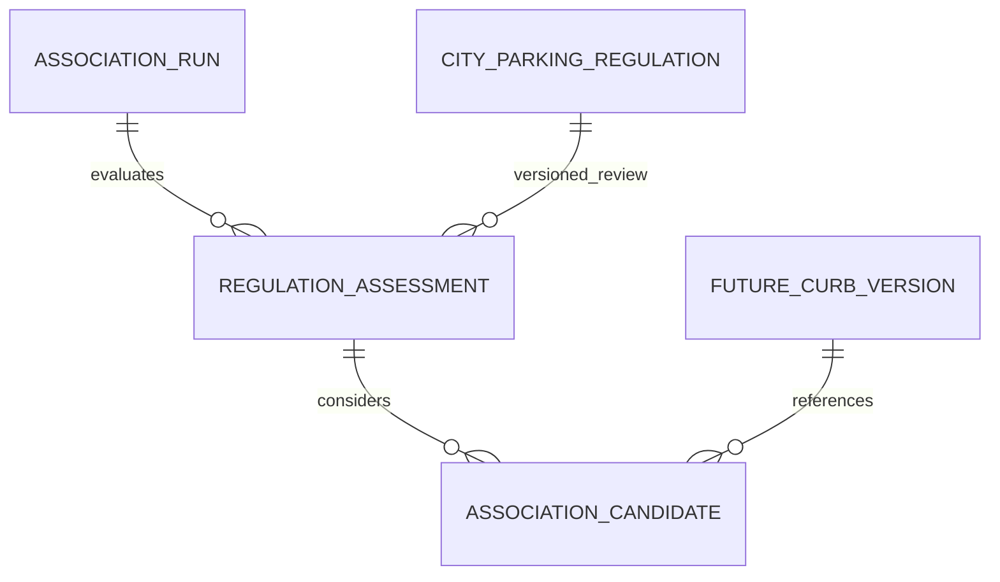

# City Regulation Association Storage Design V1

**Status: documentation only; migration and shared types deferred.** No matching, associations, database access, PostGIS enablement, or runtime changes. This design follows [Spatial Validation V2](./DATASF_REGULATION_JOIN.md#16-spatial-association-validation-v2--2026-09-18): 7,778 usable regulations, 83,796 measured pairs, 165 geometry-only screened rows, **zero independently verified associations**. The production storage baseline is supplied by the user, not re-queried here. CITY remains **INCOMPLETE**.

## 1. Existing identities and the missing target

Inspected migrations `00001`, `00005`, `00007`, `00011`; shared domain/adapters; ingestion and normalization scripts; the regulation storage, city data, spatial research, and architecture documents.

| Existing entity | Actual identity contract | Suitable association target? |
|---|---|---|
| `parking_spots` | UUID PK; existing mock/community app inventory | Not an authoritative city curb |
| `city_parking_sources` | UUID PK; unique `source_key`; dataset/provider metadata | Source registry, not a physical object |
| `city_parking_blocks` | UUID PK; unique `(source_id UUID FK, external_id text)`; nullable, **non-unique** `blockface_id text` | Coarse block inventory, not a verified curb side |
| `city_parking_meters` | UUID PK; unique `(source_id, external_id)`; post/blockface text; nullable `block_id UUID FK` | Meter point; cannot establish whole-curb extent |
| `normalized_parking_locations` | UUID PK; unique `(source_type text, source_id text)` | Runtime inventory point; current normalizer uses `datasf_parking_meter` plus `post_id` or meter `external_id` |
| `city_parking_regulations` | UUID PK; unique `(source_id UUID FK, external_id text)`; nullable `block_id` | Regulation identity, not destination geometry |

**Important naming distinction:** normalized-location `source_id` is external **text**, not the source-registry UUID used by city tables. `ParkingLocation.id` is the originating location row ID; it does not become a block/curb ID merely because its TypeScript type is `string`.

`mapBlockRow()` currently selects its external identity from `objectid`, `object_id`, `id`, or `globalid`, then a blockface fallback (with a synthetic final fallback). It does **not** explicitly map the feed's `block_id` field to the database PK or `external_id`. Thus do not assume DataSF block number, database UUID, or `blockface_id` are interchangeable. This task does not change that mapper.

Normalized-point `raw_source` records `city_table`, `city_row_id`, `external_id`, `post_id`, `blockface_id`, source key/dataset/provider, and import time. Those JSON provenance fields are not foreign keys. Blocks/meters retain raw source geometry in `raw_payload`; regulations intentionally omit geometry from `raw_source`. None is a versioned curb inventory.

**No separate curb or blockface table exists in the migrations.** Neither `pep9-66vw` nor `mk27-a5x2` is ingested as its own target entity. Public `pep9.globalid` and `mk27.blockface_id` are available as source identifiers only. A UUID-looking `globalid` must not be cast into an invented FK to an existing table. V2's temporary profiler output is not a persisted target registry.

## 2. Recommended target prerequisite

Target an **immutable, versioned citywide curb source feature and, where justified, an interval on that feature**. Initially investigate `pep9-66vw`; do not declare every source feature an independently verified physical curb or canonical city block. Metered-face identity may corroborate a feature without replacing its provenance.

A future curb-storage milestone must settle identity, lifecycle, snapshot retention, and side semantics first. Its proposed contract, **not an existing schema**, is:

- A durable target version has a generated database UUID and a real FK-backed snapshot identity. Its external identity is namespaced by provider/dataset, not a bare global ID.
- A snapshot manifest identifies immutable source bytes, capture time, upstream version, content digest, CRS, geometry canonicalization/version, inventory completeness and exclusions. A URL or `rowsUpdatedAt` alone is insufficient.
- Within a snapshot, `(dataset identity, external_id)` is unique. A changed source geometry/attributes yields a new immutable version; historical references remain valid. Equal geometry under different source IDs does not automatically merge identities.
- The provisional relation name used below is `city_parking_curb_versions`; it must supply `id UUID PRIMARY KEY` and a snapshot identity/digest that can be validated against the run. A final name and FK signature await that milestone.
- Store authoritative geometry/attributes or retain a durable, content-addressed artifact with deterministic retrieval. Choose representation in the curb milestone; this design does not require production PostGIS.
- A target interval uses a documented component/order and fractional arclength in the immutable version. Fractions are not portable across geometry revisions or reversals. Preserve source component/order and any transformation manifest.

No generic `(target_type, target_id)` pointing at arbitrary tables is recommended in V1: it cannot by itself enforce referential integrity. Use one concrete curb-version FK. `target_type: 'CURB_VERSION'` can be a discriminator in a future DTO without storing a redundant constant column. Other target classes would require an explicit future registry/FK design.

The separate **location-to-curb/interval resolution** needed to connect a normalized meter point or parking candidate to this target is also unimplemented. Regulation-to-curb links alone do not authorize a runtime lookup switch.

## 3. Smallest useful relational model

Three proposed tables separate facts with different cardinality/lifetime:

1. **`city_parking_regulation_association_runs`** — one immutable input/configuration manifest per offline batch/review revision. Shared snapshots, matcher/evidence schema versions, parameters, artifact digests and publication lifecycle belong here, not repeated on every pair.
2. **`city_parking_regulation_assessments`** — one regulation per run, including rows with no candidate or unusable geometry. Holds search outcome, regulation content/geometry digests, reasons and the decision on the complete proposed set.
3. **`city_parking_regulation_associations`** — zero or more candidate curb/interval links per assessment, with measured pair evidence and a review disposition. These rows are **not usable merely because the table is named associations**.



An unmatched/excluded assessment has no child links, so no null/fake target row is needed. Many regulation assessments may select the same curb. One regulation assessment may select several **jointly verified complementary intervals**. Competing alternatives for the same physical extent cannot be made valid by approving them independently or unioning their rules.

Use one candidate/link table with status, **not a second copied accepted table**. Parent review and a separate publication gate provide set-level safety without duplicating measurements or identity. Raw candidates and future accepted output remain separated by access/API boundaries. This refines V2's recommendation to keep unresolved evidence separate from accepted links: logical/access separation is sufficient while all base evidence tables are server-only.

## 4. State and review contract

Keep three small state dimensions because they describe different things:

| Record | Stored state | Meaning |
|---|---|---|
| Assessment | `search_status = CANDIDATES / UNMATCHED / EXCLUDED` | Complete search found candidates / no candidates within declared bounds / input cannot be searched |
| Assessment | `review_status = UNREVIEWED / APPROVED / REJECTED` | No set-level decision / a jointly verified selected set / no selected set approved |
| Candidate link | `disposition = PROPOSED / SELECTED / REJECTED` | Awaiting resolution / member of the proposed approved set / rejected alternative |
| Run | `lifecycle = DRAFT / PUBLISHED / RETIRED` | Incomplete/private work / validated immutable release / unusable historical release |

Do not store an extra `verification_status`, `is_verified`, or confidence score. A derived match result is `VERIFIED_UNIQUE_SPATIAL` only for a **selected link in an approved assessment in a published/current/valid run**, after all acceptance invariants hold. `UNIQUE` means no unresolved competing target for that source interval, not one destination for the entire regulation. A set can contain several noncompeting verified intervals.

Other candidate-bearing assessments remain `AMBIGUOUS`/unverified in the research projection, with review rejection distinguished by reasons. `UNMATCHED` is reserved for a completed bounded search with no candidate; rejecting candidates does not rewrite that historical search fact. `EXCLUDED` is a separate reasoned input outcome, not absence of parking rules. Drop `VERIFIED_EXACT` until actual evidence supports it. Do not implement `AUTOMATICALLY_VERIFIED` in V1: no such validated pipeline exists.

### Review and publication transaction

Future trusted offline/review tooling authenticates the operator; it must not accept a caller's arbitrary `reviewed_by` assertion. Use an immutable operator identifier such as issuer+subject, not a display name, email, client-editable profile field, or key. A text identifier supports offline actors without assuming they have `auth.users` rows. Its identity issuer/authorization policy remains a prerequisite.

Review the whole assessment: all alternatives, source and target versions, search completeness, interval partition, competing margins, side/location evidence and contradictions. Approve only with at least one selected link, all other links explicitly rejected, no unresolved reasons on selected links, and independent row-specific side/extent evidence. Rejecting the whole set selects nothing. Approval alone is not a publication or coverage declaration.

While DRAFT, a trusted transaction locks the run and assessment before editing dispositions/review fields. Publication locks the run, checks all cross-row invariants, validates every manifest and digest, and verifies assessed identity coverage against the source snapshot (including exclusions). Counts alone are not sufficient. A draft can contain unresolved assessments; they remain inaccessible/unusable when the batch is published. The release records precisely which assessments are approved.

Published child evidence/reviews are immutable. Correct/re-review through a new run revision; do not overwrite history or carry approvals automatically onto changed data. Retire the old run and publish its replacement atomically. A partial unique index permits at most one published run per regulation source for this single citywide-curb pipeline. Revoke urgently by retiring the entire run; coarse release-wide invalidation is the simpler fail-closed V1. Per-assessment revocation/audit events can be added later if demonstrated necessary.

Rerunning the same exact batch/review revision reuses `run_key` and must verify identical manifests before resuming; it must not overwrite different inputs under that key. A new matcher/configuration, snapshot, decision revision or source content creates a new run. Stable assessment/pair unique keys make retrying imports idempotent. UUID PKs use database defaults, not fabricated DataSF UUID mappings.

## 5. Evidence and provenance

Existing `ParkingEvidence` is a small domain fact-provenance type: `sourceCategory`, `sourceDetail`, `externalId`, `observedAt`, `retrievedAt`, `expiresAt`; ISO timestamps and null unknown observation/expiry are established conventions. It is not a replacement for research manifests or a score. Reuse it in future adapters for an actual accepted fact, with `sourceCategory: 'CITY'`; do not add another source category for spatial matching or put research metrics in availability/legality fields.

| Location | Evidence to retain | Reason |
|---|---|---|
| Run | Source and target manifests, durable artifact URI/content SHA-256, capture/observed timestamps, inventory identity digest and exclusions, CRS/transformation, canonicalization, matcher and parameter versions, evidence schema version | Reproduce inputs and methods once per batch |
| Assessment | Regulation content SHA-256, nullable source geometry SHA-256, search result/reasons, competition evidence, reviewer decision/reference | Source row can be updated in place by ingest; UUID and `updated_at` alone cannot establish snapshot equality |
| Candidate | Scoped source/target intervals, minimum and endpoint distances, sampled Hausdorff, directed buffered-length fractions at stated tolerances, length ratio, direction delta, typed side/location evidence, competitor/corner references, ambiguity/rejection reasons | Inspect a specific proposed link and its alternatives |

Use one versioned `metrics` JSON object per pair rather than duplicating the same metrics in scalar columns and a second JSON copy. JSON is justified by the changing experimental measurements; pair identity, intervals, states, reasons, versions and review fields remain typed columns. The next implementation must validate the evidence schema, finite/nonnegative metric values, ratios, units and null semantics before publication. Database object-type checks alone do not validate evidence truth.

Example evidence shape (documentation, not actual accepted data):

```typescript
type PairMetricsV1 = Readonly<{
  minimumDistanceM: number | null;
  pairedEndpointDistanceM: number | null;
  symmetricSampledHausdorffM: number | null;
  bufferedCoverage: readonly Readonly<{
    toleranceM: number;
    regulationFraction: number;
    targetFraction: number;
  }>[];
  regulationToTargetLengthRatio: number | null;
  undirectedDirectionDeltaDegrees: number | null;
}>;
```

At assessment level, `competition_evidence` records search radius/completeness, evidence artifact references, ranking metric, best/second candidate keys and **measured vs lower-bound/censored** separation. Candidate count is derived from children (a manifest count is checked, not treated as authority). Do not call a 269 m within-search second-best globally second-best when unexamined candidates beyond 50 m could be closer. Store the search lower bound and measurement context; do not store infinity for a missing second candidate.

`side_evidence` and `location_evidence` are objects with `state: UNKNOWN | SUPPORTS | CONFLICTS`, referenced source document/field and digest, verbatim bounded excerpt or artifact offsets, applicable clause/extent, independence explanation and validation method/operator. `SUPPORTS` means the claim was validated, not that two geometry-derived labels agree. Generic notes and multi-location resolution text remain UNKNOWN until a row-specific clause is established. No confidence percentages. Missing evidence is null/UNKNOWN, never zero distance or implicit support.

Use separate reason arrays, e.g. `SIDE_UNVERIFIED`, `OPPOSITE_CURB_UNRESOLVED`, `CORNER_UNRESOLVED`, `EXTENT_UNRESOLVED`, `NEAR_TIE`, `TEXT_CONFLICT`, `SNAPSHOT_UNAVAILABLE`, `INVALID_GEOMETRY`, `NO_CANDIDATE_WITHIN_SEARCH`. Version the reason vocabulary with the evidence schema; do not silently treat an unknown code as approval.

Regulation content digests must cover source identity, rule attributes and retained source evidence, excluding ingestion bookkeeping timestamps. Geometry digests bind the separately retained source geometry. Final canonicalization and handling of source changes must be specified and tested in the snapshot milestone; do not hash mutable JSON with an unspecified serializer and call it reproducible.

## 6. Future migration draft — deliberately not deployable yet

**No migration file is created.** The target entity and snapshot contract do not exist, and publication/immutability guards are not implemented. The following is exact proposed table/constraint/index/access DDL **for review**, conditional on the future `city_parking_curb_versions(id)` contract. Its names are proposals, not assertions that tables exist. Do not copy it into the migration sequence until the prerequisite and guards below are settled together. It neither enables extensions nor contains association inserts/backfills.

```sql
CREATE TABLE public.city_parking_regulation_association_runs (
  id uuid PRIMARY KEY DEFAULT gen_random_uuid(),
  source_id uuid NOT NULL REFERENCES public.city_parking_sources(id) ON DELETE RESTRICT,
  run_key text NOT NULL UNIQUE CHECK (length(btrim(run_key)) > 0),
  matcher_version text NOT NULL CHECK (length(btrim(matcher_version)) > 0),
  evidence_schema_version text NOT NULL CHECK (length(btrim(evidence_schema_version)) > 0),
  source_snapshot jsonb NOT NULL CHECK (jsonb_typeof(source_snapshot) = 'object'),
  target_snapshot jsonb NOT NULL CHECK (jsonb_typeof(target_snapshot) = 'object'),
  parameters jsonb NOT NULL CHECK (jsonb_typeof(parameters) = 'object'),
  lifecycle text NOT NULL DEFAULT 'DRAFT'
    CHECK (lifecycle IN ('DRAFT', 'PUBLISHED', 'RETIRED')),
  published_at timestamptz,
  retired_at timestamptz,
  created_at timestamptz NOT NULL DEFAULT now(),
  updated_at timestamptz NOT NULL DEFAULT now(),
  CHECK (
    (lifecycle = 'DRAFT' AND published_at IS NULL AND retired_at IS NULL) OR
    (lifecycle = 'PUBLISHED' AND published_at IS NOT NULL AND retired_at IS NULL) OR
    (lifecycle = 'RETIRED' AND retired_at IS NOT NULL)
  ),
  CHECK (retired_at IS NULL OR published_at IS NULL OR retired_at >= published_at)
);

CREATE UNIQUE INDEX city_regulation_one_published_run
  ON public.city_parking_regulation_association_runs(source_id)
  WHERE lifecycle = 'PUBLISHED';
CREATE INDEX city_regulation_runs_source_created
  ON public.city_parking_regulation_association_runs(source_id, created_at DESC);

CREATE TABLE public.city_parking_regulation_assessments (
  id uuid PRIMARY KEY DEFAULT gen_random_uuid(),
  run_id uuid NOT NULL REFERENCES public.city_parking_regulation_association_runs(id)
    ON DELETE RESTRICT,
  regulation_id uuid NOT NULL REFERENCES public.city_parking_regulations(id)
    ON DELETE RESTRICT,
  regulation_content_sha256 text NOT NULL CHECK (regulation_content_sha256 ~ '^[0-9a-f]{64}$'),
  source_geometry_sha256 text CHECK (source_geometry_sha256 ~ '^[0-9a-f]{64}$'),
  search_status text NOT NULL CHECK (search_status IN ('CANDIDATES', 'UNMATCHED', 'EXCLUDED')),
  assessment_reasons text[] NOT NULL DEFAULT '{}',
  competition_evidence jsonb NOT NULL CHECK (jsonb_typeof(competition_evidence) = 'object'),
  review_status text NOT NULL DEFAULT 'UNREVIEWED'
    CHECK (review_status IN ('UNREVIEWED', 'APPROVED', 'REJECTED')),
  reviewed_at timestamptz,
  reviewed_by text,
  review_note text,
  created_at timestamptz NOT NULL DEFAULT now(),
  updated_at timestamptz NOT NULL DEFAULT now(),
  UNIQUE (run_id, regulation_id),
  CHECK (search_status = 'EXCLUDED' OR source_geometry_sha256 IS NOT NULL),
  CHECK (search_status = 'CANDIDATES' OR cardinality(assessment_reasons) > 0),
  CHECK (array_position(assessment_reasons, NULL) IS NULL),
  CHECK (review_status <> 'APPROVED' OR
    (search_status = 'CANDIDATES' AND cardinality(assessment_reasons) = 0)),
  CHECK (
    (review_status = 'UNREVIEWED' AND reviewed_at IS NULL AND reviewed_by IS NULL AND review_note IS NULL) OR
    (review_status IN ('APPROVED', 'REJECTED') AND reviewed_at IS NOT NULL
      AND reviewed_by IS NOT NULL AND length(btrim(reviewed_by)) > 0
      AND review_note IS NOT NULL AND length(btrim(review_note)) > 0)
  )
);
CREATE INDEX city_regulation_assessments_regulation
  ON public.city_parking_regulation_assessments(regulation_id);
CREATE INDEX city_regulation_assessments_review
  ON public.city_parking_regulation_assessments(run_id, review_status);

CREATE TABLE public.city_parking_regulation_associations (
  id uuid PRIMARY KEY DEFAULT gen_random_uuid(),
  assessment_id uuid NOT NULL REFERENCES public.city_parking_regulation_assessments(id)
    ON DELETE RESTRICT,
  -- BLOCKED prerequisite: this target-version table does not exist today.
  curb_version_id uuid NOT NULL REFERENCES public.city_parking_curb_versions(id)
    ON DELETE RESTRICT,
  source_component integer NOT NULL CHECK (source_component >= 0),
  source_from numeric(13,12) NOT NULL,
  source_to numeric(13,12) NOT NULL,
  target_from numeric(13,12) NOT NULL,
  target_to numeric(13,12) NOT NULL,
  disposition text NOT NULL DEFAULT 'PROPOSED'
    CHECK (disposition IN ('PROPOSED', 'SELECTED', 'REJECTED')),
  metrics jsonb NOT NULL CHECK (jsonb_typeof(metrics) = 'object'),
  side_evidence jsonb NOT NULL CHECK (jsonb_typeof(side_evidence) = 'object'),
  location_evidence jsonb NOT NULL CHECK (jsonb_typeof(location_evidence) = 'object'),
  ambiguity_reasons text[] NOT NULL DEFAULT '{}',
  rejection_reasons text[] NOT NULL DEFAULT '{}',
  created_at timestamptz NOT NULL DEFAULT now(),
  updated_at timestamptz NOT NULL DEFAULT now(),
  CHECK (0 <= source_from AND source_from < source_to AND source_to <= 1),
  CHECK (0 <= target_from AND target_from < target_to AND target_to <= 1),
  CHECK (array_position(ambiguity_reasons, NULL) IS NULL),
  CHECK (array_position(rejection_reasons, NULL) IS NULL),
  CHECK (disposition <> 'SELECTED' OR
    (cardinality(ambiguity_reasons) = 0 AND cardinality(rejection_reasons) = 0)),
  CHECK ((disposition = 'REJECTED') = (cardinality(rejection_reasons) > 0)),
  UNIQUE (assessment_id, curb_version_id, source_component,
          source_from, source_to, target_from, target_to)
);
CREATE INDEX city_regulation_associations_curb
  ON public.city_parking_regulation_associations(curb_version_id);
CREATE INDEX city_regulation_associations_selected
  ON public.city_parking_regulation_associations(assessment_id, curb_version_id)
  WHERE disposition = 'SELECTED';

CREATE TRIGGER city_regulation_runs_updated_at
  BEFORE UPDATE ON public.city_parking_regulation_association_runs
  FOR EACH ROW EXECUTE FUNCTION public.set_updated_at();
CREATE TRIGGER city_regulation_assessments_updated_at
  BEFORE UPDATE ON public.city_parking_regulation_assessments
  FOR EACH ROW EXECUTE FUNCTION public.set_updated_at();
CREATE TRIGGER city_regulation_associations_updated_at
  BEFORE UPDATE ON public.city_parking_regulation_associations
  FOR EACH ROW EXECUTE FUNCTION public.set_updated_at();

ALTER TABLE public.city_parking_regulation_association_runs ENABLE ROW LEVEL SECURITY;
ALTER TABLE public.city_parking_regulation_assessments ENABLE ROW LEVEL SECURITY;
ALTER TABLE public.city_parking_regulation_associations ENABLE ROW LEVEL SECURITY;

REVOKE ALL ON public.city_parking_regulation_association_runs,
  public.city_parking_regulation_assessments,
  public.city_parking_regulation_associations
  FROM PUBLIC, anon, authenticated, service_role;
GRANT SELECT, INSERT, UPDATE ON public.city_parking_regulation_association_runs,
  public.city_parking_regulation_assessments,
  public.city_parking_regulation_associations TO service_role;
-- Intentionally NO anon/authenticated policies, including SELECT.
-- No client writes; no public evidence/reviewer exposure; no DELETE grant.
```

The proposed UUID/timestamp defaults and `public.set_updated_at()` reuse existing conventions. Text CHECKs match the repo's style and avoid premature global enums. FKs use RESTRICT to preserve reviewed evidence: future source/regulation deletion workflows would have to retire/archive dependent evidence explicitly, rather than silently cascading it away. Unique indexes already cover `run_id` on assessments and `assessment_id` on links through their leading columns; additional indexes address reverse target/regulation lookup and review queues. No speculative JSON GIN or spatial indexes are proposed for these evidence tables.

`regulation_id` and `matcher_version` are resolved through the assessment/run, not copied onto every link. Target geometry/snapshot provenance is resolved through the immutable target version. A source MultiLineString component is explicit; the prerequisite target version is one LineString. Fractions have a defined decimal identity precision for idempotency; the evidence artifact retains unrounded measures. A proposed full-feature pair uses explicitly supplied [0,1] extents, never defaults that pretend partial extent was verified.

### Required guards before this can become a migration

The DDL is intentionally **not** a complete deployable migration. CHECKs cannot safely assert other rows' state; [PostgreSQL documents this limitation](https://www.postgresql.org/docs/current/ddl-constraints.html). The future migration must also implement and test restricted write/publication functions or lock-aware triggers enforcing:

1. Run source is the intended regulation dataset; assessment regulation source matches it; target-version snapshot/dataset agrees with the run target manifest. Validate artifact identity/digests and evidence schema, not just JSON object shapes.
2. `CANDIDATES` has >=1 child; `UNMATCHED` and `EXCLUDED` have zero. Publication covers exactly the source-snapshot identity set. Candidate references in evidence point to retained rows/artifacts from that assessment.
3. APPROVED has >=1 SELECTED child and no PROPOSED child; REJECTED has only rejected children; unreviewed assessments cannot expose selected links. Whole-set approval checks alternative rejection, independent side/extent support, no text conflict and valid complementary intervals. No overlapping alternative selections for the same source interval. An approved set must resolve the declared assessment scope, not silently omit unresolved fragments.
4. Freeze run manifests, assessments, evidence and review decisions once published; permit only publication/retirement lifecycle transitions through the trusted gate. Forbid deletes and mutation/republication of retired releases. Draft retirement is allowed without a prior publication timestamp.
5. Lock run first, then assessments in stable ID order, for all child writes/review/publication so concurrency cannot pass checks against different candidate sets. The one-published-run index enforces release uniqueness; it does not replace these guards.
6. Only trusted authenticated offline/review operators can attest support or approval. An empty reason array, JSON `SUPPORTS` string or service-role connection alone is not proof. The service-role bypass of RLS means semantic validation must live in guards/tooling too, not be attributed to RLS.

Until these are implemented in isolated tests alongside the target prerequisite, **defer migration creation**. No policies or triggers are installed by this document. RLS with no applicable policies is default-deny for normal clients; table owners/BYPASSRLS roles have different behavior, so keep service credentials server-side. [PostgreSQL row security](https://www.postgresql.org/docs/current/ddl-rowsecurity.html)

## 7. Proposed TypeScript contract (not added to shared exports)

The names below describe research/storage DTOs, not new `ParkingLocation` or `ParkingRule` fields. They remain documentation until target identity, snapshot canonicalization and publication guards are settled. Pair metrics use `PairMetricsV1` above; numeric SQL fractions need deliberate decimal serialization in an eventual adapter.

```typescript
type SearchStatus = 'CANDIDATES' | 'UNMATCHED' | 'EXCLUDED';
type ReviewStatus = 'UNREVIEWED' | 'APPROVED' | 'REJECTED';
type CandidateDisposition = 'PROPOSED' | 'SELECTED' | 'REJECTED';
type RunLifecycle = 'DRAFT' | 'PUBLISHED' | 'RETIRED';
type MatchOutcome = 'VERIFIED_UNIQUE_SPATIAL' | 'AMBIGUOUS' | 'UNMATCHED' | 'EXCLUDED';
type DecimalFraction = string; // Validated [0,1], not an arbitrary string.

interface SnapshotManifest {
  readonly provider: 'DATASF' | 'SFMTA';
  readonly datasetId: string;
  readonly artifactUri: string;
  readonly artifactSha256: string;
  readonly identitySetSha256: string;
  readonly capturedAt: string;
  readonly observedAt: string | null;
  readonly upstreamVersion: string | null;
  readonly canonicalizationVersion: string;
  readonly crs: string;
  readonly totalRows: number;
  readonly excludedRows: number;
}
interface AssociationRun {
  readonly id: string;
  readonly sourceRegistryId: string;
  readonly runKey: string;
  readonly matcherVersion: string;
  readonly evidenceSchemaVersion: string;
  readonly sourceSnapshot: SnapshotManifest;
  readonly targetSnapshot: SnapshotManifest;
  readonly parameters: Readonly<Record<string, unknown>>; // Version-validated.
  readonly lifecycle: RunLifecycle;
  readonly publishedAt: string | null;
  readonly retiredAt: string | null;
}
interface EvidenceClaim {
  readonly state: 'UNKNOWN' | 'SUPPORTS' | 'CONFLICTS';
  readonly artifactReference: string | null;
  readonly artifactSha256: string | null;
  readonly clauseReference: string | null;
  readonly validatedBy: string | null;
  readonly validatedAt: string | null;
  readonly explanation: string;
}
interface AssociationAssessment {
  readonly id: string;
  readonly runId: string;
  readonly regulationId: string;
  readonly regulationContentSha256: string;
  readonly sourceGeometrySha256: string | null;
  readonly searchStatus: SearchStatus;
  readonly reviewStatus: ReviewStatus;
  readonly reasons: readonly string[]; // Validated versioned vocabulary.
  readonly reviewedBy: string | null;
  readonly reviewedAt: string | null; // ISO timestamp.
  readonly reviewNote: string | null;
}
interface AssociationCandidate {
  readonly id: string;
  readonly assessmentId: string;
  readonly target: { readonly type: 'CURB_VERSION'; readonly versionId: string };
  readonly sourceComponent: number;
  readonly sourceInterval: readonly [DecimalFraction, DecimalFraction];
  readonly targetInterval: readonly [DecimalFraction, DecimalFraction];
  readonly disposition: CandidateDisposition;
  readonly metrics: PairMetricsV1;
  readonly sideEvidence: EvidenceClaim;
  readonly locationEvidence: EvidenceClaim;
  readonly ambiguityReasons: readonly string[];
  readonly rejectionReasons: readonly string[];
}
```

These DTOs do not confer verification by construction. A future trusted read adapter must validate the published/approved/selected set and current versions before emitting a verified association DTO. Retain existing `ParkingEvidence` for the resulting domain fact; an association evidence reference can link back to the server-side audit record without exposing reviewer details. No matcher/helper or runtime adapter is added now.

The snapshot DTO is the common manifest header; versioned artifacts supply per-row geometry/attribute digests, exclusions, completeness and transformation details. SUPPORTS/CONFLICTS claims require non-null proof references/digests and validated operator/time under the future schema validator; nullable fields permit UNKNOWN, not unsupported attestation. Ordinary TypeScript interfaces and JSON object CHECKs cannot enforce those semantic conditions on untrusted input.

## 8. Future runtime contract and invalidation

The future boundary is a narrowly scoped **server-side accepted-association projection**, not client reads of evidence tables. Require all of: published/current run, approved assessment, selected link, valid manifests, no retirement/expiry/invalidation, unchanged regulation content and applicable target version, and independently validated parking-location-to-curb/interval identity. That projection must fail closed if any check is unavailable. Never expose privileged credentials to mobile or web clients.

Do not consume AMBIGUOUS, UNMATCHED, EXCLUDED, rejected, draft or geometry-only evidence. An approved link does not apply to every point in the containing street-block polygon, opposite side or rest of a long source line. Multiple verified rules can apply to the same target; unresolved alternatives cannot be unioned to fabricate certainty. Missing associations are unknown evidence, not permission to park.

Current ingest updates regulations in place and resets `block_id` null. Import timestamps alone change on idempotent reruns; a versioned content/geometry equality check must distinguish bookkeeping from changed evidence. The eventual runtime boundary must detect relevant source/target changes independently of this unchanged ingest script, or require an explicit release-invalidation integration before rollout. No approved result may be silently reused after a changed digest. A retired or replaced run is unusable, even if its individual link rows still say SELECTED.

Do not connect this proposal to current lookup now. The live regulation path remains `city_parking_blocks`; current domain types, adapters and coverage behavior are unchanged.

## 9. `block_id`, computation, and remaining dependencies

Leave `city_parking_regulations.block_id` **nullable and unpopulated**. Mark it conceptually legacy/insufficient for general curb association; do not dual-write a coarse best block from a selected curb. Keep the column/FK/index for compatibility until a later consumer audit and accepted-association rollout justify removal in a separate migration. Current legacy rule summaries on `city_parking_blocks` are a different compatibility concern and are not removed here.

PostGIS is not enabled per the user's SQL result. Prefer an **isolated PostGIS analysis environment plus offline, reviewed, precomputed releases**. Retain source snapshots, transformations, matcher configuration and complete competing evidence. Production can later store versioned targets/evidence and accepted links without doing runtime geometry matching. Enabling production PostGIS is a separate decision only if its storage/query workload actually requires it; no extension or heavy JS GIS dependency is added here.

Open prerequisites: persisted curb-version/snapshot identity and source registration; source geometry retention linked to regulation versions; canonical digests and geometry direction/interval conventions; positional-error/CRS calibration and independent side/extent labels; reviewed-set publication/immutability guards and authenticated operator policy; source-change invalidation; and the missing parking-location-to-curb link. The SQL and TypeScript proposals intentionally remain documentation until these dependencies are resolved.

Association addresses **regulation -> physical curb/location** only. Street sweeping, permit interpretation, meter-payment interpretation, `OTHER` semantics, unsupported schedules, and complete city-source coverage remain unresolved. CITY remains **INCOMPLETE** regardless of association count or approval status.
